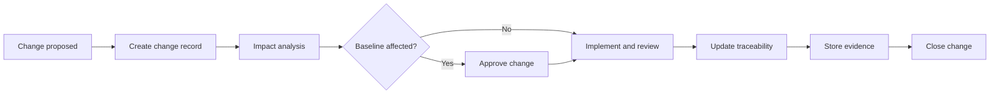
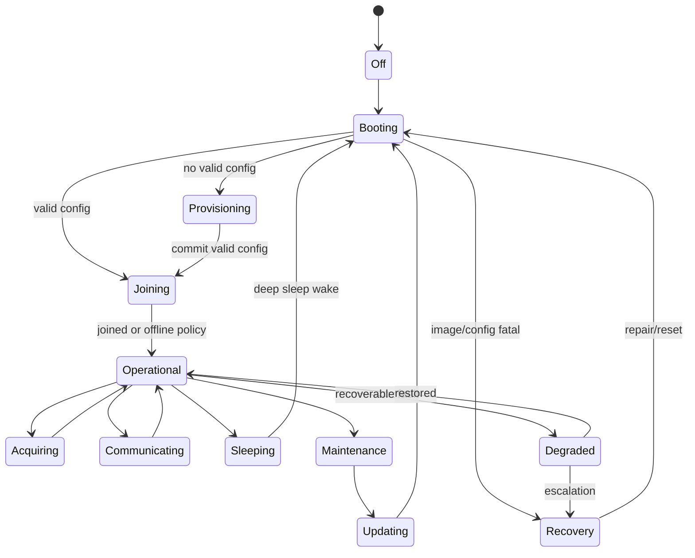
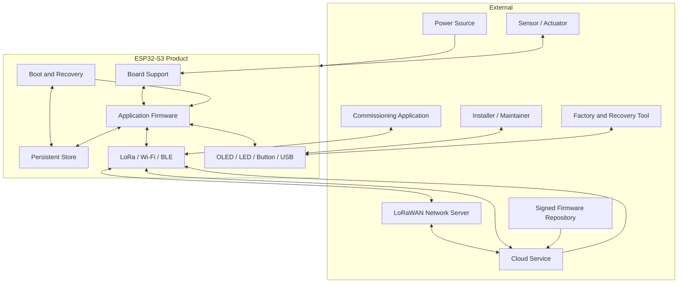
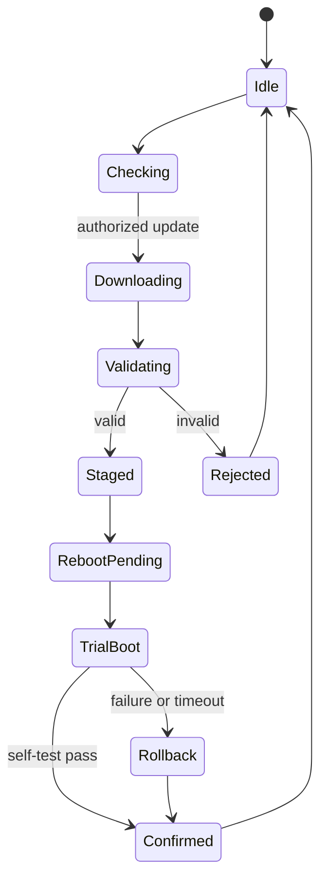
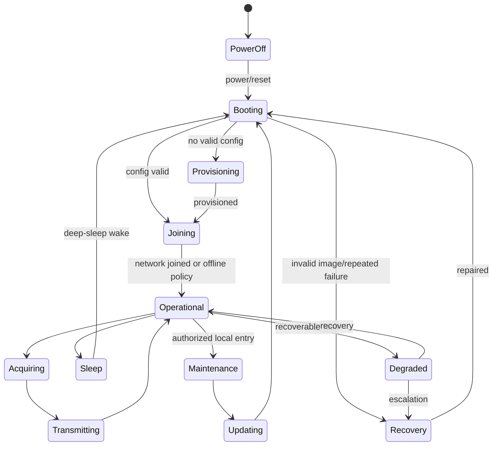
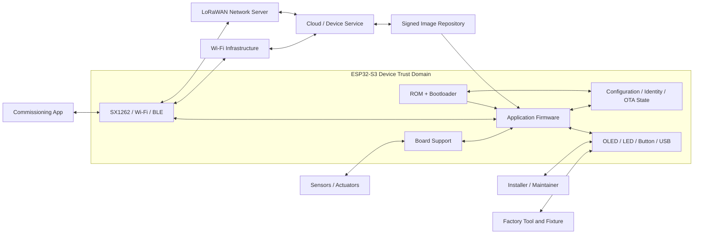
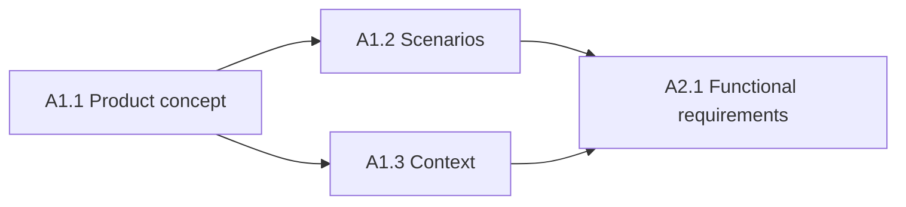
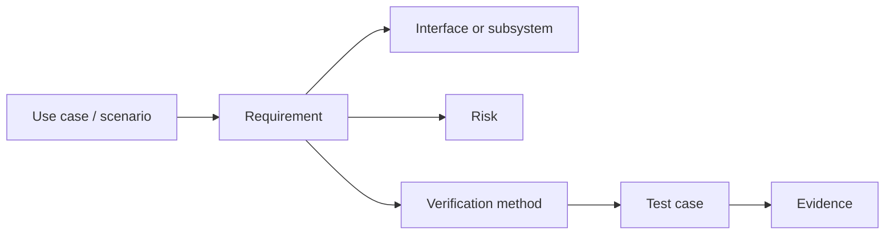
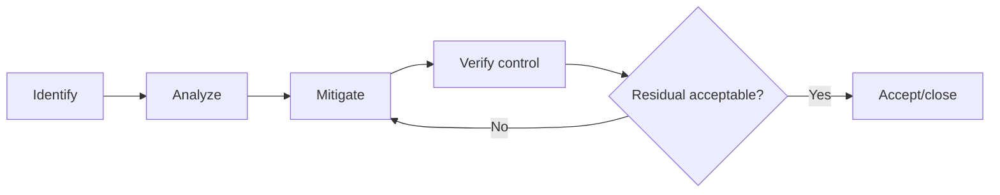

# ESP32-S3 Phase A Industrial Documentation Handbook

Generated: 2026-07-14

This consolidated handbook contains the complete Markdown documentation pack. The repository files remain authoritative for editing and version control.


---

# FILE: `README.md`

---
document_id: ESP32S3-PA-INDEX
title: "ESP32-S3 Phase A Industrial Documentation Pack"
phase: "A"
cluster: ""
work_package: ""
status: "Draft"
version: "0.1"
owner: "Me"
approver: "Me"
classification: "Internal Engineering"
created: "2026-07-14"
baseline_gate: "G-A"
platform: "ESP32-S3, 8 MB flash baseline"
toolchain: "ESP-IDF 5.5.x"
---

# ESP32-S3 Phase A Industrial Documentation Pack

| Control field | Value |
|---|---|
| Document ID | `ESP32S3-PA-INDEX` |
| Version | `0.1` |
| Status | Draft |
| Owner / approver | Me |
| Product baseline | Heltec WiFi LoRa 32 V3 / exact revision TBD |
| Target gate | G-A — Phase A baseline approval |
| Change control | Changes after baseline require a recorded change request |
| Evidence rule | A claim is complete only when linked evidence exists |

> **Control note:** `TBD-*` items are not omissions. They are controlled decisions that require an owner, due date, and closure evidence before the applicable gate.


## Purpose

This repository is the controlled engineering baseline for Phase A: Product Definition and Planning. It converts the WBS into reviewable, traceable, evidence-driven documents suitable for a production firmware program.

The reference product is a secure, maintainable, low-power edge device based on an ESP32-S3 and a Heltec WiFi LoRa 32 V3-class board. LoRaWAN is treated as the primary telemetry path; Wi-Fi, BLE, USB, and local UI functions remain subject to product decisions.

## Baseline assumptions

| ID | Assumption | Disposition |
|---|---|---|
| ASM-001 | Target MCU is ESP32-S3. | Confirm in A3.1 |
| ASM-002 | Available SPI flash is 8 MB. | Confirm by tool and module marking |
| ASM-003 | Target board is Heltec WiFi LoRa 32 V3. | Record exact hardware revision |
| ASM-004 | SX1262 is the LoRa transceiver. | Confirm by schematic and board marking |
| ASM-005 | ESP-IDF 5.5.x is the controlled framework line. | Pin exact patch version in build evidence |
| ASM-006 | LoRaWAN is the primary field communications mechanism. | Ratify in A1.1 |
| ASM-007 | Wi-Fi/BLE are maintenance or provisioning mechanisms, not always-on requirements. | Ratify in A1.1 |
| ASM-008 | USB is the factory and recovery path. | Validate in A1.3/A3.1 |
| ASM-009 | One person owns all WBS items. | Account for serial workload and review independence risk |

## Document hierarchy

```text
Phase A — Product Definition and Planning
├── A1 — Product Concept Definition
│   ├── A1.1 Product Concept
│   ├── A1.2 Operating Scenarios
│   └── A1.3 System Context and Boundaries
├── A2 — Requirements Engineering
│   ├── A2.1 Functional Requirements
│   ├── A2.2 Non-functional Requirements
│   ├── A2.3 Interface Control
│   └── A2.4 Requirements Traceability
└── A3 — Feasibility and Risk Analysis
    ├── A3.1 Hardware Feasibility
    ├── A3.2 High-risk Proofs of Concept
    └── A3.3 Risk, Threat Model and Gate Closure
```

## Repository map

| Location | Purpose |
|---|---|
| `docs/phase-a/` | Controlled phase, cluster, and work-package documents |
| `docs/diagrams/` | Mermaid source diagrams and diagram rules |
| `docs/evidence/` | Immutable or append-only proof: logs, screenshots, measurements, datasheets |
| `docs/risks/` | Risk register and preliminary threat model |
| `prototypes/` | Isolated high-risk proof-of-concept plans and results |

## Document status model

| Status | Meaning |
|---|---|
| Draft | In preparation; not approved for downstream reliance |
| In Review | Content complete enough for structured review |
| Approved | Accepted for current baseline |
| Superseded | Replaced by a newer approved version |
| Obsolete | No longer applicable; retained for history |

## Completion model

A work package is 100% complete only when:

1. Required content is present.
2. Open `TBD` items are within the allowed threshold.
3. Required reviews are recorded.
4. Evidence links resolve.
5. Exit criteria are satisfied.
6. The WBS row is updated with actual completion and contribution.

## Quick start

1. Read `docs/phase-a/Phase_A_Product_Definition_and_Planning.md`.
2. Execute A1.1 through A3.3 in dependency order.
3. Place raw proof in `docs/evidence/`.
4. Update traceability and risk records continuously.
5. Conduct gate G-A using `A3.3_Phase_A_Gate_Record.md`.

## Authoritative technical references

- Heltec WiFi LoRa 32 product documentation and exact board schematic.
- Espressif ESP-IDF Programming Guide for ESP32-S3, pinned to the project framework version.
- LoRa Alliance specifications applicable to the selected regional parameters and LoRaWAN version.
- Internal product, security, regulatory, and manufacturing decisions.

No statement in this repository overrides an exact component datasheet, schematic revision, regulatory requirement, or approved product requirement.


---

# FILE: `docs/Document_Control_Standard.md`

---
document_id: ESP32S3-STD-DOC-001
title: "Document Control and Configuration Management Standard"
phase: ""
cluster: ""
work_package: ""
status: "Draft"
version: "0.1"
owner: "Me"
approver: "Me"
classification: "Internal Engineering"
created: "2026-07-14"
baseline_gate: "G-A"
platform: "ESP32-S3, 8 MB flash baseline"
toolchain: "ESP-IDF 5.5.x"
---

# Document Control and Configuration Management Standard

| Control field | Value |
|---|---|
| Document ID | `ESP32S3-STD-DOC-001` |
| Version | `0.1` |
| Status | Draft |
| Owner / approver | Me |
| Product baseline | Heltec WiFi LoRa 32 V3 / exact revision TBD |
| Target gate | G-A — Phase A baseline approval |
| Change control | Changes after baseline require a recorded change request |
| Evidence rule | A claim is complete only when linked evidence exists |

> **Control note:** `TBD-*` items are not omissions. They are controlled decisions that require an owner, due date, and closure evidence before the applicable gate.


## 1. Objective

Define how engineering records are named, reviewed, approved, changed, and retained. The objective is reproducibility: another competent engineer must be able to determine what was decided, why it was decided, what evidence supported it, and which product baseline used it.

## 2. Identification rules

Each controlled document uses a unique ID:

```text
ESP32S3-<TYPE>-<AREA>-<SEQUENCE>
```

Examples:

- `ESP32S3-PA-A1.1`
- `ESP32S3-REQ-FR-BOOT-001`
- `ESP32S3-TEST-AT-OTA-003`
- `ESP32S3-RISK-R-007`
- `ESP32S3-DEC-012`

## 3. Versioning

| Change | Version action |
|---|---|
| Draft iteration before approval | Increment minor draft version: 0.1, 0.2 |
| First approval | 1.0 |
| Backward-compatible clarification | 1.1 |
| Requirement, interface, or behavior change | 2.0 |
| Typographic correction with no semantic effect | Patch commit only; version may remain |

## 4. Required front matter

Every controlled Markdown document shall identify its document ID, title, version, status, owner, approver, creation date, target gate, product baseline, and toolchain baseline.

## 5. Review records

Reviews shall record:

- Review date.
- Reviewed version or commit.
- Reviewer.
- Finding ID.
- Severity: Critical, Major, Minor, Editorial.
- Resolution.
- Closure evidence.
- Approval decision.

Because the project has one owner, self-review shall be separated from authorship by a deliberate review pass and checklist. Critical security or electrical decisions should obtain independent review when available; lack of independent review is itself a recorded risk.

## 6. Change-control workflow



## 7. Naming conventions

Evidence file names:

```text
<date>_<work-package>_<test-or-topic>_<board-serial>_<result>.<ext>
```

Example:

```text
2026-08-14_A3.2_AT-PWR-001_HV3-0001_PASS.csv
```

## 8. Repository controls

- Markdown is UTF-8.
- Source files use LF line endings unless the toolchain requires otherwise.
- Binary evidence is not edited after capture; corrections create a new file.
- Secrets, production keys, private certificates, and personal data are never committed.
- Commit messages include the WBS or artifact ID.
- Baseline tags follow `phase-a-v1.0`, `phase-b-v1.0`, etc.

## 9. Exit criteria

This standard is effective when all Phase A documents use the required metadata, naming, review, and evidence practices.


---

# FILE: `docs/Requirements_Writing_Standard.md`

---
document_id: ESP32S3-STD-REQ-001
title: "Requirements Writing and Quality Standard"
phase: ""
cluster: ""
work_package: ""
status: "Draft"
version: "0.1"
owner: "Me"
approver: "Me"
classification: "Internal Engineering"
created: "2026-07-14"
baseline_gate: "G-A"
platform: "ESP32-S3, 8 MB flash baseline"
toolchain: "ESP-IDF 5.5.x"
---

# Requirements Writing and Quality Standard

| Control field | Value |
|---|---|
| Document ID | `ESP32S3-STD-REQ-001` |
| Version | `0.1` |
| Status | Draft |
| Owner / approver | Me |
| Product baseline | Heltec WiFi LoRa 32 V3 / exact revision TBD |
| Target gate | G-A — Phase A baseline approval |
| Change control | Changes after baseline require a recorded change request |
| Evidence rule | A claim is complete only when linked evidence exists |

> **Control note:** `TBD-*` items are not omissions. They are controlled decisions that require an owner, due date, and closure evidence before the applicable gate.


## 1. Requirement form

A requirement shall express one testable obligation:

> The `<system element>` shall `<observable behavior>` when `<condition or trigger>` within `<measurable limit>`.

## 2. Mandatory attributes

| Attribute | Rule |
|---|---|
| ID | Unique, immutable, category-based |
| Statement | Uses `shall`; one obligation |
| Source | Use case, scenario, stakeholder, risk, standard, or interface |
| Rationale | Explains why without weakening the obligation |
| Priority | Must / Should / Could or P0 / P1 / P2 |
| Verification | Test, analysis, inspection, or demonstration |
| Acceptance criterion | Binary pass/fail condition |
| Trace links | Upstream source and downstream test |
| Status | Proposed, Accepted, Changed, Deleted, Verified |

## 3. Prohibited language

Avoid:

- Fast, user-friendly, robust, secure, minimal, sufficient, appropriate.
- “As required,” “where possible,” or “etc.”
- Combined obligations connected by multiple `and` clauses.
- Implementation details without an architectural reason.
- Requirements that merely restate a design.

## 4. Quality checklist

A requirement is acceptable when it is:

- Necessary.
- Correct.
- Unambiguous.
- Complete.
- Singular.
- Feasible.
- Verifiable.
- Traceable.
- Consistent.
- Technology-appropriate.
- Assigned to one responsible system element.

## 5. Identifier scheme

```text
FR-BOOT-001
FR-PROV-001
FR-LORA-001
NFR-PWR-001
NFR-SEC-001
```

IDs are never reused. Deleted requirements remain in history with status `Deleted`.

## 6. Verification codes

| Code | Method |
|---|---|
| T | Test |
| A | Analysis |
| I | Inspection |
| D | Demonstration |

## 7. Baseline rule

No requirement enters the approved baseline with an unresolved contradiction, undefined verification method, or missing source. Numeric limits may remain `TBD` only when a dated closure action exists and the gate allows it.


---

# FILE: `docs/Technical_Reference_Baseline.md`

---
document_id: ESP32S3-REF-001
title: "Technical Reference Baseline"
phase: ""
cluster: ""
work_package: ""
status: "Draft"
version: "0.1"
owner: "Me"
approver: "Me"
classification: "Internal Engineering"
created: "2026-07-14"
baseline_gate: "G-A"
platform: "ESP32-S3, 8 MB flash baseline"
toolchain: "ESP-IDF 5.5.x"
---

# Technical Reference Baseline

| Control field | Value |
|---|---|
| Document ID | `ESP32S3-REF-001` |
| Version | `0.1` |
| Status | Draft |
| Owner / approver | Me |
| Product baseline | Heltec WiFi LoRa 32 V3 / exact revision TBD |
| Target gate | G-A — Phase A baseline approval |
| Change control | Changes after baseline require a recorded change request |
| Evidence rule | A claim is complete only when linked evidence exists |

> **Control note:** `TBD-*` items are not omissions. They are controlled decisions that require an owner, due date, and closure evidence before the applicable gate.


## Purpose

List the authoritative technical sources that constrain Phase A decisions. The exact downloaded revision used by the project should be stored in `docs/evidence/datasheets/` when licensing permits.

## Platform sources

1. Heltec WiFi LoRa 32 official product documentation and exact revision schematic.
2. Espressif ESP32-S3 datasheet and technical reference manual.
3. ESP-IDF Programming Guide for the pinned 5.5.x patch.
4. Semtech SX1262 datasheet.
5. LoRa Alliance LoRaWAN specification and regional parameters for the approved market.

## Framework topics to baseline

- Partition tables.
- OTA and rollback.
- Secure Boot v2.
- Flash encryption.
- NVS and NVS encryption.
- Sleep modes and power management.
- Heap and stack diagnostics.
- Wi-Fi event and reconnect behavior.
- USB serial/JTAG and recovery.
- Core dump and fatal-error behavior.

## Reference-control record

| Reference ID | Document/source | Version/revision | Retrieved | Applicable baseline | Local evidence path |
|---|---|---|---|---|---|
| REF-HELTEC-001 | Heltec WiFi LoRa 32 documentation | TBD | TBD | Exact board | TBD |
| REF-ESP-001 | ESP32-S3 datasheet | TBD | TBD | MCU | TBD |
| REF-IDF-001 | ESP-IDF Programming Guide | 5.5.x exact TBD | TBD | Firmware | TBD |
| REF-SX-001 | SX1262 datasheet | TBD | TBD | LoRa radio | TBD |
| REF-LORA-001 | LoRaWAN spec/regional parameters | TBD | TBD | Network | TBD |

## Technical cautions

- Board product names do not guarantee identical PCB revisions.
- Enabling secure boot or flash encryption can affect bootloader size, debugging, provisioning, and recovery.
- OTA requires a partition design that fits the production image plus growth margin.
- Board-level sleep current can be dominated by regulators, display, radio, pull networks, and external loads.
- Wi-Fi/TLS memory peaks must be measured with the real configuration.


---

# FILE: `docs/Verification_Evidence_Standard.md`

---
document_id: ESP32S3-STD-EVID-001
title: "Verification Evidence and Test Record Standard"
phase: ""
cluster: ""
work_package: ""
status: "Draft"
version: "0.1"
owner: "Me"
approver: "Me"
classification: "Internal Engineering"
created: "2026-07-14"
baseline_gate: "G-A"
platform: "ESP32-S3, 8 MB flash baseline"
toolchain: "ESP-IDF 5.5.x"
---

# Verification Evidence and Test Record Standard

| Control field | Value |
|---|---|
| Document ID | `ESP32S3-STD-EVID-001` |
| Version | `0.1` |
| Status | Draft |
| Owner / approver | Me |
| Product baseline | Heltec WiFi LoRa 32 V3 / exact revision TBD |
| Target gate | G-A — Phase A baseline approval |
| Change control | Changes after baseline require a recorded change request |
| Evidence rule | A claim is complete only when linked evidence exists |

> **Control note:** `TBD-*` items are not omissions. They are controlled decisions that require an owner, due date, and closure evidence before the applicable gate.


## 1. Evidence principles

Evidence shall be authentic, attributable, reproducible, time-stamped, and linked to the exact hardware, firmware, configuration, and requirement under test.

## 2. Minimum test record

Every test record includes:

| Field | Required content |
|---|---|
| Test ID | Stable identifier |
| Requirement IDs | One or more traced requirements |
| Objective | What is proven |
| Hardware | Board model, revision, serial number |
| Firmware | Git commit, build ID, ESP-IDF version |
| Configuration | `sdkconfig`, partition table, keys mode |
| Equipment | Instrument model and calibration status |
| Preconditions | Supply, network, RF, temperature, battery state |
| Procedure | Numbered, repeatable steps |
| Expected result | Binary criterion |
| Actual result | Measurements and observations |
| Evidence | Log, screenshot, trace, photo, binary hash |
| Disposition | Pass, Fail, Blocked, Conditional |
| Defects/Risks | Linked issue identifiers |
| Executor/date | Person and timestamp |

## 3. Evidence integrity

- Calculate SHA-256 for release-critical binaries and externally supplied artifacts.
- Preserve raw serial logs.
- Keep measurement units in column headers.
- Record instrument ranges and sampling conditions.
- Do not alter screenshots except redaction of secrets.
- Store derived graphs separately from raw data.
- Keep failed-test evidence.

## 4. Test result rules

`PASS` means every acceptance criterion is met.  
`FAIL` means at least one criterion is not met.  
`BLOCKED` means the test cannot be executed because an entry condition is missing.  
`CONDITIONAL` requires an approved deviation and is not equivalent to pass.

## 5. Evidence index

All evidence is registered in `docs/evidence/Evidence_Index.md`. A WBS item cannot reach 100% if its required evidence is absent from the index.


---

# FILE: `docs/diagrams/Device_State_Model.md`

---
document_id: ESP32S3-DIAG-STATE-001
title: "Device State Model"
phase: ""
cluster: ""
work_package: ""
status: "Draft"
version: "0.1"
owner: "Me"
approver: "Me"
classification: "Internal Engineering"
created: "2026-07-14"
baseline_gate: "G-A"
platform: "ESP32-S3, 8 MB flash baseline"
toolchain: "ESP-IDF 5.5.x"
---

# Device State Model

| Control field | Value |
|---|---|
| Document ID | `ESP32S3-DIAG-STATE-001` |
| Version | `0.1` |
| Status | Draft |
| Owner / approver | Me |
| Product baseline | Heltec WiFi LoRa 32 V3 / exact revision TBD |
| Target gate | G-A — Phase A baseline approval |
| Change control | Changes after baseline require a recorded change request |
| Evidence rule | A claim is complete only when linked evidence exists |

> **Control note:** `TBD-*` items are not omissions. They are controlled decisions that require an owner, due date, and closure evidence before the applicable gate.




## State-definition rule

Each state must define entry conditions, allowed events, prohibited operations, timeout, persistent effects, exit conditions, UI indication, and diagnostic events.


---

# FILE: `docs/diagrams/README.md`

---
document_id: ESP32S3-DIAG-INDEX
title: "Engineering Diagram Index"
phase: ""
cluster: ""
work_package: ""
status: "Draft"
version: "0.1"
owner: "Me"
approver: "Me"
classification: "Internal Engineering"
created: "2026-07-14"
baseline_gate: "G-A"
platform: "ESP32-S3, 8 MB flash baseline"
toolchain: "ESP-IDF 5.5.x"
---

# Engineering Diagram Index

| Control field | Value |
|---|---|
| Document ID | `ESP32S3-DIAG-INDEX` |
| Version | `0.1` |
| Status | Draft |
| Owner / approver | Me |
| Product baseline | Heltec WiFi LoRa 32 V3 / exact revision TBD |
| Target gate | G-A — Phase A baseline approval |
| Change control | Changes after baseline require a recorded change request |
| Evidence rule | A claim is complete only when linked evidence exists |

> **Control note:** `TBD-*` items are not omissions. They are controlled decisions that require an owner, due date, and closure evidence before the applicable gate.


## Rules

- Diagram source is stored as Mermaid in Markdown.
- Every diagram has an owner, revision, and linked source document.
- A diagram shall not introduce behavior absent from requirements.
- Trust boundaries, data directions, and state transitions are labeled.
- Exported images are evidence derivatives; Markdown source is authoritative.

## Diagram register

| ID | Diagram | Source |
|---|---|---|
| DIAG-CTX-001 | Product system context | `System_Context_Diagram.md` |
| DIAG-STATE-001 | Device state model | `Device_State_Model.md` |
| DIAG-OTA-001 | OTA lifecycle | A1.1 / A2.3 |
| DIAG-TRACE-001 | Traceability flow | A2 super document |


---

# FILE: `docs/diagrams/System_Context_Diagram.md`

---
document_id: ESP32S3-DIAG-CTX-001
title: "System Context Diagram"
phase: ""
cluster: ""
work_package: ""
status: "Draft"
version: "0.1"
owner: "Me"
approver: "Me"
classification: "Internal Engineering"
created: "2026-07-14"
baseline_gate: "G-A"
platform: "ESP32-S3, 8 MB flash baseline"
toolchain: "ESP-IDF 5.5.x"
---

# System Context Diagram

| Control field | Value |
|---|---|
| Document ID | `ESP32S3-DIAG-CTX-001` |
| Version | `0.1` |
| Status | Draft |
| Owner / approver | Me |
| Product baseline | Heltec WiFi LoRa 32 V3 / exact revision TBD |
| Target gate | G-A — Phase A baseline approval |
| Change control | Changes after baseline require a recorded change request |
| Evidence rule | A claim is complete only when linked evidence exists |

> **Control note:** `TBD-*` items are not omissions. They are controlled decisions that require an owner, due date, and closure evidence before the applicable gate.




## Review questions

- Is every external actor shown?
- Does every arrow correspond to an interface record?
- Are factory and field paths distinct?
- Is update authority represented correctly?
- Are trust boundaries present in A1.3?


---

# FILE: `docs/evidence/Evidence_Index.md`

---
document_id: ESP32S3-EVID-REGISTER
title: "Evidence Index"
phase: ""
cluster: ""
work_package: ""
status: "Draft"
version: "0.1"
owner: "Me"
approver: "Me"
classification: "Internal Engineering"
created: "2026-07-14"
baseline_gate: "G-A"
platform: "ESP32-S3, 8 MB flash baseline"
toolchain: "ESP-IDF 5.5.x"
---

# Evidence Index

| Control field | Value |
|---|---|
| Document ID | `ESP32S3-EVID-REGISTER` |
| Version | `0.1` |
| Status | Draft |
| Owner / approver | Me |
| Product baseline | Heltec WiFi LoRa 32 V3 / exact revision TBD |
| Target gate | G-A — Phase A baseline approval |
| Change control | Changes after baseline require a recorded change request |
| Evidence rule | A claim is complete only when linked evidence exists |

> **Control note:** `TBD-*` items are not omissions. They are controlled decisions that require an owner, due date, and closure evidence before the applicable gate.


| Evidence ID | Date | WBS/Test | Description | Hardware | Firmware commit | Result | Relative path | SHA-256 | Reviewer |
|---|---|---|---|---|---|---|---|---|---|
| EVID-0001 | TBD | TBD | Initial placeholder; replace | TBD | TBD | TBD | TBD | TBD | Me |

## Index rules

- One row per immutable evidence artifact.
- Derived artifacts reference their raw source.
- Failed and blocked tests remain indexed.
- Hash release-critical binaries, manifests, and signed images.


---

# FILE: `docs/evidence/README.md`

---
document_id: ESP32S3-EVID-INDEX
title: "Evidence Repository Instructions"
phase: ""
cluster: ""
work_package: ""
status: "Draft"
version: "0.1"
owner: "Me"
approver: "Me"
classification: "Internal Engineering"
created: "2026-07-14"
baseline_gate: "G-A"
platform: "ESP32-S3, 8 MB flash baseline"
toolchain: "ESP-IDF 5.5.x"
---

# Evidence Repository Instructions

| Control field | Value |
|---|---|
| Document ID | `ESP32S3-EVID-INDEX` |
| Version | `0.1` |
| Status | Draft |
| Owner / approver | Me |
| Product baseline | Heltec WiFi LoRa 32 V3 / exact revision TBD |
| Target gate | G-A — Phase A baseline approval |
| Change control | Changes after baseline require a recorded change request |
| Evidence rule | A claim is complete only when linked evidence exists |

> **Control note:** `TBD-*` items are not omissions. They are controlled decisions that require an owner, due date, and closure evidence before the applicable gate.


## Purpose

Store raw and derived proof used to complete WBS items and verify requirements.

## Folder rules

| Folder | Content |
|---|---|
| `logs/` | Serial, test-run, build, network, and fault-injection logs |
| `screenshots/` | UI, tool output, scope captures, setup photos |
| `measurements/` | CSV/raw measurements and analysis |
| `datasheets/` | Exact approved vendor documents and schematic revisions |

## Prohibited content

- Production private keys.
- Wi-Fi passwords.
- LoRaWAN root/session keys.
- Access tokens.
- Personal information not required for engineering.
- Unlicensed third-party material.

## Required naming

`YYYY-MM-DD_WBS_TEST_BOARD_RESULT.ext`

## Evidence acceptance

The evidence index must identify the generating test, hardware, firmware commit, configuration, result, and relative path.


---

# FILE: `docs/evidence/datasheets/README.md`

---
document_id: ESP32S3-EVID-DATA
title: "Datasheet and Schematic Control Rules"
phase: ""
cluster: ""
work_package: ""
status: "Draft"
version: "0.1"
owner: "Me"
approver: "Me"
classification: "Internal Engineering"
created: "2026-07-14"
baseline_gate: "G-A"
platform: "ESP32-S3, 8 MB flash baseline"
toolchain: "ESP-IDF 5.5.x"
---

# Datasheet and Schematic Control Rules

| Control field | Value |
|---|---|
| Document ID | `ESP32S3-EVID-DATA` |
| Version | `0.1` |
| Status | Draft |
| Owner / approver | Me |
| Product baseline | Heltec WiFi LoRa 32 V3 / exact revision TBD |
| Target gate | G-A — Phase A baseline approval |
| Change control | Changes after baseline require a recorded change request |
| Evidence rule | A claim is complete only when linked evidence exists |

> **Control note:** `TBD-*` items are not omissions. They are controlled decisions that require an owner, due date, and closure evidence before the applicable gate.


## Policy

Store only the exact vendor document revision used. Record source, retrieval date, document revision, and applicable board/component revision. Newer documents do not silently replace the approved baseline.


---

# FILE: `docs/evidence/logs/README.md`

---
document_id: ESP32S3-EVID-LOGS
title: "Log Evidence Rules"
phase: ""
cluster: ""
work_package: ""
status: "Draft"
version: "0.1"
owner: "Me"
approver: "Me"
classification: "Internal Engineering"
created: "2026-07-14"
baseline_gate: "G-A"
platform: "ESP32-S3, 8 MB flash baseline"
toolchain: "ESP-IDF 5.5.x"
---

# Log Evidence Rules

| Control field | Value |
|---|---|
| Document ID | `ESP32S3-EVID-LOGS` |
| Version | `0.1` |
| Status | Draft |
| Owner / approver | Me |
| Product baseline | Heltec WiFi LoRa 32 V3 / exact revision TBD |
| Target gate | G-A — Phase A baseline approval |
| Change control | Changes after baseline require a recorded change request |
| Evidence rule | A claim is complete only when linked evidence exists |

> **Control note:** `TBD-*` items are not omissions. They are controlled decisions that require an owner, due date, and closure evidence before the applicable gate.


## Policy

Store raw logs without editing. Start each capture with board ID, firmware commit, test ID, timestamp, and configuration. Redact secrets by preventing them from being logged, not by altering raw evidence after capture.


---

# FILE: `docs/evidence/measurements/README.md`

---
document_id: ESP32S3-EVID-MEAS
title: "Measurement Evidence Rules"
phase: ""
cluster: ""
work_package: ""
status: "Draft"
version: "0.1"
owner: "Me"
approver: "Me"
classification: "Internal Engineering"
created: "2026-07-14"
baseline_gate: "G-A"
platform: "ESP32-S3, 8 MB flash baseline"
toolchain: "ESP-IDF 5.5.x"
---

# Measurement Evidence Rules

| Control field | Value |
|---|---|
| Document ID | `ESP32S3-EVID-MEAS` |
| Version | `0.1` |
| Status | Draft |
| Owner / approver | Me |
| Product baseline | Heltec WiFi LoRa 32 V3 / exact revision TBD |
| Target gate | G-A — Phase A baseline approval |
| Change control | Changes after baseline require a recorded change request |
| Evidence rule | A claim is complete only when linked evidence exists |

> **Control note:** `TBD-*` items are not omissions. They are controlled decisions that require an owner, due date, and closure evidence before the applicable gate.


## Policy

Store raw numeric data in CSV or instrument-native form plus a Markdown test record. Record units, range, sampling rate, calibration status, supply voltage, temperature, and uncertainty.


---

# FILE: `docs/evidence/screenshots/README.md`

---
document_id: ESP32S3-EVID-SHOTS
title: "Screenshot and Photograph Evidence Rules"
phase: ""
cluster: ""
work_package: ""
status: "Draft"
version: "0.1"
owner: "Me"
approver: "Me"
classification: "Internal Engineering"
created: "2026-07-14"
baseline_gate: "G-A"
platform: "ESP32-S3, 8 MB flash baseline"
toolchain: "ESP-IDF 5.5.x"
---

# Screenshot and Photograph Evidence Rules

| Control field | Value |
|---|---|
| Document ID | `ESP32S3-EVID-SHOTS` |
| Version | `0.1` |
| Status | Draft |
| Owner / approver | Me |
| Product baseline | Heltec WiFi LoRa 32 V3 / exact revision TBD |
| Target gate | G-A — Phase A baseline approval |
| Change control | Changes after baseline require a recorded change request |
| Evidence rule | A claim is complete only when linked evidence exists |

> **Control note:** `TBD-*` items are not omissions. They are controlled decisions that require an owner, due date, and closure evidence before the applicable gate.


## Policy

Capture full context: tool title/version, timestamp when practical, board/setup identity, and relevant result. Do not crop away error context. Redactions must be documented.


---

# FILE: `docs/phase-a/A1.1_Product_Concept.md`

---
document_id: ESP32S3-PA-A1.1
title: "A1.1 — Product Concept"
phase: "A"
cluster: "A1"
work_package: "A1.1"
status: "Draft"
version: "0.1"
owner: "Me"
approver: "Me"
classification: "Internal Engineering"
created: "2026-07-14"
baseline_gate: "G-A"
platform: "ESP32-S3, 8 MB flash baseline"
toolchain: "ESP-IDF 5.5.x"
---

# A1.1 — Product Concept

| Control field | Value |
|---|---|
| Document ID | `ESP32S3-PA-A1.1` |
| Version | `0.1` |
| Status | Draft |
| Owner / approver | Me |
| Product baseline | Heltec WiFi LoRa 32 V3 / exact revision TBD |
| Target gate | G-A — Phase A baseline approval |
| Change control | Changes after baseline require a recorded change request |
| Evidence rule | A claim is complete only when linked evidence exists |

> **Control note:** `TBD-*` items are not omissions. They are controlled decisions that require an owner, due date, and closure evidence before the applicable gate.


## 1. Product thesis

The product is a maintainable ESP32-S3 edge node that acquires application-specific data, applies bounded local processing, preserves essential state across resets, and exchanges telemetry and authorized commands through defined communications paths.

### Reference positioning

- **Primary communications candidate:** LoRaWAN.
- **Provisioning/maintenance candidates:** Wi-Fi, BLE, USB.
- **Local UI candidates:** OLED, LED, button, serial console.
- **Power model:** battery, USB, or regulated external supply; final source is `TBD-PROD-001`.
- **Application payload:** `TBD-PROD-002`.
- **Target deployment environment:** `TBD-PROD-003`.

This thesis is a baseline candidate, not a final product claim.

## 2. Product principles

1. Safe recovery is part of normal product behavior.
2. No remote command is trusted merely because it was received.
3. Power and memory are budgets, not afterthoughts.
4. Factory, field, and developer modes are intentionally separated.
5. A failed update shall not permanently remove the recovery path.
6. Diagnostics shall support root-cause analysis without exposing secrets.
7. Board-specific behavior shall be isolated behind a board-support contract.

## 3. Users and stakeholders

| ID | Role | Goal | Primary interactions | Failure concern |
|---|---|---|---|---|
| USR-001 | Installer | Install and commission correctly | Power, antenna, mobile/USB provisioning | Ambiguous status or incorrect credentials |
| USR-002 | Operator | Obtain reliable service | Normal telemetry and alerts | Silent data loss |
| USR-003 | Maintainer | Diagnose and restore service | Logs, reset, replacement, update | No recovery path |
| USR-004 | Factory technician | Program and verify units | Fixture, serial, test commands | Wrong identity or incomplete test |
| USR-005 | Service administrator | Manage devices and credentials | Network server, cloud, fleet tooling | Unauthorized device or stale credential |
| USR-006 | Firmware engineer | Build, debug, release | ESP-IDF, USB/JTAG/serial, CI | Irreproducible build |
| USR-007 | Security owner | Control trust and release | Keys, signing, threat records | Key compromise or unsigned code |

## 4. Operating environment

| Attribute | Baseline candidate | Closure |
|---|---|---|
| Indoor/outdoor | TBD-PROD-003 | Product decision |
| Ambient temperature | TBD-ENV-001 °C to TBD-ENV-002 °C | Requirement and test |
| Humidity | TBD-ENV-003 %RH; condensation policy TBD | Requirement |
| Ingress protection | Enclosure-dependent; TBD-ENV-004 | Mechanical requirement |
| Vibration/shock | TBD-ENV-005 | Deployment analysis |
| RF region | TBD-REG-001 | Regulatory decision |
| Gateway availability | Intermittent connectivity shall be assumed | Scenario validation |
| Wi-Fi availability | Optional unless explicitly required | Product decision |
| Service access | Local access may be unavailable after installation | Recovery strategy |
| EMC environment | TBD-ENV-006 | Regulatory checklist |

## 5. Installation concept

1. Verify product and antenna variant.
2. Inspect enclosure and connectors.
3. Mount with specified orientation and clearance.
4. Connect antenna before RF transmission.
5. Connect approved power source.
6. Enter commissioning mode.
7. Assign device identity and provision credentials.
8. Verify local status.
9. Perform network join and test transmission.
10. Record installation evidence and location identifier.
11. Exit commissioning mode and lock maintenance access as required.

### Installation decisions

| ID | Decision | Options | Due |
|---|---|---|---|
| TBD-INST-001 | Mounting method | DIN rail / wall / enclosure / integrated | Before A2 baseline |
| TBD-INST-002 | Antenna type and connector | Integrated / external | Before RF testing |
| TBD-INST-003 | Commissioning tool | Mobile / web / USB CLI / factory pre-provision | Before A3.2 |
| TBD-INST-004 | Installer acceptance test | Local-only / network-confirmed | Before A2.4 |

## 6. Power concept

The firmware shall be designed around explicit power states rather than implicit idling.

| State | Intent | Radios | Display | Persistent write policy |
|---|---|---|---|---|
| OFF | No operation | Off | Off | None |
| BOOT | Validate and initialize | As needed | Minimal | Recovery metadata only |
| ACTIVE | Acquire/process | Controlled | On if required | Buffered |
| TX/RX | Communicate | One or more active | Optional | Session metadata |
| MAINTENANCE | Provision/diagnose/update | As required | Status | Controlled |
| LIGHT SLEEP | Fast wake | Config-dependent | Off | None |
| DEEP SLEEP | Lowest product power | Off | Off | Pre-commit essential state |
| FAULT | Bounded degraded behavior | Minimum required | Fault indication | Diagnostic record |

Numeric power targets are defined in A2.2 and validated in A3.1/A3.2.

## 7. Connectivity concept

| Interface | Product role | Default availability | Security expectation |
|---|---|---|---|
| LoRaWAN | Telemetry and bounded commands | Field | Network and application-layer controls as required |
| Wi-Fi STA | Provisioning, diagnostics, HTTPS OTA | Maintenance window | Authenticated network and TLS |
| BLE | Optional local provisioning | Time-limited | Authenticated commissioning policy |
| USB | Factory, development, recovery | Physical access | Mode- and lifecycle-controlled |
| UART | Debug or peripheral | Internal | Disabled/restricted in production as required |
| I²C/SPI/GPIO | Sensors, OLED, SX1262, controls | Internal | Electrical and software bounds |
| OLED/LED/button | Local status and action | Product-dependent | No secret display |

## 8. UI concept

The UI shall communicate state, not internal implementation detail.

| UI state | Required information |
|---|---|
| Unprovisioned | Commissioning required |
| Joining | Network attempt in progress |
| Operational | Healthy state without excessive power cost |
| Degraded | Service reduced; diagnostic code available |
| Updating | Do not remove power unless recovery permits |
| Recovery | Local intervention path |
| Factory test | Explicit non-field mode |
| Security lockout | Authorized service required |

## 9. Maintenance and lifecycle

- Device identification shall remain readable after firmware failure.
- Field logs shall use stable event IDs.
- Factory reset behavior shall distinguish configuration reset from identity destruction.
- Credential rotation shall be defined.
- Firmware compatibility shall be versioned.
- Update support lifetime is `TBD-LIFE-001`.
- Spare/replacement procedure is `TBD-LIFE-002`.
- Decommissioning shall remove or invalidate credentials.
- Service tools shall report firmware, hardware revision, reset reason, and configuration schema version.

## 10. Update strategy

### Candidate policy

- Signed application images.
- HTTPS or controlled local transport.
- Inactive-slot write.
- Image validation before activation.
- First-boot self-test.
- Explicit image confirmation.
- Automatic rollback on failed confirmation.
- Anti-rollback policy based on product security decision.
- Recovery through USB or approved bootloader path.
- Update audit event without exposing credentials.

### Update lifecycle states



## 11. Primary use cases

| ID | Use case | Primary actor | Success outcome |
|---|---|---|---|
| UC-001 | Manufacture and program device | Factory technician | Correct image, identity, configuration, test result |
| UC-002 | Commission a new device | Installer | Device bound to intended service |
| UC-003 | Join LoRaWAN network | Device | Authenticated network session |
| UC-004 | Acquire application data | Device | Valid timestamped sample |
| UC-005 | Transmit telemetry | Device | Payload accepted or retained for retry |
| UC-006 | Receive authorized command | Administrator | Command validated and executed once |
| UC-007 | Enter low-power state | Device | Energy reduced without losing essential state |
| UC-008 | Wake and resume operation | Device | Correct reason and retained state |
| UC-009 | Diagnose a fault | Maintainer | Actionable fault evidence obtained |
| UC-010 | Perform OTA update | Administrator | New image confirmed |
| UC-011 | Recover from interrupted update | Device/maintainer | Known-good image restored |
| UC-012 | Recover storage | Device/maintainer | Valid configuration or controlled reset |
| UC-013 | Factory reset | Maintainer | Defined data classes erased |
| UC-014 | Replace/decommission device | Administrator | Service continuity and credential invalidation |

## 12. Product exclusions

Unless later approved, the product does not promise:

- Continuous cloud connectivity.
- Safety-critical control.
- Medical use.
- Always-on display.
- Unbounded offline storage.
- Arbitrary remote shell access.
- Field access to production signing keys.
- Guaranteed RF range without deployment qualification.

## 13. Open decisions

| ID | Decision | Owner | Required by | Status |
|---|---|---|---|---|
| TBD-PROD-001 | Primary power source | Me | A2.2 | Open |
| TBD-PROD-002 | Sensor/payload definition | Me | A2.1 | Open |
| TBD-PROD-003 | Deployment environment | Me | A2.2 | Open |
| TBD-REG-001 | LoRaWAN region(s) | Me | A2.3/A3.2 | Open |
| TBD-SEC-001 | Secure boot and flash-encryption production policy | Me | A3.3 | Open |
| TBD-UX-001 | Required local UI elements | Me | A2.1 | Open |

## 14. Evidence

- Approved use-case list.
- Product decision log.
- Reviewed product concept.
- Links to board and platform references.
- Review findings and closure record.

## 15. Exit checklist

- [ ] Users and stakeholders reviewed.
- [ ] Operating environment defined or controlled TBDs accepted.
- [ ] Installation concept reviewed.
- [ ] Power and connectivity concepts reviewed.
- [ ] UI, maintenance, recovery, and update concepts reviewed.
- [ ] Primary use cases uniquely identified.
- [ ] Product exclusions agreed.
- [ ] Open decisions have owners and dates.
- [ ] Review evidence linked.


---

# FILE: `docs/phase-a/A1.2_Operating_Scenarios.md`

---
document_id: ESP32S3-PA-A1.2
title: "A1.2 — Operating Scenario Catalogue"
phase: "A"
cluster: "A1"
work_package: "A1.2"
status: "Draft"
version: "0.1"
owner: "Me"
approver: "Me"
classification: "Internal Engineering"
created: "2026-07-14"
baseline_gate: "G-A"
platform: "ESP32-S3, 8 MB flash baseline"
toolchain: "ESP-IDF 5.5.x"
---

# A1.2 — Operating Scenario Catalogue

| Control field | Value |
|---|---|
| Document ID | `ESP32S3-PA-A1.2` |
| Version | `0.1` |
| Status | Draft |
| Owner / approver | Me |
| Product baseline | Heltec WiFi LoRa 32 V3 / exact revision TBD |
| Target gate | G-A — Phase A baseline approval |
| Change control | Changes after baseline require a recorded change request |
| Evidence rule | A claim is complete only when linked evidence exists |

> **Control note:** `TBD-*` items are not omissions. They are controlled decisions that require an owner, due date, and closure evidence before the applicable gate.


## 1. Purpose

Define system behavior in normal, degraded, abnormal, and recovery conditions. Scenarios are upstream sources for functional requirements and acceptance tests.

## 2. Scenario record schema

| Field | Rule |
|---|---|
| Scenario ID | Immutable `SCN-N-*`, `SCN-A-*`, or `SCN-R-*` |
| Initial state | Named state from the state model |
| Trigger | Observable initiating condition |
| Preconditions | Required state, configuration, authorization, power, network |
| Main flow | Ordered behavior |
| Alternate flow | Valid non-primary outcome |
| Timeout | Numeric or controlled TBD |
| Retry policy | Count, backoff, and terminal behavior |
| Output | Data, UI, log, response, state transition |
| Recovery | Automatic, degraded, rollback, local service, factory |
| Diagnostics | Stable event IDs and retained evidence |
| Trace | Use case and requirement IDs |
| Verification | Planned test or demonstration |

## 3. Product state model



## 4. Normal scenarios

| ID | Scenario | Initial state | Trigger | Required behavior | Success outcome |
|---|---|---|---|---|---|
| SCN-N-001 | Power-on boot | OFF | Power applied | Validate image, initialize minimum platform, classify reset, enter intended state | Operational/provisioning/fault state |
| SCN-N-002 | First-time provisioning | UNPROVISIONED | Authorized local request | Accept validated product configuration and credentials | Provisioned identity and audit event |
| SCN-N-003 | LoRaWAN join | NETWORK_JOIN | Join policy triggers | Perform activation with bounded retries/backoff | Session established or degraded state |
| SCN-N-004 | Data acquisition | ACTIVE | Schedule or event | Power sensor, sample, validate, timestamp, queue | Valid sample or diagnostic |
| SCN-N-005 | Telemetry uplink | TX | Queue and policy allow | Encode versioned payload and transmit | Ack/status retained as policy requires |
| SCN-N-006 | Authorized downlink | RX | Command received | Authenticate, authorize, deduplicate, validate, execute | Result event and response if supported |
| SCN-N-007 | Deep sleep | ACTIVE | No blocking work | Commit essential state, configure wake sources, power down | Deep-sleep entry |
| SCN-N-008 | Wake resume | DEEP_SLEEP | Timer/GPIO/other wake | Record wake cause and resume correct workflow | Operational state |
| SCN-N-009 | Local maintenance | OPERATIONAL | Authorized service entry | Expose bounded diagnostics/config/update functions | Service completed and mode exited |
| SCN-N-010 | OTA update | OPERATIONAL | Authorized update | Download, validate, stage, trial boot, confirm | Confirmed new image or rollback |

## 5. Abnormal and degraded scenarios

| ID | Scenario | Detection | Required recovery policy |
|---|---|---|---|
| SCN-A-001 | Invalid application image | Boot validation fails | Boot known-good slot or recovery; never execute untrusted image |
| SCN-A-002 | Boot loop | Reset threshold exceeded | Enter diagnosed recovery/degraded mode |
| SCN-A-003 | NVS corrupt | Storage initialization or CRC/schema fails | Recover known data, migrate, or controlled reset by data class |
| SCN-A-004 | Sensor timeout | Peripheral response exceeds limit | Retry bounded times; mark sample invalid; continue degraded |
| SCN-A-005 | LoRaWAN join fails | Retry budget exhausted | Exponential backoff and offline operation |
| SCN-A-006 | Uplink fails | MAC/network failure | Retain/drop according to data priority and queue budget |
| SCN-A-007 | Wi-Fi authentication fails | Connection denied | Do not expose secret; retry policy; return to safe mode |
| SCN-A-008 | TLS validation fails | Certificate/hostname/time invalid | Reject connection and update; log stable reason |
| SCN-A-009 | OTA interrupted | Transport or power loss | Preserve running image; resume/restart safely |
| SCN-A-010 | Trial image fails | Self-test/reset/timeout | Rollback and retain diagnostic |
| SCN-A-011 | Brownout during flash write | Voltage unsafe | Abort if detectable; recover transactionally on next boot |
| SCN-A-012 | Watchdog reset | Task or interrupt stalls | Record cause; bounded restart; escalate repeated fault |
| SCN-A-013 | Low battery | Voltage/SoC threshold crossed | Reduce workload, report, avoid destructive writes |
| SCN-A-014 | Unauthorized command | Authentication/authorization fails | Reject without side effect; rate-limit/audit |
| SCN-A-015 | Replay command | Nonce/counter/version duplicate | Reject exactly-once operation |
| SCN-A-016 | Queue full | Storage/RAM budget exhausted | Apply priority/age policy; record data loss |
| SCN-A-017 | Invalid RTC time | Time not trustworthy | Mark timestamp quality; defer certificate-sensitive action if needed |
| SCN-A-018 | Sleep entry blocked | Lock or peripheral active | Report blocker; bounded fallback |
| SCN-A-019 | Unexpected wake | Wake cause invalid/noise | Debounce/rate-limit and return to sleep |
| SCN-A-020 | Factory mode exposed | Field boot enters factory path | Require lifecycle authorization; exit safely |

## 6. Recovery classes

| Class | Description | Examples |
|---|---|---|
| RC-1 Retry | Immediate bounded retry | Transient bus failure |
| RC-2 Backoff | Retry after increasing delay | LoRaWAN join failure |
| RC-3 Degraded | Continue reduced service | One sensor unavailable |
| RC-4 Restart | Controlled software restart | Recoverable subsystem deadlock |
| RC-5 Rollback | Restore known-good software/data | Failed OTA trial |
| RC-6 Local recovery | Physical service required | Credential or flash issue |
| RC-7 Factory reset | Erase defined customer configuration | Irrecoverable configuration |
| RC-8 Permanent fault | Stop unsafe/untrusted operation | No valid signed image |

## 7. Cross-cutting behavior

### Retry

Retries shall be bounded. Retry counters, time windows, jitter, and terminal state are requirements, not implementation defaults.

### Logging

Logs use stable event IDs and severity. Secrets, full credentials, private keys, and sensitive payloads are prohibited.

### State persistence

Before reset or sleep, only essential state is committed. Persistent writes shall be rate-limited and transactionally recoverable.

### Repeated-fault escalation

Repeated resets or failures within a defined window shall escalate from retry to degraded or recovery mode.

## 8. Scenario completeness matrix

| Coverage area | Normal | Abnormal | Recovery |
|---|---:|---:|---:|
| Boot and image selection | Yes | Yes | Yes |
| Provisioning and identity | Yes | Yes | Yes |
| Sensor/peripheral | Yes | Yes | Yes |
| LoRaWAN | Yes | Yes | Yes |
| Wi-Fi/TLS | Maintenance | Yes | Yes |
| OTA | Yes | Yes | Yes |
| Storage | Normal persistence | Yes | Yes |
| Sleep/wake | Yes | Yes | Yes |
| Factory/service | Yes | Yes | Yes |
| Security commands | Yes | Yes | Yes |

## 9. Open scenario decisions

- `TBD-SCN-001`: Maximum boot-loop count and time window.
- `TBD-SCN-002`: Offline queue retention and drop policy.
- `TBD-SCN-003`: Join retry schedule.
- `TBD-SCN-004`: Command deduplication window.
- `TBD-SCN-005`: Factory-reset data classes.
- `TBD-SCN-006`: Maximum allowed wake storm rate.

## 10. Exit checklist

- [ ] Each use case has one or more scenarios.
- [ ] Each major failure has a detection mechanism.
- [ ] Each abnormal scenario has a terminal behavior.
- [ ] Timeouts/retries are numeric or controlled TBDs.
- [ ] Recovery preserves security boundaries.
- [ ] Diagnostics and evidence are identified.
- [ ] Scenarios are traced into A2.1.


---

# FILE: `docs/phase-a/A1.3_System_Context.md`

---
document_id: ESP32S3-PA-A1.3
title: "A1.3 — System Context, Product Boundaries and Trust Boundaries"
phase: "A"
cluster: "A1"
work_package: "A1.3"
status: "Draft"
version: "0.1"
owner: "Me"
approver: "Me"
classification: "Internal Engineering"
created: "2026-07-14"
baseline_gate: "G-A"
platform: "ESP32-S3, 8 MB flash baseline"
toolchain: "ESP-IDF 5.5.x"
---

# A1.3 — System Context, Product Boundaries and Trust Boundaries

| Control field | Value |
|---|---|
| Document ID | `ESP32S3-PA-A1.3` |
| Version | `0.1` |
| Status | Draft |
| Owner / approver | Me |
| Product baseline | Heltec WiFi LoRa 32 V3 / exact revision TBD |
| Target gate | G-A — Phase A baseline approval |
| Change control | Changes after baseline require a recorded change request |
| Evidence rule | A claim is complete only when linked evidence exists |

> **Control note:** `TBD-*` items are not omissions. They are controlled decisions that require an owner, due date, and closure evidence before the applicable gate.


## 1. System of interest

The system of interest is the field device including the ESP32-S3 application firmware, approved bootloader configuration, board support, local persistent data, communications adapters, diagnostics, and update/recovery behavior.

## 2. Context diagram



## 3. Responsibility matrix

| Responsibility | Application | Bootloader | Cloud/LNS | Mobile/service tool | Factory tool |
|---|---|---|---|---|---|
| Sensor acquisition | Primary | None | Consume | Diagnose | Test |
| Product state machine | Primary | Boot-only | Observe/control within API | Observe | Test |
| Image selection | Support/confirm | Primary | Publish policy | Initiate if authorized | Program/recover |
| Image authenticity | Verify through platform API | Enforce boot policy | Sign/publish | None | Verify/program |
| Configuration schema | Primary | Minimal compatibility data | Store desired state | Edit authorized fields | Seed defaults |
| Device identity | Use/protect | Preserve lifecycle | Register/authorize | Bind | Provision |
| LoRaWAN session | Primary | None | Network side | Configure | Test |
| Diagnostics | Produce/redact | Boot/reset reason | Collect | Display | Capture |
| Factory reset | Execute policy | Preserve recovery | Revoke/rebind | Authorize/initiate | Restore |
| Recovery | Participate | Primary safe path | Provide image/config | Local steps | Full recovery |

One row shall not have two primary owners.

## 4. Product boundary decisions

### Inside device product boundary

- Firmware and approved boot configuration.
- Device configuration, identity reference, counters, and logs.
- Board-support behavior.
- Local UI and service interface.
- Communications protocol adapters.
- Update, rollback, reset, and recovery logic.

### Outside product boundary

- LoRaWAN network availability.
- Gateway placement.
- Cloud service uptime.
- Mobile OS behavior.
- External sensor accuracy unless supplied as part of the product.
- Power quality beyond specified limits.
- Regulatory authorization outside approved region configuration.

## 5. Trust boundaries

| ID | Boundary | Threat focus | Required control direction |
|---|---|---|---|
| TB-001 | Device ↔ LoRaWAN network | Spoofing, replay, command abuse | Session security, counters, authorization |
| TB-002 | Device ↔ Wi-Fi/Internet | MITM, malicious endpoint | TLS, certificate/time policy |
| TB-003 | Device ↔ Mobile app | Unauthorized provisioning | Authenticated, time-limited commissioning |
| TB-004 | Device ↔ Factory tool | Identity/key exposure | Controlled fixture and lifecycle state |
| TB-005 | Bootloader ↔ Application | Untrusted image | Signature verification and rollback policy |
| TB-006 | Application ↔ Persistent store | Corruption, rollback, secret exposure | Schema/version, encryption policy, atomic updates |
| TB-007 | Device ↔ Physical user | Debug/service abuse | Access policy, production lock-down |
| TB-008 | Cloud ↔ Image repository | Supply-chain tampering | Signed artifacts, hash, release authorization |

## 6. Data classes

| Class | Examples | Confidentiality | Integrity | Retention |
|---|---|---|---|---|
| D1 Public | Firmware version, product model | Low | Medium | Product lifetime |
| D2 Operational | Telemetry, status | Product-specific | High | Policy-defined |
| D3 Configuration | Sampling, endpoints, region | Medium | High | Until reset/change |
| D4 Credentials | Wi-Fi, LoRaWAN keys, tokens | Critical | Critical | Controlled lifecycle |
| D5 Security state | anti-rollback, counters, trust anchors | High | Critical | Product lifetime |
| D6 Diagnostics | reset reasons, faults | Medium | High | Bounded ring/history |
| D7 Factory | serial, calibration, manufacturing result | Medium | Critical | Product lifetime |

## 7. External interface inventory

| Interface ID | Interface | Owner | Direction | Specification location |
|---|---|---|---|---|
| IF-HW-001 | Sensor/peripheral electrical interface | BSP | Bidirectional | A2.3 |
| IF-RF-001 | LoRa/SX1262 | Radio adapter | Bidirectional | A2.3 |
| IF-NET-001 | LoRaWAN application payload | App/Cloud | Bidirectional | A2.3 |
| IF-NET-002 | Wi-Fi/TLS service | App/Cloud | Bidirectional | A2.3 |
| IF-LOC-001 | BLE provisioning | App/Mobile | Bidirectional | A2.3 |
| IF-SVC-001 | USB/serial service | App/Tool | Bidirectional | A2.3 |
| IF-OTA-001 | OTA manifest and image | App/Repository | Inbound | A2.3 |
| IF-MFG-001 | Factory programming/test | Factory | Bidirectional | A2.3 |
| IF-DATA-001 | Persistent schema | App/Boot | Internal | A2.3 |

## 8. Boundary acceptance checks

- No cloud responsibility is silently assigned to firmware.
- No bootloader responsibility is duplicated in the application.
- Factory-only capability has a lifecycle restriction.
- Recovery remains available after application failure.
- Every external data flow crosses an identified trust boundary.
- Every interface has one specification owner.

## 9. Exit checklist

- [ ] Exact external actors identified.
- [ ] Product boundary approved.
- [ ] Responsibility matrix has one primary owner per row.
- [ ] Trust boundaries and data classes reviewed.
- [ ] Interface inventory complete.
- [ ] Out-of-scope items explicit.
- [ ] Diagram source committed.


---

# FILE: `docs/phase-a/A1_Product_Concept_Definition.md`

---
document_id: ESP32S3-PA-A1
title: "A1 — Product Concept Definition"
phase: "A"
cluster: "A1"
work_package: ""
status: "Draft"
version: "0.1"
owner: "Me"
approver: "Me"
classification: "Internal Engineering"
created: "2026-07-14"
baseline_gate: "G-A"
platform: "ESP32-S3, 8 MB flash baseline"
toolchain: "ESP-IDF 5.5.x"
---

# A1 — Product Concept Definition

| Control field | Value |
|---|---|
| Document ID | `ESP32S3-PA-A1` |
| Version | `0.1` |
| Status | Draft |
| Owner / approver | Me |
| Product baseline | Heltec WiFi LoRa 32 V3 / exact revision TBD |
| Target gate | G-A — Phase A baseline approval |
| Change control | Changes after baseline require a recorded change request |
| Evidence rule | A claim is complete only when linked evidence exists |

> **Control note:** `TBD-*` items are not omissions. They are controlled decisions that require an owner, due date, and closure evidence before the applicable gate.


## Objective

Establish a shared and testable understanding of the product before detailed requirements are written.

## Work packages

| ID | Work package | Primary output |
|---|---|---|
| A1.1 | Product concept | Product concept and use-case baseline |
| A1.2 | Operating scenarios | Normal, abnormal, degraded, and recovery catalogue |
| A1.3 | System context | Boundaries, responsibilities, trust zones, external actors |

## Execution sequence



## Concept quality rules

- Describe user value before implementation.
- Separate product behavior from architecture.
- Treat failure and maintenance behavior as first-class product behavior.
- Declare assumptions visibly.
- Assign every responsibility to one system element.
- Define what the product will not do.
- Use measurable language or controlled TBDs.

## Cluster exit criteria

- Primary users and use cases are identified.
- Operating modes and recovery behavior are defined.
- External systems and trust boundaries are visible.
- No major responsibility is ambiguous.
- Inputs are sufficient to write testable functional requirements.


---

# FILE: `docs/phase-a/A2.1_Functional_Requirements.md`

---
document_id: ESP32S3-PA-A2.1
title: "A2.1 — Functional Requirements Specification"
phase: "A"
cluster: "A2"
work_package: "A2.1"
status: "Draft"
version: "0.1"
owner: "Me"
approver: "Me"
classification: "Internal Engineering"
created: "2026-07-14"
baseline_gate: "G-A"
platform: "ESP32-S3, 8 MB flash baseline"
toolchain: "ESP-IDF 5.5.x"
---

# A2.1 — Functional Requirements Specification

| Control field | Value |
|---|---|
| Document ID | `ESP32S3-PA-A2.1` |
| Version | `0.1` |
| Status | Draft |
| Owner / approver | Me |
| Product baseline | Heltec WiFi LoRa 32 V3 / exact revision TBD |
| Target gate | G-A — Phase A baseline approval |
| Change control | Changes after baseline require a recorded change request |
| Evidence rule | A claim is complete only when linked evidence exists |

> **Control note:** `TBD-*` items are not omissions. They are controlled decisions that require an owner, due date, and closure evidence before the applicable gate.


## 1. Purpose and scope

Define externally observable product behavior. These requirements are baseline candidates until review and approval.

## 2. Requirement conventions

- `shall` denotes a mandatory obligation.
- Each requirement has one principal obligation.
- `TBD-*` values require a closure action.
- Design notes do not weaken the requirement.
- Deleted IDs are never reused.
- Verification codes: T test, A analysis, I inspection, D demonstration.

## 3. Functional requirements

| ID | Requirement | Source | Verification | Status |
|---|---|---|---|---|
| FR-BOOT-001 | The device firmware shall classify the reset reason before starting application services. | UC-003/SCN-N-001 | T | Proposed |
| FR-BOOT-002 | The device shall enter an operational, provisioning, degraded, or recovery state within TBD-TIME-BOOT after reset. | SCN-N-001 | T | Proposed |
| FR-BOOT-003 | The device shall detect repeated resets using a defined count and time window. | SCN-A-002 | T | Proposed |
| FR-PROV-001 | The device shall expose provisioning functions only while an authorized provisioning state is active. | UC-002 | T | Proposed |
| FR-PROV-002 | The device shall validate required configuration fields before committing a new configuration. | SCN-N-002 | T | Proposed |
| FR-PROV-003 | The device shall reject provisioning data that fails schema, range, or authorization checks without altering the active configuration. | SCN-N-002 | T | Proposed |
| FR-ID-001 | The device shall expose a stable product identifier and hardware revision through the authorized service interface. | UC-001/UC-009 | T | Proposed |
| FR-SENS-001 | The device shall acquire each enabled sensor according to its configured schedule or event trigger. | UC-004 | T | Proposed |
| FR-SENS-002 | The device shall mark a sample invalid when sensor validation fails. | SCN-A-004 | T | Proposed |
| FR-SENS-003 | The device shall continue defined degraded operation when a non-critical sensor is unavailable. | SCN-A-004 | T | Proposed |
| FR-DATA-001 | The device shall encode telemetry using a versioned payload format. | UC-005 | I/T | Proposed |
| FR-DATA-002 | The device shall apply the approved queue retention and drop policy when transmission is unavailable. | SCN-A-006/016 | T | Proposed |
| FR-LORA-001 | The device shall perform the approved LoRaWAN activation method using provisioned device credentials. | UC-003 | T | Proposed |
| FR-LORA-002 | The device shall apply bounded join retries and backoff after a failed join attempt. | SCN-A-005 | T | Proposed |
| FR-LORA-003 | The device shall transmit telemetry on the assigned application port using the approved confirmed/unconfirmed policy. | UC-005 | T | Proposed |
| FR-LORA-004 | The device shall validate and deduplicate supported downlink commands before execution. | UC-006 | T | Proposed |
| FR-WIFI-001 | The device shall enable Wi-Fi only in product states that require it. | Power concept | T | Proposed |
| FR-WIFI-002 | The device shall close and recreate affected network sessions after a Wi-Fi disconnect or IP-address change. | SCN-A-007 | T | Proposed |
| FR-TLS-001 | The device shall reject a TLS peer that fails the approved certificate, hostname, or time policy. | SCN-A-008 | T | Proposed |
| FR-STOR-001 | The device shall store configuration using an explicitly versioned schema. | UC-012 | I/T | Proposed |
| FR-STOR-002 | The device shall detect missing, corrupt, or incompatible persistent data and execute the defined recovery policy. | SCN-A-003 | T | Proposed |
| FR-STOR-003 | The device shall preserve factory identity data during a customer configuration reset unless the approved reset policy states otherwise. | UC-013 | T | Proposed |
| FR-PWR-001 | The device shall enter the selected low-power state when no blocking work remains and the sleep policy permits. | UC-007 | T | Proposed |
| FR-PWR-002 | The device shall record and expose the wake source after resume. | UC-008 | T | Proposed |
| FR-PWR-003 | The device shall prevent or defer non-essential flash writes when supply voltage is below the approved threshold. | SCN-A-011/013 | T | Proposed |
| FR-OTA-001 | The device shall write an update to an inactive application partition. | UC-010 | I/T | Proposed |
| FR-OTA-002 | The device shall reject an update image that fails authenticity, integrity, compatibility, or version policy. | SCN-A-009 | T | Proposed |
| FR-OTA-003 | The trial image shall confirm itself only after completing the approved startup self-test. | UC-010 | T | Proposed |
| FR-OTA-004 | The boot process shall roll back to a known-good image when the trial image is not confirmed within the approved condition. | UC-011 | T | Proposed |
| FR-DIAG-001 | The device shall assign stable identifiers to product-significant events and faults. | UC-009 | I/T | Proposed |
| FR-DIAG-002 | The device shall report firmware version, hardware revision, reset reason, and configuration schema version through the authorized diagnostic interface. | UC-009 | T | Proposed |
| FR-DIAG-003 | The device shall redact credentials and private key material from all product logs and UI output. | Security principle | I/T | Proposed |
| FR-SEC-001 | The device shall reject unauthorized commands without changing product state. | SCN-A-014 | T | Proposed |
| FR-SEC-002 | The device shall reject replayed commands according to the approved freshness mechanism. | SCN-A-015 | T | Proposed |
| FR-SEC-003 | Production firmware shall restrict development and factory functions according to the approved lifecycle policy. | SCN-A-020 | I/T | Proposed |
| FR-REC-001 | The device shall enter a defined recovery path when no valid application image can be started. | SCN-A-001 | T | Proposed |
| FR-REC-002 | A factory reset shall erase only the data classes identified by the approved reset policy. | UC-013 | T | Proposed |
| FR-MFG-001 | The factory flow shall program and verify the firmware, device identity, required configuration, and production-test result. | UC-001 | T | Proposed |
| FR-UI-001 | The local UI shall distinguish unprovisioned, operational, degraded, updating, and recovery states when the applicable UI hardware is present. | UI concept | D/T | Proposed |

## 4. Command-processing contract

Every remotely or locally received command shall pass through:


No rejected command may have a partial side effect.

## 5. Reset and data-erasure policy table

| Reset type | Customer configuration | Network credentials | Device identity | Factory calibration | Logs | OTA known-good image |
|---|---|---|---|---|---|---|
| Soft restart | Preserve | Preserve | Preserve | Preserve | Preserve | Preserve |
| Customer reset | Erase/TBD | Erase/TBD | Preserve | Preserve | Policy/TBD | Preserve |
| Service recovery | Case-specific | Case-specific | Preserve | Preserve | Preserve/export | Preserve |
| Secure decommission | Erase | Erase | Revoke/preserve serial | Preserve or erase by policy | Erase | Product decision |
| Factory rework | Authorized procedure | Authorized procedure | Controlled | Controlled | Controlled | Controlled |

## 6. Open requirement decisions

- `TBD-TIME-BOOT`: maximum boot-to-state time.
- `TBD-RETRY-LORA`: LoRaWAN join retry/backoff.
- `TBD-DATA-QUEUE`: queue depth, priority, age, and drop policy.
- `TBD-CMD-FRESH`: command freshness/deduplication mechanism.
- `TBD-RESET-DATA`: reset/decommission data-class matrix.
- `TBD-LIFE-POLICY`: factory/development interface lifecycle.
- `TBD-UI-HW`: required local UI hardware.

## 7. Review checklist

- [ ] Each requirement is necessary.
- [ ] Each requirement is singular and unambiguous.
- [ ] Each requirement has a source.
- [ ] Each requirement is feasible on the target platform.
- [ ] Each requirement has a verification method.
- [ ] Failure and recovery behavior are covered.
- [ ] Security and manufacturing requirements are included.
- [ ] No requirement embeds an unjustified implementation.
- [ ] Contradictions are resolved.


---

# FILE: `docs/phase-a/A2.2_Nonfunctional_Requirements.md`

---
document_id: ESP32S3-PA-A2.2
title: "A2.2 — Non-functional Requirements and Engineering Budgets"
phase: "A"
cluster: "A2"
work_package: "A2.2"
status: "Draft"
version: "0.1"
owner: "Me"
approver: "Me"
classification: "Internal Engineering"
created: "2026-07-14"
baseline_gate: "G-A"
platform: "ESP32-S3, 8 MB flash baseline"
toolchain: "ESP-IDF 5.5.x"
---

# A2.2 — Non-functional Requirements and Engineering Budgets

| Control field | Value |
|---|---|
| Document ID | `ESP32S3-PA-A2.2` |
| Version | `0.1` |
| Status | Draft |
| Owner / approver | Me |
| Product baseline | Heltec WiFi LoRa 32 V3 / exact revision TBD |
| Target gate | G-A — Phase A baseline approval |
| Change control | Changes after baseline require a recorded change request |
| Evidence rule | A claim is complete only when linked evidence exists |

> **Control note:** `TBD-*` items are not omissions. They are controlled decisions that require an owner, due date, and closure evidence before the applicable gate.


## 1. Budget philosophy

Budgets are allocated early, measured repeatedly, and tightened only through change control. A numeric target without a measurement condition is incomplete.

## 2. NFR catalogue

| ID | Budget / quality | Target | Measurement condition | Verification | Status |
|---|---|---|---|---|---|
| NFR-TIME-001 | Boot to classified product state | Candidate ≤ 5 s; ratify | Power-on/reset to state event | T | Proposed |
| NFR-TIME-002 | Watchdog recovery | TBD by fault class | Injected task stall to restarted/degraded state | T | Proposed |
| NFR-TIME-003 | Command response | TBD by command class | Valid command receipt to recorded result | T | Proposed |
| NFR-FLASH-001 | Application partition margin | ≥ 15% free at release candidate | `idf.py size` vs slot size | A | Proposed |
| NFR-FLASH-002 | Two application OTA slots | Required unless alternate recovery approved | Partition-table inspection | I | Proposed |
| NFR-RAM-001 | Minimum free internal heap | TBD under worst-case radio workload | Runtime measurement | T | Proposed |
| NFR-RAM-002 | Stack high-water margin | ≥ 25% per task candidate | Instrumentation under stress | T | Proposed |
| NFR-PWR-001 | Deep-sleep board current | TBD product/system target | Calibrated current measurement | T | Proposed |
| NFR-PWR-002 | Average energy per duty cycle | TBD from battery-life model | Measured state energy integration | A/T | Proposed |
| NFR-PWR-003 | Low-voltage write inhibition | Threshold TBD from supply/flash analysis | Voltage sweep and fault injection | T | Proposed |
| NFR-REL-001 | Unexpected reset rate | 0 in qualification workload; field target TBD | Soak test/telemetry | T/A | Proposed |
| NFR-REL-002 | Persistent-data recovery | 100% defined test cases recover safely | Corruption/fault-injection campaign | T | Proposed |
| NFR-AVAIL-001 | Offline operation | Continue defined local functions for TBD duration | Network outage test | T | Proposed |
| NFR-SEC-001 | External IP communications | TLS required unless approved exception | Configuration and connection test | I/T | Proposed |
| NFR-SEC-002 | Firmware authenticity | Signed image enforcement in production policy | Invalid image test | T | Proposed |
| NFR-SEC-003 | Secret disclosure | 0 credentials/private keys in logs and diagnostics | Inspection and test | I/T | Proposed |
| NFR-MAINT-001 | Diagnostic identity | Version/reset/hardware/schema available in ≤ TBD steps | Service demonstration | D | Proposed |
| NFR-TEST-001 | Reproducible build | Same source/toolchain produces traceable artifacts | Clean build comparison | A | Proposed |
| NFR-ENV-001 | Temperature range | TBD-ENV-001 to TBD-ENV-002 | Environmental test/analysis | T/A | Proposed |
| NFR-RF-001 | LoRaWAN region compliance | Exactly one approved regional profile per SKU/config | Inspection and RF test | I/T | Proposed |

## 3. Candidate 8 MB flash budget

This is an engineering planning model, not an approved partition table.

| Region | Candidate allocation | Rule |
|---|---:|---|
| Bootloader + partition table space | 128 KiB planning reserve | Recalculate when security features are enabled |
| NVS application data | 64 KiB | Increase after key-count analysis |
| NVS keys | 4 KiB | Required when NVS encryption policy uses it |
| OTA metadata | 8 KiB | ESP-IDF OTA data requirement |
| PHY/init/calibration | 16–32 KiB | Confirm selected IDF mode |
| Factory/read-only identity | 32–64 KiB | Product/manufacturing decision |
| Core dump | 64–128 KiB | Based on selected dump mode |
| OTA slot A | ~3 MiB candidate | Must retain release margin |
| OTA slot B | ~3 MiB candidate | Equal to slot A |
| Data/filesystem/reserve | Remaining space | Product decision and growth reserve |

The final CSV must be generated and checked by the ESP-IDF partition tooling.

## 4. RAM budget method

Measure at:

1. End of boot.
2. LoRa active.
3. Wi-Fi connected.
4. TLS handshake peak.
5. OTA download/write.
6. Diagnostics enabled.
7. Worst-case queue occupancy.
8. Recovery after repeated failures.

Record free heap, minimum-ever free heap, largest free block, task stack high-water marks, DMA-capable memory, and PSRAM use.

## 5. Power budget method

For each product state, capture:

| State | Duration | Average current | Peak current | Energy per occurrence | Occurrences/day |
|---|---:|---:|---:|---:|---:|
| Boot | TBD | TBD | TBD | TBD | TBD |
| Sensor warm-up/acquire | TBD | TBD | TBD | TBD | TBD |
| LoRa join | TBD | TBD | TBD | TBD | TBD |
| LoRa uplink | TBD | TBD | TBD | TBD | TBD |
| Wi-Fi/TLS maintenance | TBD | TBD | TBD | TBD | TBD |
| Deep sleep | TBD | TBD | TBD | TBD | continuous remainder |

Battery life shall be calculated using measured system-level current, battery derating, self-discharge, temperature, and retry behavior.

## 6. Security quality attributes

- Authentic software.
- Confidential credentials.
- Integrity-protected configuration and security state.
- Authorized commands.
- Freshness/replay resistance.
- Bounded denial-of-service behavior.
- Lifecycle-controlled debug and factory access.
- Auditable release and provisioning actions.
- Secure failure: rejected operations do not create a weaker state.

## 7. TBD closure table

| TBD | Required analysis/test | Owner | Closure gate |
|---|---|---|---|
| TBD-TIME-BOOT | Boot measurements across reset classes | Me | G-A or architecture entry |
| TBD-HEAP-MIN | Worst-case RAM POC | Me | Architecture baseline |
| TBD-PWR-SLEEP | Exact board current measurement | Me | G-A |
| TBD-PWR-LIFE | Duty-cycle and battery model | Me | Product baseline |
| TBD-ENV-* | Market and enclosure decision | Me | Requirements baseline |
| TBD-RF-REGION | Sales/deployment region | Me | Before LoRaWAN POC |

## 8. Exit checklist

- [ ] Each NFR has a numeric target or controlled TBD.
- [ ] Each target has operating conditions and a test method.
- [ ] Flash/OTA feasibility is demonstrated.
- [ ] RAM peak conditions are identified.
- [ ] Power states and battery model are defined.
- [ ] Security targets are testable.
- [ ] Environmental and RF-region decisions are owned.


---

# FILE: `docs/phase-a/A2.3_Interface_Control_Document.md`

---
document_id: ESP32S3-PA-A2.3
title: "A2.3 — Interface Control Document"
phase: "A"
cluster: "A2"
work_package: "A2.3"
status: "Draft"
version: "0.1"
owner: "Me"
approver: "Me"
classification: "Internal Engineering"
created: "2026-07-14"
baseline_gate: "G-A"
platform: "ESP32-S3, 8 MB flash baseline"
toolchain: "ESP-IDF 5.5.x"
---

# A2.3 — Interface Control Document

| Control field | Value |
|---|---|
| Document ID | `ESP32S3-PA-A2.3` |
| Version | `0.1` |
| Status | Draft |
| Owner / approver | Me |
| Product baseline | Heltec WiFi LoRa 32 V3 / exact revision TBD |
| Target gate | G-A — Phase A baseline approval |
| Change control | Changes after baseline require a recorded change request |
| Evidence rule | A claim is complete only when linked evidence exists |

> **Control note:** `TBD-*` items are not omissions. They are controlled decisions that require an owner, due date, and closure evidence before the applicable gate.


## 1. Interface-control policy

An interface is a contract. Each contract defines ownership, direction, electrical or logical representation, timing, limits, errors, recovery, security, versioning, and evidence.

## 2. Interface inventory

| ID | Interface | Type | Owner | Criticality |
|---|---|---|---|---|
| IF-HW-001 | Sensor/peripheral GPIO/I²C/SPI | Hardware/software | BSP | High |
| IF-RF-001 | ESP32-S3 ↔ SX1262 | SPI/GPIO | LoRa adapter | Critical |
| IF-UI-001 | OLED/LED/button | Hardware/software | UI/BSP | Medium |
| IF-PWR-001 | Supply, battery sense, Vext/peripheral power | Electrical/software | BSP/power manager | Critical |
| IF-USB-001 | USB/serial/JTAG/recovery | Service | Platform/service | Critical |
| IF-NET-001 | LoRaWAN payload and commands | Protocol | Communications | Critical |
| IF-NET-002 | Wi-Fi/TLS maintenance service | Protocol | Communications | High |
| IF-LOC-001 | BLE provisioning | Protocol | Provisioning | High |
| IF-DATA-001 | Persistent configuration schema | Data | Storage service | Critical |
| IF-OTA-001 | Manifest, image, confirmation | Protocol/data | Update service | Critical |
| IF-MFG-001 | Programming, identity, test result | Process/protocol | Manufacturing | Critical |
| IF-DIAG-001 | Product events and diagnostics | Data/service | Diagnostics | High |

## 3. Hardware pin register

Do not populate from memory. Record the exact board schematic revision and verify each item on hardware.

| Signal | Candidate GPIO | Direction | Active level | Boot behavior | Sleep behavior | Source | Verified |
|---|---:|---|---|---|---|---|---|
| SX1262 NSS | TBD | Out | Low | Safe inactive | Retained/off | Schematic | No |
| SX1262 RESET | TBD | Out | TBD | Safe | TBD | Schematic | No |
| SX1262 BUSY | TBD | In | High busy | Input | Wake? TBD | Schematic | No |
| SX1262 DIO1 | TBD | In/IRQ | TBD | Input | Wake? TBD | Schematic | No |
| OLED SDA/SCL | TBD | I²C | N/A | Pull policy | Off | Schematic | No |
| Vext control | Candidate GPIO21 active-low on some Heltec documentation; exact revision must be verified | Out | Low enables candidate | Safe off/on decision | Off | Exact schematic | No |
| Battery ADC | TBD | Analog | N/A | Input | Off | Schematic | No |
| User button | TBD | In | TBD | Strap interaction? | Wake? | Schematic | No |
| USB D+/D- | Native USB pins or board bridge per exact revision | Bidirectional | N/A | Boot/service | Power impact | Schematic | No |

## 4. LoRaWAN interface contract

### Configuration

- Region: `TBD-RF-REGION`.
- LoRaWAN version: `TBD-LORA-VER`.
- Activation: OTAA preferred candidate; final decision required.
- Device class: Class A candidate for low power.
- Join retry/backoff: requirement-controlled.
- Session persistence: explicitly defined and tested.
- ADR policy: `TBD-LORA-ADR`.
- Confirmed-message policy: by message criticality.
- Application ports: centrally allocated.
- Payload byte order and scaling: versioned.
- Maximum payload: determined by regional data rate and protocol overhead.

### Payload envelope candidate

| Field | Size | Rule |
|---|---:|---|
| Schema version | 1 byte | Breaking format discriminator |
| Message type | 1 byte | Telemetry/event/response |
| Flags | 1 byte | Quality, time validity, error |
| Sequence | 2–4 bytes | Wrap behavior defined |
| Timestamp/age | Product decision | Avoid false precision |
| Payload | Variable | Typed and bounded |
| Optional application integrity | Product decision | Based on end-to-end threat model |

### Downlink processing

Downlinks are decoded, authenticated as applicable, authorized, freshness-checked, range-checked, and executed transactionally. Unsupported versions and ports are rejected.

## 5. Wi-Fi/TLS interface contract

- Wi-Fi is enabled only in approved states.
- SSID and credential storage class is defined.
- Connection timeout and retry policy are bounded.
- Sockets are recreated after disconnect or IP change.
- TLS peer validation uses approved trust anchors and hostname policy.
- Device time validity and certificate policy are documented.
- OTA endpoint and diagnostics endpoint are separated when practical.
- TLS/private-key errors never print secret material.

## 6. BLE provisioning contract

If enabled:

- Advertising is time-limited or physically authorized.
- Product identity exposure is minimized.
- Pairing/authentication method is approved.
- Provisioning messages are versioned and length-bounded.
- Active configuration changes are atomic.
- Commissioning exit disables unnecessary exposure.
- Re-provisioning requires explicit authorization.

## 7. Persistent-data contract

### Namespaces/data classes

| Namespace | Data | Security | Reset behavior |
|---|---|---|---|
| `factory` | serial, hardware rev, calibration | Integrity critical; read-only candidate | Preserve |
| `identity` | device/network identity references | Confidential/integrity critical | Preserve/revoke by lifecycle |
| `config_a` / `config_b` | active/staged configuration | Integrity critical | Customer reset policy |
| `runtime` | counters, queue metadata | Integrity | Rebuild if safe |
| `diag` | reset/fault summaries | Confidentiality medium | Retention policy |
| `ota` | application metadata | Integrity critical | Preserve |

Every stored structure has schema version, length/range validation, migration logic, and corruption behavior.

## 8. OTA interface contract

### Manifest candidate fields

| Field | Rule |
|---|---|
| Product ID | Exact target family |
| Hardware compatibility | Revision/range |
| Firmware version | Monotonic semantic/product version |
| Security version | Anti-rollback input if enabled |
| Image size | Exact bytes and partition-fit check |
| SHA-256 | Integrity |
| Signature metadata | Approved algorithm/key ID |
| Minimum bootloader/config schema | Compatibility |
| Release channel | Development/test/production |
| Expiry/authorization | Product policy |

### State contract

`IDLE → CHECK → DOWNLOAD → VERIFY → STAGE → REBOOT → TRIAL → CONFIRM`  
Any failure transitions to `REJECT`, `RETRY`, or `ROLLBACK` according to an explicit rule.

## 9. Factory interface contract

- Program approved bootloader, partition table, application, and factory data.
- Verify programmed hashes.
- Assign immutable serial and device identity.
- Provision credentials without logging secret values.
- Execute board-level tests.
- Record pass/fail and software/hardware versions.
- Lock or configure lifecycle security state only through an approved irreversible-operation procedure.
- Produce a unit record that can be reconciled with cloud inventory.

## 10. Diagnostics contract

Event format candidate:

```text
timestamp_or_age | event_id | severity | component | state | reason | numeric_context
```

No secrets. Large raw dumps require explicit service authorization and storage budget.

## 11. Error taxonomy

| Class | Meaning | Caller action |
|---|---|---|
| OK | Completed | Continue |
| RETRYABLE | Temporary condition | Apply bounded retry/backoff |
| INVALID_INPUT | Schema/range/version failure | Reject |
| UNAUTHORIZED | Authentication/authorization failure | Reject and audit/rate-limit |
| RESOURCE | Memory/storage/queue unavailable | Degrade or shed load |
| HARDWARE | Peripheral/electrical failure | Retry/degrade/service |
| CORRUPT | Integrity/schema failure | Recover/reset data class |
| INCOMPATIBLE | Version/hardware mismatch | Reject |
| FATAL | Cannot maintain trusted operation | Recovery mode |

## 12. Exit checklist

- [ ] Exact pin map tied to schematic revision.
- [ ] All protocol versions and regions decided or controlled.
- [ ] Payloads and commands are versioned and bounded.
- [ ] Timeouts/retries/errors/recovery are defined.
- [ ] Security and lifecycle rules are defined.
- [ ] Persistent schema and reset behavior are defined.
- [ ] OTA and factory contracts are complete.


---

# FILE: `docs/phase-a/A2.4_Requirements_Traceability.md`

---
document_id: ESP32S3-PA-A2.4
title: "A2.4 — Requirements Traceability Matrix and Acceptance-Test Catalogue"
phase: "A"
cluster: "A2"
work_package: "A2.4"
status: "Draft"
version: "0.1"
owner: "Me"
approver: "Me"
classification: "Internal Engineering"
created: "2026-07-14"
baseline_gate: "G-A"
platform: "ESP32-S3, 8 MB flash baseline"
toolchain: "ESP-IDF 5.5.x"
---

# A2.4 — Requirements Traceability Matrix and Acceptance-Test Catalogue

| Control field | Value |
|---|---|
| Document ID | `ESP32S3-PA-A2.4` |
| Version | `0.1` |
| Status | Draft |
| Owner / approver | Me |
| Product baseline | Heltec WiFi LoRa 32 V3 / exact revision TBD |
| Target gate | G-A — Phase A baseline approval |
| Change control | Changes after baseline require a recorded change request |
| Evidence rule | A claim is complete only when linked evidence exists |

> **Control note:** `TBD-*` items are not omissions. They are controlled decisions that require an owner, due date, and closure evidence before the applicable gate.


## 1. Traceability policy

Bidirectional traceability is required:

- Upstream: requirement → use case/scenario/risk/interface.
- Downstream: requirement → architecture element → implementation item → test → evidence.

During Phase A, the architecture and implementation columns may be `TBD`, but source and verification links may not be empty.

## 2. RTM schema

| Field | Rule |
|---|---|
| Requirement ID | Accepted or proposed requirement |
| Source | Use case, scenario, risk, standard |
| Subsystem/interface | Allocation candidate |
| Verification | T/A/I/D |
| Test ID | Planned acceptance or qualification test |
| Requirement status | Proposed/Accepted/Changed/Deleted |
| Verification status | Not Run/Pass/Fail/Blocked |
| Evidence | Exact relative path and hash if critical |

## 3. Initial matrix excerpt

| Requirement | Source | Allocation | Verification | Planned test | Requirement status | Verification status |
|---|---|---|---|---|---|---|
| FR-BOOT-001 | UC-003/SCN-N-001 | TBD subsystem | T | AT-BOOT-001 | Proposed | Not Run |
| FR-BOOT-002 | SCN-N-001 | TBD subsystem | T | AT-BOOT-002 | Proposed | Not Run |
| FR-BOOT-003 | SCN-A-002 | TBD subsystem | T | AT-BOOT-003 | Proposed | Not Run |
| FR-PROV-001 | UC-002 | TBD subsystem | T | AT-PROV-004 | Proposed | Not Run |
| FR-PROV-002 | SCN-N-002 | TBD subsystem | T | AT-PROV-005 | Proposed | Not Run |
| FR-PROV-003 | SCN-N-002 | TBD subsystem | T | AT-PROV-006 | Proposed | Not Run |
| FR-ID-001 | UC-001/UC-009 | TBD subsystem | T | AT-ID-007 | Proposed | Not Run |
| FR-SENS-001 | UC-004 | TBD subsystem | T | AT-SENS-008 | Proposed | Not Run |
| FR-SENS-002 | SCN-A-004 | TBD subsystem | T | AT-SENS-009 | Proposed | Not Run |
| FR-SENS-003 | SCN-A-004 | TBD subsystem | T | AT-SENS-010 | Proposed | Not Run |
| FR-DATA-001 | UC-005 | TBD subsystem | I/T | AT-DATA-011 | Proposed | Not Run |
| FR-DATA-002 | SCN-A-006/016 | TBD subsystem | T | AT-DATA-012 | Proposed | Not Run |
| FR-LORA-001 | UC-003 | TBD subsystem | T | AT-LORA-013 | Proposed | Not Run |
| FR-LORA-002 | SCN-A-005 | TBD subsystem | T | AT-LORA-014 | Proposed | Not Run |
| FR-LORA-003 | UC-005 | TBD subsystem | T | AT-LORA-015 | Proposed | Not Run |
| FR-LORA-004 | UC-006 | TBD subsystem | T | AT-LORA-016 | Proposed | Not Run |
| FR-WIFI-001 | Power concept | TBD subsystem | T | AT-WIFI-017 | Proposed | Not Run |
| FR-WIFI-002 | SCN-A-007 | TBD subsystem | T | AT-WIFI-018 | Proposed | Not Run |
| FR-TLS-001 | SCN-A-008 | TBD subsystem | T | AT-TLS-019 | Proposed | Not Run |
| FR-STOR-001 | UC-012 | TBD subsystem | I/T | AT-STOR-020 | Proposed | Not Run |
| FR-STOR-002 | SCN-A-003 | TBD subsystem | T | AT-STOR-021 | Proposed | Not Run |
| FR-STOR-003 | UC-013 | TBD subsystem | T | AT-STOR-022 | Proposed | Not Run |
| FR-PWR-001 | UC-007 | TBD subsystem | T | AT-PWR-023 | Proposed | Not Run |
| FR-PWR-002 | UC-008 | TBD subsystem | T | AT-PWR-024 | Proposed | Not Run |

## 4. Acceptance-test catalogue

| Test ID | Objective | Key stimulus | Acceptance criterion |
|---|---|---|---|
| AT-BOOT-001 | Valid boot | Power-on known-good unit | Enters classified state within approved time |
| AT-BOOT-002 | Boot-loop handling | Inject repeated reset | Escalates according to policy |
| AT-PROV-001 | Valid provisioning | Authorized valid config | Atomic activation and audit event |
| AT-PROV-002 | Invalid provisioning | Bad schema/range/auth | Rejects without altering active config |
| AT-LORA-001 | Network join | Valid credentials and gateway | Joins within policy or enters bounded backoff |
| AT-LORA-002 | Uplink | Valid queued telemetry | Correct versioned payload transmitted |
| AT-LORA-003 | Unauthorized/replayed command | Invalid/freshness-failed downlink | No side effect; event recorded |
| AT-STOR-001 | Corrupt NVS recovery | Corrupt selected entries | Defined recovery without trusted-state loss |
| AT-PWR-001 | Deep-sleep current | Approved board/config | Meets system target |
| AT-PWR-002 | Wake behavior | Timer/GPIO wake | Correct cause and state restoration |
| AT-OTA-001 | Valid OTA | Signed compatible image | Trial boot and confirmation |
| AT-OTA-002 | Invalid OTA | Corrupt/unsigned/incompatible image | Rejected; running image preserved |
| AT-OTA-003 | Interrupted OTA | Power/network interruption | Known-good image remains bootable |
| AT-OTA-004 | Trial failure | Self-test failure/reset | Automatic rollback |
| AT-DIAG-001 | Diagnostic identity | Service request | Required versions/reset data reported |
| AT-SEC-001 | Log secret scan | Exercise provisioning/TLS/OTA | No secret material present |
| AT-MFG-001 | Factory programming | Blank/rework unit | Correct identity/image/test record |

## 5. Coverage metrics

- Source coverage = requirements with source / total requirements.
- Verification coverage = requirements with method / total requirements.
- Test coverage = accepted requirements with planned test or justified A/I/D / total accepted requirements.
- Evidence coverage = verified requirements with evidence / verified requirements.
- Orphan test count = tests with no requirement or risk justification.

Gate targets: 100% source coverage, 100% verification-method coverage, 0 orphan accepted requirements.

## 6. Traceability review checklist

- [ ] Every requirement appears exactly once as a primary row.
- [ ] Combined verification is explained.
- [ ] Deleted requirements retain history.
- [ ] Tests trace to requirements or risks.
- [ ] High-risk requirements have target-hardware tests.
- [ ] Evidence links are relative, stable, and accessible.


---

# FILE: `docs/phase-a/A2_Requirements_Engineering.md`

---
document_id: ESP32S3-PA-A2
title: "A2 — Requirements Engineering"
phase: "A"
cluster: "A2"
work_package: ""
status: "Draft"
version: "0.1"
owner: "Me"
approver: "Me"
classification: "Internal Engineering"
created: "2026-07-14"
baseline_gate: "G-A"
platform: "ESP32-S3, 8 MB flash baseline"
toolchain: "ESP-IDF 5.5.x"
---

# A2 — Requirements Engineering

| Control field | Value |
|---|---|
| Document ID | `ESP32S3-PA-A2` |
| Version | `0.1` |
| Status | Draft |
| Owner / approver | Me |
| Product baseline | Heltec WiFi LoRa 32 V3 / exact revision TBD |
| Target gate | G-A — Phase A baseline approval |
| Change control | Changes after baseline require a recorded change request |
| Evidence rule | A claim is complete only when linked evidence exists |

> **Control note:** `TBD-*` items are not omissions. They are controlled decisions that require an owner, due date, and closure evidence before the applicable gate.


## Objective

Transform the approved product concept into uniquely identified, measurable, feasible, traceable, and verifiable requirements and interfaces.

## Work packages

| ID | Work package | Output |
|---|---|---|
| A2.1 | Functional requirements | Observable system behavior |
| A2.2 | Non-functional requirements | Numeric performance and quality budgets |
| A2.3 | Interface control | External/internal contracts and failure behavior |
| A2.4 | Traceability | Source-to-test coverage and acceptance catalogue |

## Requirements lifecycle



## Review dimensions

- Correctness and necessity.
- Unambiguous wording.
- Completeness and consistency.
- Feasibility on the target platform.
- Verification cost and method.
- Security and safety implications.
- Backward compatibility and lifecycle effects.
- Manufacturing and recovery coverage.

## Cluster exit criteria

- Every requirement has an immutable ID.
- Every requirement has a source.
- Every requirement has a verification method.
- NFRs use numeric targets or controlled closure actions.
- Interfaces define ownership, limits, errors, recovery, and security.
- The RTM contains no orphan requirement.


---

# FILE: `docs/phase-a/A3.1_Hardware_Feasibility.md`

---
document_id: ESP32S3-PA-A3.1
title: "A3.1 — ESP32-S3 / Heltec V3 Hardware Feasibility Report"
phase: "A"
cluster: "A3"
work_package: "A3.1"
status: "Draft"
version: "0.1"
owner: "Me"
approver: "Me"
classification: "Internal Engineering"
created: "2026-07-14"
baseline_gate: "G-A"
platform: "ESP32-S3, 8 MB flash baseline"
toolchain: "ESP-IDF 5.5.x"
---

# A3.1 — ESP32-S3 / Heltec V3 Hardware Feasibility Report

| Control field | Value |
|---|---|
| Document ID | `ESP32S3-PA-A3.1` |
| Version | `0.1` |
| Status | Draft |
| Owner / approver | Me |
| Product baseline | Heltec WiFi LoRa 32 V3 / exact revision TBD |
| Target gate | G-A — Phase A baseline approval |
| Change control | Changes after baseline require a recorded change request |
| Evidence rule | A claim is complete only when linked evidence exists |

> **Control note:** `TBD-*` items are not omissions. They are controlled decisions that require an owner, due date, and closure evidence before the applicable gate.


## 1. Objective

Confirm the exact target board and prove that critical electrical, memory, RF, USB, and power assumptions support the requirements baseline.

## 2. Hardware identification record

| Field | Recorded value | Evidence |
|---|---|---|
| Manufacturer | Heltec Automation candidate | Board/photo |
| Product | WiFi LoRa 32 V3 candidate | Board/photo |
| PCB revision | TBD-HW-001 | Silkscreen/photo |
| Schematic revision | TBD-HW-002 | Controlled PDF |
| MCU/module marking | TBD-HW-003 | Macro photo |
| Flash device/size | 8 MB baseline; verify | `esptool` and marking |
| PSRAM device/size | TBD-HW-004 | Boot log/tool |
| LoRa transceiver | SX1262 candidate | Marking/schematic |
| Display controller | TBD-HW-005 | Schematic/test |
| USB topology | Native USB or bridge per revision | Schematic/device enumeration |
| Board serial | Assign prototype ID | Label/photo |

## 3. Source hierarchy

1. Exact board schematic revision.
2. Component datasheets.
3. Physical marking and continuity/measurement.
4. Official board documentation.
5. Framework output.
6. Community sources only as non-authoritative leads.

## 4. Pin and constraint verification

For every signal, record GPIO, direction, active level, pull, boot state, strap function, interrupt/wake ability, voltage domain, shared use, and test evidence.

Critical checks:

- Strapping pins are not driven to unsafe boot values.
- Flash/PSRAM pins are not allocated.
- Native USB pins are preserved if USB is required.
- SX1262 BUSY/DIO/RESET/NSS behavior is correct.
- Antenna switch or RF control is understood.
- OLED and Vext power dependencies are understood.
- Battery ADC divider and conversion are characterized.
- Wake-capable pins support the selected sleep strategy.
- External sensor current does not exceed board or Vext limits.

## 5. Flash and PSRAM verification procedure

```bash
idf.py set-target esp32s3
idf.py fullclean
idf.py build
idf.py size
idf.py size-components
idf.py size-files
idf.py partition-table
esptool.py --chip esp32s3 flash_id
```

Capture:

- Tool versions.
- Full command output.
- Boot ROM and application log.
- Detected flash/PSRAM.
- Partition layout.
- Application image size and margin.
- Static IRAM/DRAM.
- Runtime free heap and largest free block.
- PSRAM allocation policy.

## 6. USB verification

Test:

1. Cold-plug enumeration.
2. Reset while connected.
3. Bootloader/download mode.
4. Serial logging stability.
5. Firmware flash and recovery.
6. Sleep interaction.
7. Cable removal/reinsert.
8. Windows driver and COM/device identity.
9. Behavior when the application crashes.
10. Production policy for USB/JTAG access.

## 7. LoRa/RF verification

- Correct antenna installed before transmit.
- Region and frequency configuration recorded.
- SPI and control lines verified.
- Basic register/device identification.
- Transmit and receive sanity test.
- LoRaWAN join and uplink.
- RSSI/SNR records at controlled distance.
- Coexistence sequence with Wi-Fi/BLE.
- Duty-cycle and regional-parameter compliance analysis.
- RF test does not claim product range qualification.

## 8. Power verification

### Instruments

Record supply, current analyzer/DMM, bandwidth, shunt/range, calibration status, cable, and measurement point.

### Test states

- Power off/leakage.
- Boot.
- Idle.
- OLED on/off.
- LoRa receive/transmit.
- Wi-Fi scan/connect/TLS.
- BLE advertising/provisioning.
- Light sleep.
- Deep sleep.
- Vext/peripheral off/on.
- Battery measurement.
- Brownout and low-voltage behavior.

### Pass conditions

Numeric thresholds come from A2.2. Until approved, the report records measured values and deviations without declaring success.

## 9. Environmental and electrical constraints

- Approved supply range: TBD.
- USB and battery simultaneous-use behavior: TBD.
- Charging and thermal constraints: exact board documentation.
- GPIO maximum current and voltage: exact MCU/board data.
- Sensor/peripheral load budget: TBD.
- Operating temperature: product/enclosure decision.
- ESD/EMC protection: board/enclosure analysis.

## 10. Feasibility decision table

| Area | Evidence | Result | Residual risk |
|---|---|---|---|
| Board identity | TBD | Not tested | R-HW-001 |
| Pin map/straps | TBD | Not tested | R-HW-002 |
| 8 MB flash | TBD | Not tested | R-MEM-001 |
| PSRAM | TBD | Not tested | R-MEM-002 |
| USB/recovery | TBD | Not tested | R-USB-001 |
| LoRa/SX1262 | TBD | Not tested | R-RF-001 |
| Wi-Fi/BLE | TBD | Not tested | R-RF-002 |
| Sleep current | TBD | Not tested | R-PWR-001 |
| Brownout/write safety | TBD | Not tested | R-PWR-002 |

## 11. Exit checklist

- [ ] Exact hardware and schematic revision recorded.
- [ ] Critical pins verified against schematic and hardware.
- [ ] Flash and PSRAM confirmed.
- [ ] Partition/application margin assessed.
- [ ] USB programming and recovery demonstrated.
- [ ] LoRa, Wi-Fi, BLE, OLED, and power controls assessed as applicable.
- [ ] Deep-sleep and active-state measurements captured.
- [ ] Unresolved issues entered in risk register.


---

# FILE: `docs/phase-a/A3.2_Feasibility_POC_Report.md`

---
document_id: ESP32S3-PA-A3.2
title: "A3.2 — High-risk Capability Proof-of-Concept Plan and Report"
phase: "A"
cluster: "A3"
work_package: "A3.2"
status: "Draft"
version: "0.1"
owner: "Me"
approver: "Me"
classification: "Internal Engineering"
created: "2026-07-14"
baseline_gate: "G-A"
platform: "ESP32-S3, 8 MB flash baseline"
toolchain: "ESP-IDF 5.5.x"
---

# A3.2 — High-risk Capability Proof-of-Concept Plan and Report

| Control field | Value |
|---|---|
| Document ID | `ESP32S3-PA-A3.2` |
| Version | `0.1` |
| Status | Draft |
| Owner / approver | Me |
| Product baseline | Heltec WiFi LoRa 32 V3 / exact revision TBD |
| Target gate | G-A — Phase A baseline approval |
| Change control | Changes after baseline require a recorded change request |
| Evidence rule | A claim is complete only when linked evidence exists |

> **Control note:** `TBD-*` items are not omissions. They are controlled decisions that require an owner, due date, and closure evidence before the applicable gate.


## 1. POC policy

A POC proves or disproves one risk assumption with minimal code. POC code is not production code and shall not be merged into the product architecture without review.

## 2. Common POC baseline

Each POC records:

- POC ID and risk IDs.
- Exact board/revision/serial.
- ESP-IDF version and toolchain.
- Git commit.
- `sdkconfig` and partition table.
- Setup and external services.
- Test cases and expected results.
- Raw logs and measurements.
- Pass/fail conclusion.
- Limitations.
- Architecture implications.
- Follow-up issue or risk.

## 3. POC portfolio

| POC | Objective | Primary risks | Mandatory demonstrations |
|---|---|---|---|
| POC-PROV | Safe provisioning lifecycle | Bad config, unauthorized re-provision | Atomic valid config, reject invalid, reset |
| POC-LORA | LoRaWAN viability | Library/region/join/session issues | Join, uplink, downlink, retry/backoff |
| POC-TLS | Authenticated IP communication | Certificate/time/heap failure | Valid and invalid peer, reconnect, memory peak |
| POC-OTA | Safe update and rollback | Bricking, slot size, authenticity | Valid update, rejection, interruption, rollback |
| POC-SLEEP | Product power and wake | Excess current, lost state, wake storm | Deep sleep, wake sources, measured current |
| POC-STOR | Corruption-safe persistence | NVS corruption/schema migration | Missing/corrupt data, migration, power interruption |

## 4. Common test stages

1. Build reproducibly.
2. Capture baseline boot and memory.
3. Execute happy path.
4. Inject invalid input.
5. Inject transport/peripheral failure.
6. Inject reset or power loss at critical point.
7. Repeat for reliability.
8. Capture evidence.
9. Analyze residual risk.
10. Record recommendation: adopt, modify, reject, investigate.

## 5. POC acceptance rule

A POC passes only when the core claim is demonstrated on the target board and all mandatory failure tests have defined outcomes. A partial result may retire some risks but cannot be labeled pass for the full capability.

## 6. Summary results

| POC | Hardware | Commit | Result | Evidence | Architecture recommendation |
|---|---|---|---|---|---|
| POC-PROV | TBD | TBD | Not Run | TBD | TBD |
| POC-LORA | TBD | TBD | Not Run | TBD | TBD |
| POC-TLS | TBD | TBD | Not Run | TBD | TBD |
| POC-OTA | TBD | TBD | Not Run | TBD | TBD |
| POC-SLEEP | TBD | TBD | Not Run | TBD | TBD |
| POC-STOR | TBD | TBD | Not Run | TBD | TBD |

## 7. Exit checklist

- [ ] Six POC reports completed.
- [ ] Target hardware used.
- [ ] Commits and configurations recorded.
- [ ] Failure injection performed.
- [ ] Logs/measurements indexed.
- [ ] Failed assumptions converted to risks.
- [ ] Architecture recommendations recorded.


---

# FILE: `docs/phase-a/A3.3_Phase_A_Gate_Record.md`

---
document_id: ESP32S3-PA-A3.3
title: "A3.3 — Phase A Risk, Threat and Gate G-A Record"
phase: "A"
cluster: "A3"
work_package: "A3.3"
status: "Draft"
version: "0.1"
owner: "Me"
approver: "Me"
classification: "Internal Engineering"
created: "2026-07-14"
baseline_gate: "G-A"
platform: "ESP32-S3, 8 MB flash baseline"
toolchain: "ESP-IDF 5.5.x"
---

# A3.3 — Phase A Risk, Threat and Gate G-A Record

| Control field | Value |
|---|---|
| Document ID | `ESP32S3-PA-A3.3` |
| Version | `0.1` |
| Status | Draft |
| Owner / approver | Me |
| Product baseline | Heltec WiFi LoRa 32 V3 / exact revision TBD |
| Target gate | G-A — Phase A baseline approval |
| Change control | Changes after baseline require a recorded change request |
| Evidence rule | A claim is complete only when linked evidence exists |

> **Control note:** `TBD-*` items are not omissions. They are controlled decisions that require an owner, due date, and closure evidence before the applicable gate.


## 1. Gate objective

Determine whether the product concept, requirements, interfaces, hardware evidence, and risk posture are sufficiently mature to authorize architecture development.

## 2. Gate meeting record

| Field | Value |
|---|---|
| Meeting date | TBD |
| Baseline commit/tag | TBD |
| Chair | Me |
| Reviewer(s) | Me / independent reviewer if available |
| Hardware baseline | TBD |
| ESP-IDF baseline | TBD |
| Decision | TBD: PASS / PASS WITH ACTIONS / FAIL |
| Decision rationale | TBD |

## 3. Required inputs

- Approved/reviewed A1.1, A1.2, A1.3.
- Reviewed A2.1, A2.2, A2.3, A2.4.
- A3.1 hardware feasibility evidence.
- A3.2 POC result summaries.
- Current risk register.
- Current threat model.
- Evidence index.
- Open-decision list.
- Proposed deviations/waivers.

## 4. Gate checklist

| Question | Required result | Result | Evidence/findings |
|---|---|---|---|
| Product purpose and users defined? | Yes | TBD | |
| Environment, installation, power, connectivity defined? | Yes/TBD bounded | TBD | |
| Normal/abnormal/recovery scenarios defined? | Yes | TBD | |
| Product and trust boundaries unambiguous? | Yes | TBD | |
| Functional requirements measurable and traced? | Yes | TBD | |
| NFR budgets numeric or closure-controlled? | Yes | TBD | |
| Interfaces define limits/errors/recovery/security? | Yes | TBD | |
| RTM has no orphan accepted requirements? | Yes | TBD | |
| Exact hardware revision verified? | Yes | TBD | |
| Flash/PSRAM/USB/RF/power feasible? | Yes | TBD | |
| High-risk POCs completed? | Yes or approved action | TBD | |
| Critical threats have candidate controls? | Yes | TBD | |
| Critical/high risks have owners and mitigations? | Yes | TBD | |
| Evidence is reproducible and indexed? | Yes | TBD | |
| Open decisions permit architecture? | Yes | TBD | |

## 5. Finding severity

| Severity | Meaning | Gate effect |
|---|---|---|
| Critical | Trusted operation, safety, or feasibility not established | Gate fail |
| Major | Baseline incomplete or likely architecture rework | Fail or pass with explicit action |
| Minor | Bounded issue that does not invalidate architecture | Action allowed |
| Editorial | No semantic impact | Does not block |

## 6. Deviation/waiver record

| ID | Requirement or criterion | Justification | Risk | Compensating control | Owner | Due | Approval |
|---|---|---|---|---|---|---|---|

A waiver is not a deletion. It remains traceable and expires according to its terms.

## 7. Open actions

| Action ID | Description | Source finding/risk | Owner | Due date | Closure evidence | Status |
|---|---|---|---|---|---|---|

## 8. Decision rules

### PASS

- No open critical findings.
- No unmitigated critical risks.
- Architecture inputs are stable.
- Hardware feasibility is demonstrated.
- Remaining TBDs do not change the fundamental product or partition/security strategy.

### PASS WITH ACTIONS

- No critical findings.
- Actions are bounded, dated, and owned.
- Architecture can proceed without assuming the action outcome.
- Residual risk is explicitly accepted.

### FAIL

- Critical feasibility or trust assumption unproven.
- Exact hardware baseline unknown.
- Requirements materially incomplete or contradictory.
- OTA/recovery or memory feasibility not established where required.
- High risks lack mitigation.

## 9. Approval statement

```text
Decision:
Baseline commit/tag:
Conditions:
Residual risks accepted:
Architecture start authorized: Yes / No
Owner/approver:
Date:
```

## 10. Closure checklist

- [ ] All gate inputs reference exact versions.
- [ ] Findings have IDs and dispositions.
- [ ] Risks and threat controls updated.
- [ ] Waivers explicitly approved.
- [ ] Decision rationale written.
- [ ] WBS actual completion and evidence links updated.
- [ ] Baseline tag created.


---

# FILE: `docs/phase-a/A3_Feasibility_and_Risk_Analysis.md`

---
document_id: ESP32S3-PA-A3
title: "A3 — Feasibility and Risk Analysis"
phase: "A"
cluster: "A3"
work_package: ""
status: "Draft"
version: "0.1"
owner: "Me"
approver: "Me"
classification: "Internal Engineering"
created: "2026-07-14"
baseline_gate: "G-A"
platform: "ESP32-S3, 8 MB flash baseline"
toolchain: "ESP-IDF 5.5.x"
---

# A3 — Feasibility and Risk Analysis

| Control field | Value |
|---|---|
| Document ID | `ESP32S3-PA-A3` |
| Version | `0.1` |
| Status | Draft |
| Owner / approver | Me |
| Product baseline | Heltec WiFi LoRa 32 V3 / exact revision TBD |
| Target gate | G-A — Phase A baseline approval |
| Change control | Changes after baseline require a recorded change request |
| Evidence rule | A claim is complete only when linked evidence exists |

> **Control note:** `TBD-*` items are not omissions. They are controlled decisions that require an owner, due date, and closure evidence before the applicable gate.


## Objective

Replace critical assumptions with target-hardware evidence and make remaining uncertainty explicit, owned, and bounded.

## Work packages

| ID | Work package | Output |
|---|---|---|
| A3.1 | Hardware feasibility | Verified board identity, constraints, resource and power evidence |
| A3.2 | High-risk POCs | Executable evidence for technical risk areas |
| A3.3 | Risk/threat/gate | Risk register, threat model, baseline decision |

## Evidence hierarchy

1. Measurement on the exact target board.
2. Reproducible test on an equivalent board revision.
3. Official schematic or component datasheet.
4. Official framework documentation.
5. Engineering analysis.
6. Unverified assumption — must remain a risk.

## Cluster exit criteria

- Exact board revision and critical pin constraints are known.
- Flash, PSRAM, USB, RF, and power-control assumptions are validated.
- Each high-risk capability has target-hardware evidence.
- Failed or partial POCs are converted into risks/actions.
- Security threats have candidate controls.
- Gate G-A decision is recorded.


---

# FILE: `docs/phase-a/Phase_A_Execution_Checklist.md`

---
document_id: ESP32S3-PA-CHECKLIST
title: "Phase A Execution Checklist"
phase: "A"
cluster: ""
work_package: ""
status: "Draft"
version: "0.1"
owner: "Me"
approver: "Me"
classification: "Internal Engineering"
created: "2026-07-14"
baseline_gate: "G-A"
platform: "ESP32-S3, 8 MB flash baseline"
toolchain: "ESP-IDF 5.5.x"
---

# Phase A Execution Checklist

| Control field | Value |
|---|---|
| Document ID | `ESP32S3-PA-CHECKLIST` |
| Version | `0.1` |
| Status | Draft |
| Owner / approver | Me |
| Product baseline | Heltec WiFi LoRa 32 V3 / exact revision TBD |
| Target gate | G-A — Phase A baseline approval |
| Change control | Changes after baseline require a recorded change request |
| Evidence rule | A claim is complete only when linked evidence exists |

> **Control note:** `TBD-*` items are not omissions. They are controlled decisions that require an owner, due date, and closure evidence before the applicable gate.


## Week 1

- [ ] Initialize repository and document controls.
- [ ] Complete A1.1 sections and close product decisions required for scenarios.
- [ ] Draft normal scenarios in A1.2.
- [ ] Update WBS progress and evidence link.

## Week 2

- [ ] Complete abnormal/recovery scenarios.
- [ ] Complete context, responsibility, and trust-boundary diagrams.
- [ ] Start functional requirements from reviewed scenario/context drafts.
- [ ] Perform A1 cluster review.

## Week 3

- [ ] Complete and review functional requirements.
- [ ] Define numeric NFR candidates and closure tests.
- [ ] Start interface contracts.
- [ ] Update risks created by infeasible or unknown requirements.

## Week 4

- [ ] Complete ICD.
- [ ] Complete RTM and acceptance tests.
- [ ] Start exact hardware identity, pin, memory, USB, RF, and power validation.
- [ ] Confirm all requirements have source and verification method.

## Week 5

- [ ] Complete hardware feasibility report.
- [ ] Execute first half of POCs.
- [ ] Index logs, measurements, and screenshots.
- [ ] Update risk and threat records.

## Week 6

- [ ] Complete all POCs.
- [ ] Review residual risks and security decisions.
- [ ] Conduct gate G-A.
- [ ] Record decision/actions.
- [ ] Tag approved baseline.
- [ ] Update WBS actual completion, contribution, status, and evidence links.

## WBS update formula

```text
Actual Contribution % = Actual Completion % × Weight %
```

Completion is evidence-based, not schedule-based.


---

# FILE: `docs/phase-a/Phase_A_Product_Definition_and_Planning.md`

---
document_id: ESP32S3-PA-A
title: "Phase A — Product Definition and Planning"
phase: "A"
cluster: ""
work_package: ""
status: "Draft"
version: "0.1"
owner: "Me"
approver: "Me"
classification: "Internal Engineering"
created: "2026-07-14"
baseline_gate: "G-A"
platform: "ESP32-S3, 8 MB flash baseline"
toolchain: "ESP-IDF 5.5.x"
---

# Phase A — Product Definition and Planning

| Control field | Value |
|---|---|
| Document ID | `ESP32S3-PA-A` |
| Version | `0.1` |
| Status | Draft |
| Owner / approver | Me |
| Product baseline | Heltec WiFi LoRa 32 V3 / exact revision TBD |
| Target gate | G-A — Phase A baseline approval |
| Change control | Changes after baseline require a recorded change request |
| Evidence rule | A claim is complete only when linked evidence exists |

> **Control note:** `TBD-*` items are not omissions. They are controlled decisions that require an owner, due date, and closure evidence before the applicable gate.


## 1. Phase intent

Phase A converts a product idea into a controlled, testable engineering baseline. It establishes product scope, operating behavior, requirements, interface boundaries, hardware feasibility, high-risk technical evidence, risk ownership, and the authorization to begin architecture and implementation.

## 2. In scope

- Users, use cases, environments, installation, power, connectivity, UI, maintenance, and update model.
- Normal, degraded, abnormal, and recovery behavior.
- Product and trust boundaries.
- Functional and non-functional requirements.
- Hardware, software, communications, manufacturing, diagnostics, storage, and OTA interfaces.
- Traceability and preliminary acceptance tests.
- Hardware constraint validation.
- Proofs of concept for provisioning, LoRaWAN, TLS, OTA, sleep, and storage recovery.
- Risk register, preliminary threat model, and gate G-A.

## 3. Out of scope

- Production architecture approval.
- Full firmware implementation.
- Production enclosure qualification.
- Formal certification testing.
- Production key ceremony.
- Full manufacturing-line deployment.
- Field release.

## 4. Inputs

- Product idea and stakeholder objectives.
- Target board and component documentation.
- ESP-IDF framework documentation.
- Regulatory market assumptions.
- Budget and schedule constraints.
- Available prototype hardware and test equipment.

## 5. Outputs

| Cluster | Controlled output |
|---|---|
| A1 | Product concept, scenarios, system context |
| A2 | Functional/NFR baselines, ICD, RTM |
| A3 | Feasibility evidence, POC evidence, risk/threat records, gate decision |

## 6. Phase schedule

| Week | Primary outcomes |
|---|---|
| 1 | A1.1 complete; A1.2 normal scenarios drafted |
| 2 | A1.2 and A1.3 complete; A2.1 started |
| 3 | A2.1 and A2.2 complete; A2.3 started |
| 4 | A2.3 and A2.4 complete; A3.1 started |
| 5 | A3.1 complete; A3.2 POCs underway |
| 6 | A3.2 complete; A3.3 gate decision |

## 7. Dependency policy

A downstream item may consume a reviewed draft only when the handoff is explicitly recorded. Formal completion still requires the final upstream baseline. This prevents hidden same-week dependency violations.

## 8. Quality objectives

- 100% of accepted requirements have a source and verification method.
- 100% of critical interfaces define limits and error behavior.
- 100% of high-risk assumptions have target-hardware evidence or an open risk.
- Zero unresolved critical risks at gate.
- Zero ambiguous ownership boundaries.
- Zero secrets in the repository.

## 9. Gate G-A entry criteria

All A1, A2, and A3 work packages are complete or have approved deviations. Evidence links resolve. High and critical risks have mitigations. Product requirements are stable enough to support architecture.

## 10. Gate decision

- `PASS`: architecture may begin.
- `PASS WITH ACTIONS`: architecture may begin with bounded actions that do not invalidate the baseline.
- `FAIL`: architecture may not begin; blocking findings remain.

## 11. Phase-level risks

| Risk | Control |
|---|---|
| Single-person blind spots | Structured self-review and independent review where available |
| Schedule compression | Draft handoffs, strict scope, early risk retirement |
| Unverified board information | Exact schematic revision and physical verification |
| Premature implementation | Separate feasibility POCs from production code |
| Requirements volatility | Baseline and change control |


---

# FILE: `docs/risks/Risk_Register.md`

---
document_id: ESP32S3-RISK-REGISTER
title: "Phase A Risk Register"
phase: ""
cluster: ""
work_package: ""
status: "Draft"
version: "0.1"
owner: "Me"
approver: "Me"
classification: "Internal Engineering"
created: "2026-07-14"
baseline_gate: "G-A"
platform: "ESP32-S3, 8 MB flash baseline"
toolchain: "ESP-IDF 5.5.x"
---

# Phase A Risk Register

| Control field | Value |
|---|---|
| Document ID | `ESP32S3-RISK-REGISTER` |
| Version | `0.1` |
| Status | Draft |
| Owner / approver | Me |
| Product baseline | Heltec WiFi LoRa 32 V3 / exact revision TBD |
| Target gate | G-A — Phase A baseline approval |
| Change control | Changes after baseline require a recorded change request |
| Evidence rule | A claim is complete only when linked evidence exists |

> **Control note:** `TBD-*` items are not omissions. They are controlled decisions that require an owner, due date, and closure evidence before the applicable gate.


## Scoring

Probability and impact are Low/Medium/High/Critical. Before gate, convert to the project's numeric scoring scheme if required. Critical impact items cannot be accepted implicitly.

| Risk ID | Category | Description | Probability | Impact | Score | Mitigation | Owner | Status |
|---|---|---|---|---|---|---|---|---|
| R-HW-001 | Hardware | Board revision differs from assumed schematic | Medium | High | TBD | Record exact revision; continuity/functional verification | Me | Open |
| R-HW-002 | Hardware | GPIO or strap conflict prevents reliable boot | Medium | Critical | TBD | Pin audit and boot-mode tests | Me | Open |
| R-MEM-001 | Memory | OTA slots cannot fit production image with margin | Medium | Critical | TBD | Early partition model and size POC | Me | Open |
| R-MEM-002 | Memory | Wi-Fi/TLS peak heap causes instability | Medium | High | TBD | Instrument worst-case heap and tune buffers | Me | Open |
| R-PWR-001 | Power | Board-level deep-sleep current exceeds product target | High | High | TBD | Measure exact board; control OLED/Vext/radios; reconsider board if needed | Me | Open |
| R-PWR-002 | Power | Brownout during flash write corrupts state | Medium | Critical | TBD | Voltage threshold, transactional storage, fault injection | Me | Open |
| R-RF-001 | RF | LoRa range or join reliability below deployment need | Medium | High | TBD | Controlled link tests and deployment survey | Me | Open |
| R-RF-002 | RF | Wi-Fi/BLE/LoRa coexistence or sequencing issue | Medium | Medium | TBD | Serialized radio policy and POC | Me | Open |
| R-LORA-001 | Software | LoRaWAN stack integration incompatible with ESP-IDF baseline | Medium | High | TBD | Isolated POC and version pinning | Me | Open |
| R-OTA-001 | Update | Interrupted or bad OTA image causes loss of service | Medium | Critical | TBD | Dual slots, validation, trial confirmation, rollback tests | Me | Open |
| R-SEC-001 | Security | Credentials exposed through logs or factory process | Medium | Critical | TBD | Secret-handling policy, log scan, controlled provisioning | Me | Open |
| R-SEC-002 | Security | Unauthorized or replayed command changes state | Medium | Critical | TBD | Authorization/freshness design and negative tests | Me | Open |
| R-SEC-003 | Security | Debug/factory interface remains exposed in field lifecycle | Medium | High | TBD | Lifecycle policy and production configuration review | Me | Open |
| R-STOR-001 | Storage | NVS corruption or schema migration loses trusted state | Medium | High | TBD | Versioned schema, dual-copy/transaction strategy, corruption POC | Me | Open |
| R-USB-001 | Recovery | USB/recovery path unavailable after application failure | Low | Critical | TBD | Bootloader/download-mode recovery test | Me | Open |
| R-MFG-001 | Manufacturing | Wrong identity or keys assigned to a unit | Medium | Critical | TBD | Atomic unit record, verification, reconciliation | Me | Open |
| R-REQ-001 | Process | Product use case remains ambiguous, causing requirement churn | High | High | TBD | Close A1.1 TBDs before architecture | Me | Open |
| R-REV-001 | Process | Single-person review misses critical defect | Medium | High | TBD | Structured checklist and independent review for irreversible decisions | Me | Open |

## Risk workflow



## Required risk fields before gate

Cause, consequence, trigger/indicator, probability rationale, impact rationale, mitigation, contingency, owner, due date, evidence, residual risk, and acceptance authority.


---

# FILE: `docs/risks/Threat_Model.md`

---
document_id: ESP32S3-THREAT-MODEL
title: "Preliminary STRIDE Threat Model"
phase: ""
cluster: ""
work_package: ""
status: "Draft"
version: "0.1"
owner: "Me"
approver: "Me"
classification: "Internal Engineering"
created: "2026-07-14"
baseline_gate: "G-A"
platform: "ESP32-S3, 8 MB flash baseline"
toolchain: "ESP-IDF 5.5.x"
---

# Preliminary STRIDE Threat Model

| Control field | Value |
|---|---|
| Document ID | `ESP32S3-THREAT-MODEL` |
| Version | `0.1` |
| Status | Draft |
| Owner / approver | Me |
| Product baseline | Heltec WiFi LoRa 32 V3 / exact revision TBD |
| Target gate | G-A — Phase A baseline approval |
| Change control | Changes after baseline require a recorded change request |
| Evidence rule | A claim is complete only when linked evidence exists |

> **Control note:** `TBD-*` items are not omissions. They are controlled decisions that require an owner, due date, and closure evidence before the applicable gate.


## 1. Method and scope

The model uses STRIDE to identify threats across device, boot/update, storage, local service, radio/network, cloud, and manufacturing trust boundaries. It is preliminary and does not claim formal certification.

## 2. Security objectives

- Only authorized software executes.
- Only authorized devices and services participate.
- Commands are authentic, authorized, fresh, and bounded.
- Credentials remain confidential.
- Configuration and security state maintain integrity.
- Recovery does not bypass trust controls.
- Denial-of-service behavior is bounded by power and retry policies.
- Release and factory actions are attributable.

## 3. Threat register

| Threat ID | Asset/boundary | STRIDE | Scenario | Candidate controls | Verification | Status |
|---|---|---|---|---|---|---|
| TH-001 | Device identity | Spoofing | Counterfeit device joins service | Unique identity, server registration, authenticated join | A3.2 LoRa/factory tests | Open |
| TH-002 | Firmware image | Tampering | Malicious image executes | Signed image validation, secure-boot policy, release authorization | Invalid image/boot tests | Open |
| TH-003 | OTA channel | Tampering/DoS | Update replaced or interrupted | TLS, signature, hash, inactive slot, rollback | OTA POC | Open |
| TH-004 | Commands | Spoofing/replay | Unauthorized state change | Authentication, authorization, freshness, deduplication | Negative command tests | Open |
| TH-005 | Credentials | Information disclosure | Network/service compromise | No logs, protected storage, controlled provisioning | Log scan/factory review | Open |
| TH-006 | Persistent config | Tampering | Unsafe or malicious configuration | Integrity, schema/range checks, atomic commit | Storage POC | Open |
| TH-007 | Diagnostics | Information disclosure | Sensitive operational data exposed | Access control and redaction | Diagnostic inspection | Open |
| TH-008 | Factory interface | Elevation of privilege | Field user enters privileged mode | Lifecycle control, physical/process authorization | Production config test | Open |
| TH-009 | Network interface | Denial of service | Battery drain/retry storm | Rate limits, backoff, wake budget | Fault/stress test | Open |
| TH-010 | Release process | Repudiation/tampering | Unknown artifact provenance | Signed release, hashes, approvals, reproducible build | Release evidence | Open |
| TH-011 | Boot state | Rollback | Old vulnerable image activated | Security version/anti-rollback policy | OTA/boot test | Open |
| TH-012 | Physical access | Information disclosure/tampering | Flash/debug extraction or modification | Flash encryption/secure boot/debug lifecycle decision | Security configuration review | Open |

## 4. Security lifecycle decisions

| Decision | Options | Consequence |
|---|---|---|
| Secure Boot v2 | Enable production / defer with risk | Authentic boot chain and irreversible provisioning considerations |
| Flash encryption | Enable production / defer with risk | Confidentiality and debug/rework implications |
| NVS encryption | Enable for secret-bearing partitions | Key partition and recovery implications |
| Anti-rollback | Enable security version / controlled downgrade | Service and recovery trade-off |
| JTAG/USB debug | Disable/restrict/lifecycle control | Debuggability vs field attack surface |
| Factory key injection | External HSM/tool/manual prototype | Traceability and secret exposure |
| Device certificate model | Per-device/shared/not used | Authentication strength and operations |

## 5. Abuse cases

- Attacker repeatedly triggers join or Wi-Fi scans to drain battery.
- Attacker replays a valid command.
- Malformed payload causes parser overflow or state corruption.
- Old but valid firmware is forced onto device.
- Factory reset preserves a credential that should be erased.
- Diagnostic mode exposes secrets or privileged functions.
- Power is removed during image/configuration commit.
- Counterfeit device uses copied identity material.

## 6. Gate criteria

- Critical assets and boundaries identified.
- Critical threats mapped to candidate controls.
- Controls mapped to requirements and tests.
- Irreversible security configuration decisions are not executed without approved procedure.
- Residual high/critical risks are explicitly accepted or mitigated.


---

# FILE: `prototypes/README.md`

---
document_id: ESP32S3-POC-INDEX
title: "Phase A Proof-of-Concept Workspace"
phase: ""
cluster: ""
work_package: ""
status: "Draft"
version: "0.1"
owner: "Me"
approver: "Me"
classification: "Internal Engineering"
created: "2026-07-14"
baseline_gate: "G-A"
platform: "ESP32-S3, 8 MB flash baseline"
toolchain: "ESP-IDF 5.5.x"
---

# Phase A Proof-of-Concept Workspace

| Control field | Value |
|---|---|
| Document ID | `ESP32S3-POC-INDEX` |
| Version | `0.1` |
| Status | Draft |
| Owner / approver | Me |
| Product baseline | Heltec WiFi LoRa 32 V3 / exact revision TBD |
| Target gate | G-A — Phase A baseline approval |
| Change control | Changes after baseline require a recorded change request |
| Evidence rule | A claim is complete only when linked evidence exists |

> **Control note:** `TBD-*` items are not omissions. They are controlled decisions that require an owner, due date, and closure evidence before the applicable gate.


## Isolation rule

Each POC is an independent ESP-IDF project or clearly isolated experiment. It proves one risk area and minimizes unrelated dependencies.

## Common repository contents

```text
<prototype>/
├── README.md
├── CMakeLists.txt
├── sdkconfig.defaults
├── partitions.csv            # when relevant
├── main/
├── test/
└── evidence/                 # links or local non-secret test metadata
```

Only Markdown plans are supplied in this documentation pack; source directories are created when implementation begins.

## Common commands

```bash
idf.py set-target esp32s3
idf.py fullclean
idf.py build
idf.py -p <PORT> flash monitor
idf.py size
idf.py partition-table
```

## POC completion

A POC is complete when the claim, setup, exact commit/configuration, procedure, result, evidence, limitations, and architecture recommendation are recorded.


---

# FILE: `prototypes/lorawan-poc/README.md`

---
document_id: ESP32S3-POC-LORA
title: "LoRaWAN POC"
phase: "A"
cluster: "A3"
work_package: "A3.2"
status: "Draft"
version: "0.1"
owner: "Me"
approver: "Me"
classification: "Internal Engineering"
created: "2026-07-14"
baseline_gate: "G-A"
platform: "ESP32-S3, 8 MB flash baseline"
toolchain: "ESP-IDF 5.5.x"
---

# LoRaWAN POC

| Control field | Value |
|---|---|
| Document ID | `ESP32S3-POC-LORA` |
| Version | `0.1` |
| Status | Draft |
| Owner / approver | Me |
| Product baseline | Heltec WiFi LoRa 32 V3 / exact revision TBD |
| Target gate | G-A — Phase A baseline approval |
| Change control | Changes after baseline require a recorded change request |
| Evidence rule | A claim is complete only when linked evidence exists |

> **Control note:** `TBD-*` items are not omissions. They are controlled decisions that require an owner, due date, and closure evidence before the applicable gate.


## 1. Objective

Demonstrate viable LoRaWAN activation, telemetry, command, retry, and session behavior on the target board.

## 2. Risks addressed

R-RF-001, R-LORA-001, R-RF-002

## 3. Entry criteria

- Exact target board and pin constraints recorded.
- ESP-IDF patch version pinned.
- Test credentials/environment isolated from production.
- Secrets excluded from repository and logs.
- Acceptance criteria reviewed.
- Recovery method available before destructive tests.

## 4. Implementation boundary

The POC shall contain only the minimum components required to prove the objective. It shall not establish the production architecture, public API, task model, or coding pattern by accident.

## 5. Test matrix

| Test ID | Objective | Stimulus/setup | Acceptance criterion | Result |
|---|---|---|---|---|
| LORA-T01 | Radio bring-up | Exact pin map and antenna | SX1262 initializes without error | Not Run |
| LORA-T02 | OTAA join candidate | Valid credentials/gateway | Join succeeds and session recorded | Not Run |
| LORA-T03 | Join failure backoff | Gateway unavailable | Bounded retries and measured backoff | Not Run |
| LORA-T04 | Telemetry uplink | Versioned test payload | Server receives correct bytes | Not Run |
| LORA-T05 | Downlink command | Valid command | Validated, deduplicated, bounded execution | Not Run |
| LORA-T06 | Replay downlink | Repeat command | Rejected without side effect | Not Run |
| LORA-T07 | Reset/session behavior | Reset after join | Approved rejoin/session policy observed | Not Run |
| LORA-T08 | Wi-Fi coexistence sequence | Alternate radio activity | No uncontrolled conflict; current measured | Not Run |

## 6. Required evidence

- Clean build log.
- `sdkconfig` and partition table where applicable.
- Board identity and wiring/setup photograph.
- Raw serial logs.
- Network/server evidence where applicable.
- Current/memory measurements where applicable.
- Failure-injection logs.
- Git commit and tool versions.
- Result summary and residual risks.

## 7. Result record

| Field | Value |
|---|---|
| Board/revision/serial | TBD |
| ESP-IDF/toolchain | TBD |
| Git commit | TBD |
| Configuration | TBD |
| Test date | TBD |
| Overall result | Not Run |
| Evidence path | TBD |
| Limitations | TBD |
| Architecture recommendation | TBD |
| New/updated risks | TBD |

## 8. Exit criteria

- [ ] All mandatory tests executed or explicitly blocked.
- [ ] Happy path and negative path demonstrated.
- [ ] Critical interruption/failure tests executed.
- [ ] Raw evidence indexed.
- [ ] Resource impact measured.
- [ ] Residual risks recorded.
- [ ] Recommendation documented.


---

# FILE: `prototypes/ota-poc/README.md`

---
document_id: ESP32S3-POC-OTA
title: "OTA and Rollback POC"
phase: "A"
cluster: "A3"
work_package: "A3.2"
status: "Draft"
version: "0.1"
owner: "Me"
approver: "Me"
classification: "Internal Engineering"
created: "2026-07-14"
baseline_gate: "G-A"
platform: "ESP32-S3, 8 MB flash baseline"
toolchain: "ESP-IDF 5.5.x"
---

# OTA and Rollback POC

| Control field | Value |
|---|---|
| Document ID | `ESP32S3-POC-OTA` |
| Version | `0.1` |
| Status | Draft |
| Owner / approver | Me |
| Product baseline | Heltec WiFi LoRa 32 V3 / exact revision TBD |
| Target gate | G-A — Phase A baseline approval |
| Change control | Changes after baseline require a recorded change request |
| Evidence rule | A claim is complete only when linked evidence exists |

> **Control note:** `TBD-*` items are not omissions. They are controlled decisions that require an owner, due date, and closure evidence before the applicable gate.


## 1. Objective

Demonstrate that valid images update safely and invalid/interrupted/trial-failing images cannot brick the device.

## 2. Risks addressed

R-MEM-001, R-OTA-001, R-USB-001, R-SEC-002

## 3. Entry criteria

- Exact target board and pin constraints recorded.
- ESP-IDF patch version pinned.
- Test credentials/environment isolated from production.
- Secrets excluded from repository and logs.
- Acceptance criteria reviewed.
- Recovery method available before destructive tests.

## 4. Implementation boundary

The POC shall contain only the minimum components required to prove the objective. It shall not establish the production architecture, public API, task model, or coding pattern by accident.

## 5. Test matrix

| Test ID | Objective | Stimulus/setup | Acceptance criterion | Result |
|---|---|---|---|---|
| OTA-T01 | Partition feasibility | Build representative image | Two slots and margin available | Not Run |
| OTA-T02 | Valid update | Signed compatible image | Inactive slot written, trial boot, confirm | Not Run |
| OTA-T03 | Corrupt image | Modified bytes/hash | Rejected | Not Run |
| OTA-T04 | Unauthorized image | Invalid signature/key | Rejected according to production policy | Not Run |
| OTA-T05 | Hardware/version mismatch | Incompatible manifest | Rejected before activation | Not Run |
| OTA-T06 | Network interruption | Interrupt download | Running image preserved; retry/resume safe | Not Run |
| OTA-T07 | Power loss during update | Interrupt at staged points | Known-good image remains bootable | Not Run |
| OTA-T08 | Trial self-test failure | Fail startup criterion | Rollback | Not Run |
| OTA-T09 | Recovery path | Corrupt application slots as safely possible | USB/bootloader recovery demonstrated | Not Run |

## 6. Required evidence

- Clean build log.
- `sdkconfig` and partition table where applicable.
- Board identity and wiring/setup photograph.
- Raw serial logs.
- Network/server evidence where applicable.
- Current/memory measurements where applicable.
- Failure-injection logs.
- Git commit and tool versions.
- Result summary and residual risks.

## 7. Result record

| Field | Value |
|---|---|
| Board/revision/serial | TBD |
| ESP-IDF/toolchain | TBD |
| Git commit | TBD |
| Configuration | TBD |
| Test date | TBD |
| Overall result | Not Run |
| Evidence path | TBD |
| Limitations | TBD |
| Architecture recommendation | TBD |
| New/updated risks | TBD |

## 8. Exit criteria

- [ ] All mandatory tests executed or explicitly blocked.
- [ ] Happy path and negative path demonstrated.
- [ ] Critical interruption/failure tests executed.
- [ ] Raw evidence indexed.
- [ ] Resource impact measured.
- [ ] Residual risks recorded.
- [ ] Recommendation documented.


---

# FILE: `prototypes/provisioning-poc/README.md`

---
document_id: ESP32S3-POC-PROV
title: "Provisioning POC"
phase: "A"
cluster: "A3"
work_package: "A3.2"
status: "Draft"
version: "0.1"
owner: "Me"
approver: "Me"
classification: "Internal Engineering"
created: "2026-07-14"
baseline_gate: "G-A"
platform: "ESP32-S3, 8 MB flash baseline"
toolchain: "ESP-IDF 5.5.x"
---

# Provisioning POC

| Control field | Value |
|---|---|
| Document ID | `ESP32S3-POC-PROV` |
| Version | `0.1` |
| Status | Draft |
| Owner / approver | Me |
| Product baseline | Heltec WiFi LoRa 32 V3 / exact revision TBD |
| Target gate | G-A — Phase A baseline approval |
| Change control | Changes after baseline require a recorded change request |
| Evidence rule | A claim is complete only when linked evidence exists |

> **Control note:** `TBD-*` items are not omissions. They are controlled decisions that require an owner, due date, and closure evidence before the applicable gate.


## 1. Objective

Demonstrate an authorized, atomic, recoverable provisioning lifecycle.

## 2. Risks addressed

R-SEC-001, R-STOR-001, R-MFG-001

## 3. Entry criteria

- Exact target board and pin constraints recorded.
- ESP-IDF patch version pinned.
- Test credentials/environment isolated from production.
- Secrets excluded from repository and logs.
- Acceptance criteria reviewed.
- Recovery method available before destructive tests.

## 4. Implementation boundary

The POC shall contain only the minimum components required to prove the objective. It shall not establish the production architecture, public API, task model, or coding pattern by accident.

## 5. Test matrix

| Test ID | Objective | Stimulus/setup | Acceptance criterion | Result |
|---|---|---|---|---|
| PROV-T01 | Fresh device enters provisioning state | No valid customer config | Provisioning state observable | Not Run |
| PROV-T02 | Commit valid configuration | Valid authorized payload | Config validated, atomically activated, survives reset | Not Run |
| PROV-T03 | Reject invalid schema/range | Malformed/out-of-range payload | No active-config change | Not Run |
| PROV-T04 | Reject unauthorized attempt | No authorization/expired window | No side effect; stable event | Not Run |
| PROV-T05 | Power loss during commit | Interrupt at multiple write points | Old or new valid config, never partial | Not Run |
| PROV-T06 | Re-provision | Authorized change | Version increments and old config replaced safely | Not Run |
| PROV-T07 | Customer reset | Invoke approved reset | Only approved data classes erased | Not Run |

## 6. Required evidence

- Clean build log.
- `sdkconfig` and partition table where applicable.
- Board identity and wiring/setup photograph.
- Raw serial logs.
- Network/server evidence where applicable.
- Current/memory measurements where applicable.
- Failure-injection logs.
- Git commit and tool versions.
- Result summary and residual risks.

## 7. Result record

| Field | Value |
|---|---|
| Board/revision/serial | TBD |
| ESP-IDF/toolchain | TBD |
| Git commit | TBD |
| Configuration | TBD |
| Test date | TBD |
| Overall result | Not Run |
| Evidence path | TBD |
| Limitations | TBD |
| Architecture recommendation | TBD |
| New/updated risks | TBD |

## 8. Exit criteria

- [ ] All mandatory tests executed or explicitly blocked.
- [ ] Happy path and negative path demonstrated.
- [ ] Critical interruption/failure tests executed.
- [ ] Raw evidence indexed.
- [ ] Resource impact measured.
- [ ] Residual risks recorded.
- [ ] Recommendation documented.


---

# FILE: `prototypes/sleep-poc/README.md`

---
document_id: ESP32S3-POC-SLEEP
title: "Sleep and Power POC"
phase: "A"
cluster: "A3"
work_package: "A3.2"
status: "Draft"
version: "0.1"
owner: "Me"
approver: "Me"
classification: "Internal Engineering"
created: "2026-07-14"
baseline_gate: "G-A"
platform: "ESP32-S3, 8 MB flash baseline"
toolchain: "ESP-IDF 5.5.x"
---

# Sleep and Power POC

| Control field | Value |
|---|---|
| Document ID | `ESP32S3-POC-SLEEP` |
| Version | `0.1` |
| Status | Draft |
| Owner / approver | Me |
| Product baseline | Heltec WiFi LoRa 32 V3 / exact revision TBD |
| Target gate | G-A — Phase A baseline approval |
| Change control | Changes after baseline require a recorded change request |
| Evidence rule | A claim is complete only when linked evidence exists |

> **Control note:** `TBD-*` items are not omissions. They are controlled decisions that require an owner, due date, and closure evidence before the applicable gate.


## 1. Objective

Measure board-level current and prove deterministic sleep entry, wake, state retention, and retry-energy behavior.

## 2. Risks addressed

R-PWR-001, R-PWR-002, R-RF-002

## 3. Entry criteria

- Exact target board and pin constraints recorded.
- ESP-IDF patch version pinned.
- Test credentials/environment isolated from production.
- Secrets excluded from repository and logs.
- Acceptance criteria reviewed.
- Recovery method available before destructive tests.

## 4. Implementation boundary

The POC shall contain only the minimum components required to prove the objective. It shall not establish the production architecture, public API, task model, or coding pattern by accident.

## 5. Test matrix

| Test ID | Objective | Stimulus/setup | Acceptance criterion | Result |
|---|---|---|---|---|
| PWR-T01 | Baseline states | Measure boot/idle/display/radios | Current traces captured | Not Run |
| PWR-T02 | Deep-sleep entry | No blocking work | Sleep entered within target | Not Run |
| PWR-T03 | Deep-sleep current | Approved configuration | System current measured | Not Run |
| PWR-T04 | Timer wake | Configured interval | Correct cause and resume | Not Run |
| PWR-T05 | GPIO wake | Controlled edge/level | Correct cause; debounce policy | Not Run |
| PWR-T06 | Retained state | Store minimal RTC/persistent state | State validation succeeds | Not Run |
| PWR-T07 | Wake storm | Noisy/repeated wake | Rate/budget control prevents drain | Not Run |
| PWR-T08 | Low voltage | Sweep supply | Write/radio behavior follows policy | Not Run |

## 6. Required evidence

- Clean build log.
- `sdkconfig` and partition table where applicable.
- Board identity and wiring/setup photograph.
- Raw serial logs.
- Network/server evidence where applicable.
- Current/memory measurements where applicable.
- Failure-injection logs.
- Git commit and tool versions.
- Result summary and residual risks.

## 7. Result record

| Field | Value |
|---|---|
| Board/revision/serial | TBD |
| ESP-IDF/toolchain | TBD |
| Git commit | TBD |
| Configuration | TBD |
| Test date | TBD |
| Overall result | Not Run |
| Evidence path | TBD |
| Limitations | TBD |
| Architecture recommendation | TBD |
| New/updated risks | TBD |

## 8. Exit criteria

- [ ] All mandatory tests executed or explicitly blocked.
- [ ] Happy path and negative path demonstrated.
- [ ] Critical interruption/failure tests executed.
- [ ] Raw evidence indexed.
- [ ] Resource impact measured.
- [ ] Residual risks recorded.
- [ ] Recommendation documented.


---

# FILE: `prototypes/storage-recovery-poc/README.md`

---
document_id: ESP32S3-POC-STOR
title: "Storage Recovery POC"
phase: "A"
cluster: "A3"
work_package: "A3.2"
status: "Draft"
version: "0.1"
owner: "Me"
approver: "Me"
classification: "Internal Engineering"
created: "2026-07-14"
baseline_gate: "G-A"
platform: "ESP32-S3, 8 MB flash baseline"
toolchain: "ESP-IDF 5.5.x"
---

# Storage Recovery POC

| Control field | Value |
|---|---|
| Document ID | `ESP32S3-POC-STOR` |
| Version | `0.1` |
| Status | Draft |
| Owner / approver | Me |
| Product baseline | Heltec WiFi LoRa 32 V3 / exact revision TBD |
| Target gate | G-A — Phase A baseline approval |
| Change control | Changes after baseline require a recorded change request |
| Evidence rule | A claim is complete only when linked evidence exists |

> **Control note:** `TBD-*` items are not omissions. They are controlled decisions that require an owner, due date, and closure evidence before the applicable gate.


## 1. Objective

Demonstrate versioned, atomic, corruption-tolerant persistent data and controlled reset/migration behavior.

## 2. Risks addressed

R-STOR-001, R-PWR-002, R-SEC-001

## 3. Entry criteria

- Exact target board and pin constraints recorded.
- ESP-IDF patch version pinned.
- Test credentials/environment isolated from production.
- Secrets excluded from repository and logs.
- Acceptance criteria reviewed.
- Recovery method available before destructive tests.

## 4. Implementation boundary

The POC shall contain only the minimum components required to prove the objective. It shall not establish the production architecture, public API, task model, or coding pattern by accident.

## 5. Test matrix

| Test ID | Objective | Stimulus/setup | Acceptance criterion | Result |
|---|---|---|---|---|
| STOR-T01 | Initialize defaults | Empty storage | Valid defaults and schema stored | Not Run |
| STOR-T02 | Normal update | Change config | Atomic commit and restart persistence | Not Run |
| STOR-T03 | Missing key | Remove optional/required key | Defined default or fault | Not Run |
| STOR-T04 | Corrupt entry | Modify data/CRC/length | Detected and recovered | Not Run |
| STOR-T05 | Schema migration | Old valid version | Deterministic migration or rejection | Not Run |
| STOR-T06 | Power interruption | Reset during write stages | Old or new valid state | Not Run |
| STOR-T07 | Partition full/wear | Force allocation limit | Bounded error and no trusted-state loss | Not Run |
| STOR-T08 | Reset classes | Customer/service/decommission | Correct data classes erased/preserved | Not Run |

## 6. Required evidence

- Clean build log.
- `sdkconfig` and partition table where applicable.
- Board identity and wiring/setup photograph.
- Raw serial logs.
- Network/server evidence where applicable.
- Current/memory measurements where applicable.
- Failure-injection logs.
- Git commit and tool versions.
- Result summary and residual risks.

## 7. Result record

| Field | Value |
|---|---|
| Board/revision/serial | TBD |
| ESP-IDF/toolchain | TBD |
| Git commit | TBD |
| Configuration | TBD |
| Test date | TBD |
| Overall result | Not Run |
| Evidence path | TBD |
| Limitations | TBD |
| Architecture recommendation | TBD |
| New/updated risks | TBD |

## 8. Exit criteria

- [ ] All mandatory tests executed or explicitly blocked.
- [ ] Happy path and negative path demonstrated.
- [ ] Critical interruption/failure tests executed.
- [ ] Raw evidence indexed.
- [ ] Resource impact measured.
- [ ] Residual risks recorded.
- [ ] Recommendation documented.


---

# FILE: `prototypes/tls-poc/README.md`

---
document_id: ESP32S3-POC-TLS
title: "TLS POC"
phase: "A"
cluster: "A3"
work_package: "A3.2"
status: "Draft"
version: "0.1"
owner: "Me"
approver: "Me"
classification: "Internal Engineering"
created: "2026-07-14"
baseline_gate: "G-A"
platform: "ESP32-S3, 8 MB flash baseline"
toolchain: "ESP-IDF 5.5.x"
---

# TLS POC

| Control field | Value |
|---|---|
| Document ID | `ESP32S3-POC-TLS` |
| Version | `0.1` |
| Status | Draft |
| Owner / approver | Me |
| Product baseline | Heltec WiFi LoRa 32 V3 / exact revision TBD |
| Target gate | G-A — Phase A baseline approval |
| Change control | Changes after baseline require a recorded change request |
| Evidence rule | A claim is complete only when linked evidence exists |

> **Control note:** `TBD-*` items are not omissions. They are controlled decisions that require an owner, due date, and closure evidence before the applicable gate.


## 1. Objective

Demonstrate authenticated TLS communication with known memory, time, certificate, and reconnect behavior.

## 2. Risks addressed

R-MEM-002, R-SEC-001, R-RF-002

## 3. Entry criteria

- Exact target board and pin constraints recorded.
- ESP-IDF patch version pinned.
- Test credentials/environment isolated from production.
- Secrets excluded from repository and logs.
- Acceptance criteria reviewed.
- Recovery method available before destructive tests.

## 4. Implementation boundary

The POC shall contain only the minimum components required to prove the objective. It shall not establish the production architecture, public API, task model, or coding pattern by accident.

## 5. Test matrix

| Test ID | Objective | Stimulus/setup | Acceptance criterion | Result |
|---|---|---|---|---|
| TLS-T01 | Valid endpoint | Trusted certificate and valid time | Connection and request succeed | Not Run |
| TLS-T02 | Untrusted certificate | Unknown CA | Connection rejected | Not Run |
| TLS-T03 | Hostname mismatch | Valid certificate wrong host | Connection rejected | Not Run |
| TLS-T04 | Invalid device time | Time absent/incorrect | Behavior matches approved policy | Not Run |
| TLS-T05 | Network interruption | Drop Wi-Fi/TCP | Socket closed and reconnect bounded | Not Run |
| TLS-T06 | Heap peak | Instrument handshake/request | Minimum heap/largest block recorded | Not Run |
| TLS-T07 | Secret log scan | Exercise failure paths | No credentials/private material in logs | Not Run |

## 6. Required evidence

- Clean build log.
- `sdkconfig` and partition table where applicable.
- Board identity and wiring/setup photograph.
- Raw serial logs.
- Network/server evidence where applicable.
- Current/memory measurements where applicable.
- Failure-injection logs.
- Git commit and tool versions.
- Result summary and residual risks.

## 7. Result record

| Field | Value |
|---|---|
| Board/revision/serial | TBD |
| ESP-IDF/toolchain | TBD |
| Git commit | TBD |
| Configuration | TBD |
| Test date | TBD |
| Overall result | Not Run |
| Evidence path | TBD |
| Limitations | TBD |
| Architecture recommendation | TBD |
| New/updated risks | TBD |

## 8. Exit criteria

- [ ] All mandatory tests executed or explicitly blocked.
- [ ] Happy path and negative path demonstrated.
- [ ] Critical interruption/failure tests executed.
- [ ] Raw evidence indexed.
- [ ] Resource impact measured.
- [ ] Residual risks recorded.
- [ ] Recommendation documented.
