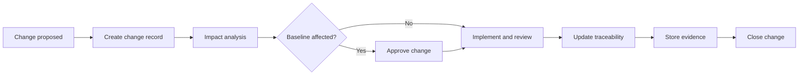

# Document Control and Configuration Management Standard

| Control field | Value |
|---|---|
| Document ID | `ESP32S3-STD-DOC-001` |
| Version | `0.1` |
| Status | Draft |
| Owner / approver | Me |
| Product baseline | Heltec WiFi LoRa 32 V3 / exact revision TBD |
| Target gate | G-A — Phase A baseline approval |
| Change control | Changes after baseline require a recorded change request |
| Evidence rule | A claim is complete only when linked evidence exists |

> **Control note:** `TBD-*` items are not omissions. They are controlled decisions that require an owner, due date, and closure evidence before the applicable gate.


## 1. Objective

Define how engineering records are named, reviewed, approved, changed, and retained. The objective is reproducibility: another competent engineer must be able to determine what was decided, why it was decided, what evidence supported it, and which product baseline used it.

## 2. Identification rules

Each controlled document uses a unique ID:

```text
ESP32S3-<TYPE>-<AREA>-<SEQUENCE>
```

Examples:

- `ESP32S3-PA-A1.1`
- `ESP32S3-REQ-FR-BOOT-001`
- `ESP32S3-TEST-AT-OTA-003`
- `ESP32S3-RISK-R-007`
- `ESP32S3-DEC-012`

## 3. Versioning

| Change | Version action |
|---|---|
| Draft iteration before approval | Increment minor draft version: 0.1, 0.2 |
| First approval | 1.0 |
| Backward-compatible clarification | 1.1 |
| Requirement, interface, or behavior change | 2.0 |
| Typographic correction with no semantic effect | Patch commit only; version may remain |

## 4. Required front matter

Every controlled Markdown document shall identify its document ID, title, version, status, owner, approver, creation date, target gate, product baseline, and toolchain baseline.

## 5. Review records

Reviews shall record:

- Review date.
- Reviewed version or commit.
- Reviewer.
- Finding ID.
- Severity: Critical, Major, Minor, Editorial.
- Resolution.
- Closure evidence.
- Approval decision.

Because the project has one owner, self-review shall be separated from authorship by a deliberate review pass and checklist. Critical security or electrical decisions should obtain independent review when available; lack of independent review is itself a recorded risk.

## 6. Change-control workflow



## 7. Naming conventions

Evidence file names:

```text
<date>_<work-package>_<test-or-topic>_<board-serial>_<result>.<ext>
```

Example:

```text
2026-08-14_A3.2_AT-PWR-001_HV3-0001_PASS.csv
```

## 8. Repository controls

- Markdown is UTF-8.
- Source files use LF line endings unless the toolchain requires otherwise.
- Binary evidence is not edited after capture; corrections create a new file.
- Secrets, production keys, private certificates, and personal data are never committed.
- Commit messages include the WBS or artifact ID.
- Baseline tags follow `phase-a-v1.0`, `phase-b-v1.0`, etc.

## 9. Exit criteria

This standard is effective when all Phase A documents use the required metadata, naming, review, and evidence practices.
