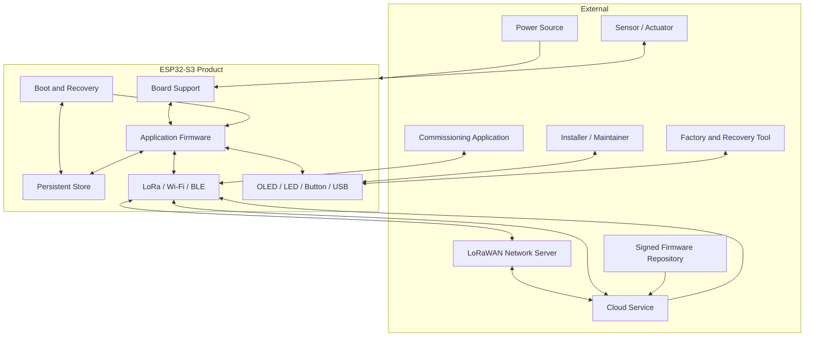

# System Context Diagram

| Control field | Value |
|---|---|
| Document ID | `ESP32S3-DIAG-CTX-001` |
| Version | `0.1` |
| Status | Draft |
| Owner / approver | Me |
| Product baseline | Heltec WiFi LoRa 32 V3 / exact revision TBD |
| Target gate | G-A — Phase A baseline approval |
| Change control | Changes after baseline require a recorded change request |
| Evidence rule | A claim is complete only when linked evidence exists |

> **Control note:** `TBD-*` items are not omissions. They are controlled decisions that require an owner, due date, and closure evidence before the applicable gate.

## Review questions

- Is every external actor shown?
- Does every arrow correspond to an interface record?
- Are factory and field paths distinct?
- Is update authority represented correctly?
- Are trust boundaries present in A1.3?
