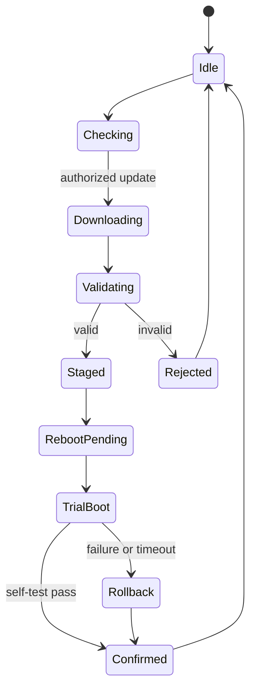

# A1.1 — Product Concept

| Control field | Value |
|---|---|
| Document ID | `ESP32S3-PA-A1.1` |
| Version | `0.1` |
| Status | Draft |
| Owner / approver | Me |
| Product baseline | Heltec WiFi LoRa 32 V3 / exact revision TBD |
| Target gate | G-A — Phase A baseline approval |
| Change control | Changes after baseline require a recorded change request |
| Evidence rule | A claim is complete only when linked evidence exists |

> **Control note:** `TBD-*` items are not omissions. They are controlled decisions that require an owner, due date, and closure evidence before the applicable gate.

## 1. Product thesis

The product is a maintainable ESP32-S3 edge node that acquires application-specific data, applies bounded local processing, preserves essential state across resets, and exchanges telemetry and authorized commands through defined communications paths.

### Reference positioning

- **Primary communications candidate:** LoRaWAN.
- **Provisioning/maintenance candidates:** Wi-Fi, BLE, USB.
- **Local UI candidates:** OLED, LED, button, serial console.
- **Power model:** battery, USB, or regulated external supply; final source is `TBD-PROD-001`.
- **Application payload:** `TBD-PROD-002`.
- **Target deployment environment:** `TBD-PROD-003`.

This thesis is a baseline candidate, not a final product claim.

## 2. Product principles

1. Safe recovery is part of normal product behavior.
2. No remote command is trusted merely because it was received.
3. Power and memory are budgets, not afterthoughts.
4. Factory, field, and developer modes are intentionally separated.
5. A failed update shall not permanently remove the recovery path.
6. Diagnostics shall support root-cause analysis without exposing secrets.
7. Board-specific behavior shall be isolated behind a board-support contract.

## 3. Users and stakeholders

| ID | Role | Goal | Primary interactions | Failure concern |
|---|---|---|---|---|
| USR-001 | Installer | Install and commission correctly | Power, antenna, mobile/USB provisioning | Ambiguous status or incorrect credentials |
| USR-002 | Operator | Obtain reliable service | Normal telemetry and alerts | Silent data loss |
| USR-003 | Maintainer | Diagnose and restore service | Logs, reset, replacement, update | No recovery path |
| USR-004 | Factory technician | Program and verify units | Fixture, serial, test commands | Wrong identity or incomplete test |
| USR-005 | Service administrator | Manage devices and credentials | Network server, cloud, fleet tooling | Unauthorized device or stale credential |
| USR-006 | Firmware engineer | Build, debug, release | ESP-IDF, USB/JTAG/serial, CI | Irreproducible build |
| USR-007 | Security owner | Control trust and release | Keys, signing, threat records | Key compromise or unsigned code |

## 4. Operating environment

| Attribute | Baseline candidate | Closure |
|---|---|---|
| Indoor/outdoor | TBD-PROD-003 | Product decision |
| Ambient temperature | TBD-ENV-001 °C to TBD-ENV-002 °C | Requirement and test |
| Humidity | TBD-ENV-003 %RH; condensation policy TBD | Requirement |
| Ingress protection | Enclosure-dependent; TBD-ENV-004 | Mechanical requirement |
| Vibration/shock | TBD-ENV-005 | Deployment analysis |
| RF region | TBD-REG-001 | Regulatory decision |
| Gateway availability | Intermittent connectivity shall be assumed | Scenario validation |
| Wi-Fi availability | Optional unless explicitly required | Product decision |
| Service access | Local access may be unavailable after installation | Recovery strategy |
| EMC environment | TBD-ENV-006 | Regulatory checklist |

## 5. Installation concept

1. Verify product and antenna variant.
2. Inspect enclosure and connectors.
3. Mount with specified orientation and clearance.
4. Connect antenna before RF transmission.
5. Connect approved power source.
6. Enter commissioning mode.
7. Assign device identity and provision credentials.
8. Verify local status.
9. Perform network join and test transmission.
10. Record installation evidence and location identifier.
11. Exit commissioning mode and lock maintenance access as required.

### Installation decisions

| ID | Decision | Options | Due |
|---|---|---|---|
| TBD-INST-001 | Mounting method | DIN rail / wall / enclosure / integrated | Before A2 baseline |
| TBD-INST-002 | Antenna type and connector | Integrated / external | Before RF testing |
| TBD-INST-003 | Commissioning tool | Mobile / web / USB CLI / factory pre-provision | Before A3.2 |
| TBD-INST-004 | Installer acceptance test | Local-only / network-confirmed | Before A2.4 |

## 6. Power concept

The firmware shall be designed around explicit power states rather than implicit idling.

| State | Intent | Radios | Display | Persistent write policy |
|---|---|---|---|---|
| OFF | No operation | Off | Off | None |
| BOOT | Validate and initialize | As needed | Minimal | Recovery metadata only |
| ACTIVE | Acquire/process | Controlled | On if required | Buffered |
| TX/RX | Communicate | One or more active | Optional | Session metadata |
| MAINTENANCE | Provision/diagnose/update | As required | Status | Controlled |
| LIGHT SLEEP | Fast wake | Config-dependent | Off | None |
| DEEP SLEEP | Lowest product power | Off | Off | Pre-commit essential state |
| FAULT | Bounded degraded behavior | Minimum required | Fault indication | Diagnostic record |

Numeric power targets are defined in A2.2 and validated in A3.1/A3.2.

## 7. Connectivity concept

| Interface | Product role | Default availability | Security expectation |
|---|---|---|---|
| LoRaWAN | Telemetry and bounded commands | Field | Network and application-layer controls as required |
| Wi-Fi STA | Provisioning, diagnostics, HTTPS OTA | Maintenance window | Authenticated network and TLS |
| BLE | Optional local provisioning | Time-limited | Authenticated commissioning policy |
| USB | Factory, development, recovery | Physical access | Mode- and lifecycle-controlled |
| UART | Debug or peripheral | Internal | Disabled/restricted in production as required |
| I²C/SPI/GPIO | Sensors, OLED, SX1262, controls | Internal | Electrical and software bounds |
| OLED/LED/button | Local status and action | Product-dependent | No secret display |

## 8. UI concept

The UI shall communicate state, not internal implementation detail.

| UI state | Required information |
|---|---|
| Unprovisioned | Commissioning required |
| Joining | Network attempt in progress |
| Operational | Healthy state without excessive power cost |
| Degraded | Service reduced; diagnostic code available |
| Updating | Do not remove power unless recovery permits |
| Recovery | Local intervention path |
| Factory test | Explicit non-field mode |
| Security lockout | Authorized service required |

## 9. Maintenance and lifecycle

- Device identification shall remain readable after firmware failure.
- Field logs shall use stable event IDs.
- Factory reset behavior shall distinguish configuration reset from identity destruction.
- Credential rotation shall be defined.
- Firmware compatibility shall be versioned.
- Update support lifetime is `TBD-LIFE-001`.
- Spare/replacement procedure is `TBD-LIFE-002`.
- Decommissioning shall remove or invalidate credentials.
- Service tools shall report firmware, hardware revision, reset reason, and configuration schema version.

## 10. Update strategy

### Candidate policy

- Signed application images.
- HTTPS or controlled local transport.
- Inactive-slot write.
- Image validation before activation.
- First-boot self-test.
- Explicit image confirmation.
- Automatic rollback on failed confirmation.
- Anti-rollback policy based on product security decision.
- Recovery through USB or approved bootloader path.
- Update audit event without exposing credentials.

### Update lifecycle states

## 11. Primary use cases

| ID | Use case | Primary actor | Success outcome |
|---|---|---|---|
| UC-001 | Manufacture and program device | Factory technician | Correct image, identity, configuration, test result |
| UC-002 | Commission a new device | Installer | Device bound to intended service |
| UC-003 | Join LoRaWAN network | Device | Authenticated network session |
| UC-004 | Acquire application data | Device | Valid timestamped sample |
| UC-005 | Transmit telemetry | Device | Payload accepted or retained for retry |
| UC-006 | Receive authorized command | Administrator | Command validated and executed once |
| UC-007 | Enter low-power state | Device | Energy reduced without losing essential state |
| UC-008 | Wake and resume operation | Device | Correct reason and retained state |
| UC-009 | Diagnose a fault | Maintainer | Actionable fault evidence obtained |
| UC-010 | Perform OTA update | Administrator | New image confirmed |
| UC-011 | Recover from interrupted update | Device/maintainer | Known-good image restored |
| UC-012 | Recover storage | Device/maintainer | Valid configuration or controlled reset |
| UC-013 | Factory reset | Maintainer | Defined data classes erased |
| UC-014 | Replace/decommission device | Administrator | Service continuity and credential invalidation |

## 12. Product exclusions

Unless later approved, the product does not promise:

- Continuous cloud connectivity.
- Safety-critical control.
- Medical use.
- Always-on display.
- Unbounded offline storage.
- Arbitrary remote shell access.
- Field access to production signing keys.
- Guaranteed RF range without deployment qualification.

## 13. Open decisions

| ID | Decision | Owner | Required by | Status |
|---|---|---|---|---|
| TBD-PROD-001 | Primary power source | Me | A2.2 | Open |
| TBD-PROD-002 | Sensor/payload definition | Me | A2.1 | Open |
| TBD-PROD-003 | Deployment environment | Me | A2.2 | Open |
| TBD-REG-001 | LoRaWAN region(s) | Me | A2.3/A3.2 | Open |
| TBD-SEC-001 | Secure boot and flash-encryption production policy | Me | A3.3 | Open |
| TBD-UX-001 | Required local UI elements | Me | A2.1 | Open |

## 14. Evidence

- Approved use-case list.
- Product decision log.
- Reviewed product concept.
- Links to board and platform references.
- Review findings and closure record.

## 15. Exit checklist

- [ ] Users and stakeholders reviewed.
- [ ] Operating environment defined or controlled TBDs accepted.
- [ ] Installation concept reviewed.
- [ ] Power and connectivity concepts reviewed.
- [ ] UI, maintenance, recovery, and update concepts reviewed.
- [ ] Primary use cases uniquely identified.
- [ ] Product exclusions agreed.
- [ ] Open decisions have owners and dates.
- [ ] Review evidence linked.
