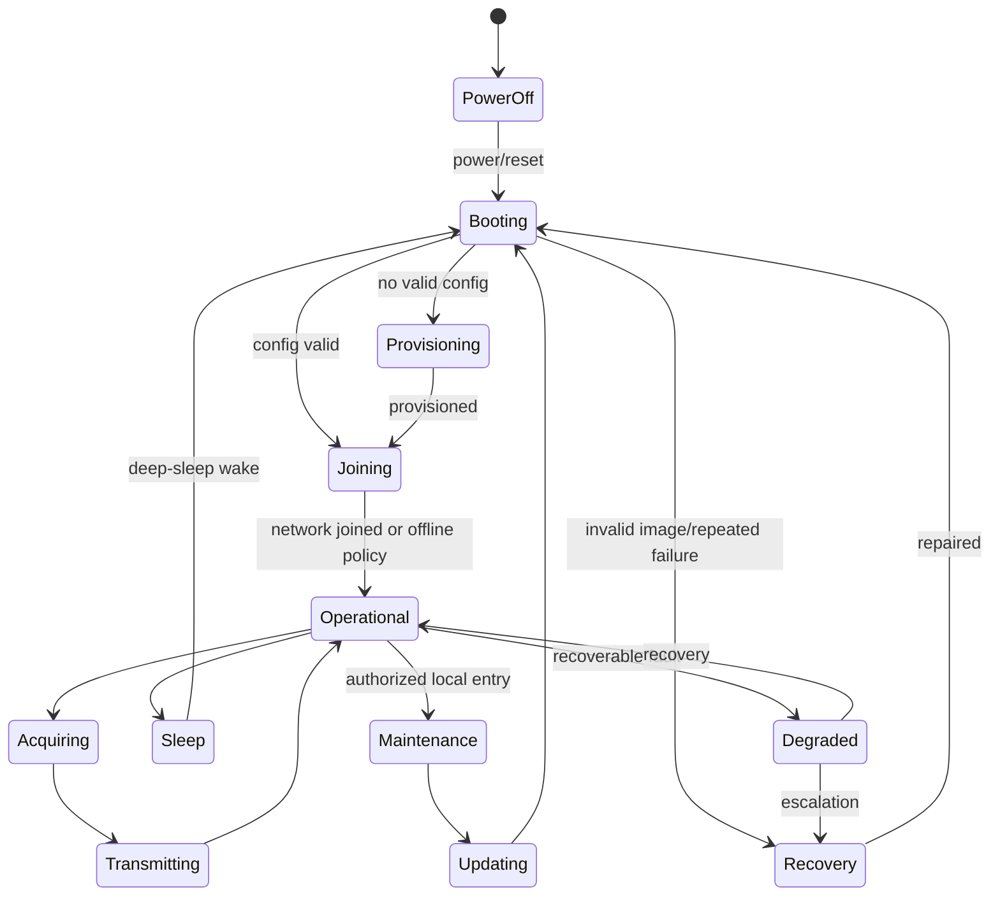

# A1.2 — Operating Scenario Catalogue

| Control field | Value |
|---|---|
| Document ID | `ESP32S3-PA-A1.2` |
| Version | `0.1` |
| Status | Draft |
| Owner / approver | Me |
| Product baseline | Heltec WiFi LoRa 32 V3 / exact revision TBD |
| Target gate | G-A — Phase A baseline approval |
| Change control | Changes after baseline require a recorded change request |
| Evidence rule | A claim is complete only when linked evidence exists |

> **Control note:** `TBD-*` items are not omissions. They are controlled decisions that require an owner, due date, and closure evidence before the applicable gate.

## 1. Purpose

Define system behavior in normal, degraded, abnormal, and recovery conditions. Scenarios are upstream sources for functional requirements and acceptance tests.

## 2. Scenario record schema

| Field | Rule |
|---|---|
| Scenario ID | Immutable `SCN-N-*`, `SCN-A-*`, or `SCN-R-*` |
| Initial state | Named state from the state model |
| Trigger | Observable initiating condition |
| Preconditions | Required state, configuration, authorization, power, network |
| Main flow | Ordered behavior |
| Alternate flow | Valid non-primary outcome |
| Timeout | Numeric or controlled TBD |
| Retry policy | Count, backoff, and terminal behavior |
| Output | Data, UI, log, response, state transition |
| Recovery | Automatic, degraded, rollback, local service, factory |
| Diagnostics | Stable event IDs and retained evidence |
| Trace | Use case and requirement IDs |
| Verification | Planned test or demonstration |

## 3. Product state model

## 4. Normal scenarios

| ID | Scenario | Initial state | Trigger | Required behavior | Success outcome |
|---|---|---|---|---|---|
| SCN-N-001 | Power-on boot | OFF | Power applied | Validate image, initialize minimum platform, classify reset, enter intended state | Operational/provisioning/fault state |
| SCN-N-002 | First-time provisioning | UNPROVISIONED | Authorized local request | Accept validated product configuration and credentials | Provisioned identity and audit event |
| SCN-N-003 | LoRaWAN join | NETWORK_JOIN | Join policy triggers | Perform activation with bounded retries/backoff | Session established or degraded state |
| SCN-N-004 | Data acquisition | ACTIVE | Schedule or event | Power sensor, sample, validate, timestamp, queue | Valid sample or diagnostic |
| SCN-N-005 | Telemetry uplink | TX | Queue and policy allow | Encode versioned payload and transmit | Ack/status retained as policy requires |
| SCN-N-006 | Authorized downlink | RX | Command received | Authenticate, authorize, deduplicate, validate, execute | Result event and response if supported |
| SCN-N-007 | Deep sleep | ACTIVE | No blocking work | Commit essential state, configure wake sources, power down | Deep-sleep entry |
| SCN-N-008 | Wake resume | DEEP_SLEEP | Timer/GPIO/other wake | Record wake cause and resume correct workflow | Operational state |
| SCN-N-009 | Local maintenance | OPERATIONAL | Authorized service entry | Expose bounded diagnostics/config/update functions | Service completed and mode exited |
| SCN-N-010 | OTA update | OPERATIONAL | Authorized update | Download, validate, stage, trial boot, confirm | Confirmed new image or rollback |

## 5. Abnormal and degraded scenarios

| ID | Scenario | Detection | Required recovery policy |
|---|---|---|---|
| SCN-A-001 | Invalid application image | Boot validation fails | Boot known-good slot or recovery; never execute untrusted image |
| SCN-A-002 | Boot loop | Reset threshold exceeded | Enter diagnosed recovery/degraded mode |
| SCN-A-003 | NVS corrupt | Storage initialization or CRC/schema fails | Recover known data, migrate, or controlled reset by data class |
| SCN-A-004 | Sensor timeout | Peripheral response exceeds limit | Retry bounded times; mark sample invalid; continue degraded |
| SCN-A-005 | LoRaWAN join fails | Retry budget exhausted | Exponential backoff and offline operation |
| SCN-A-006 | Uplink fails | MAC/network failure | Retain/drop according to data priority and queue budget |
| SCN-A-007 | Wi-Fi authentication fails | Connection denied | Do not expose secret; retry policy; return to safe mode |
| SCN-A-008 | TLS validation fails | Certificate/hostname/time invalid | Reject connection and update; log stable reason |
| SCN-A-009 | OTA interrupted | Transport or power loss | Preserve running image; resume/restart safely |
| SCN-A-010 | Trial image fails | Self-test/reset/timeout | Rollback and retain diagnostic |
| SCN-A-011 | Brownout during flash write | Voltage unsafe | Abort if detectable; recover transactionally on next boot |
| SCN-A-012 | Watchdog reset | Task or interrupt stalls | Record cause; bounded restart; escalate repeated fault |
| SCN-A-013 | Low battery | Voltage/SoC threshold crossed | Reduce workload, report, avoid destructive writes |
| SCN-A-014 | Unauthorized command | Authentication/authorization fails | Reject without side effect; rate-limit/audit |
| SCN-A-015 | Replay command | Nonce/counter/version duplicate | Reject exactly-once operation |
| SCN-A-016 | Queue full | Storage/RAM budget exhausted | Apply priority/age policy; record data loss |
| SCN-A-017 | Invalid RTC time | Time not trustworthy | Mark timestamp quality; defer certificate-sensitive action if needed |
| SCN-A-018 | Sleep entry blocked | Lock or peripheral active | Report blocker; bounded fallback |
| SCN-A-019 | Unexpected wake | Wake cause invalid/noise | Debounce/rate-limit and return to sleep |
| SCN-A-020 | Factory mode exposed | Field boot enters factory path | Require lifecycle authorization; exit safely |

## 6. Recovery classes

| Class | Description | Examples |
|---|---|---|
| RC-1 Retry | Immediate bounded retry | Transient bus failure |
| RC-2 Backoff | Retry after increasing delay | LoRaWAN join failure |
| RC-3 Degraded | Continue reduced service | One sensor unavailable |
| RC-4 Restart | Controlled software restart | Recoverable subsystem deadlock |
| RC-5 Rollback | Restore known-good software/data | Failed OTA trial |
| RC-6 Local recovery | Physical service required | Credential or flash issue |
| RC-7 Factory reset | Erase defined customer configuration | Irrecoverable configuration |
| RC-8 Permanent fault | Stop unsafe/untrusted operation | No valid signed image |

## 7. Cross-cutting behavior

### Retry

Retries shall be bounded. Retry counters, time windows, jitter, and terminal state are requirements, not implementation defaults.

### Logging

Logs use stable event IDs and severity. Secrets, full credentials, private keys, and sensitive payloads are prohibited.

### State persistence

Before reset or sleep, only essential state is committed. Persistent writes shall be rate-limited and transactionally recoverable.

### Repeated-fault escalation

Repeated resets or failures within a defined window shall escalate from retry to degraded or recovery mode.

## 8. Scenario completeness matrix

| Coverage area | Normal | Abnormal | Recovery |
|---|---:|---:|---:|
| Boot and image selection | Yes | Yes | Yes |
| Provisioning and identity | Yes | Yes | Yes |
| Sensor/peripheral | Yes | Yes | Yes |
| LoRaWAN | Yes | Yes | Yes |
| Wi-Fi/TLS | Maintenance | Yes | Yes |
| OTA | Yes | Yes | Yes |
| Storage | Normal persistence | Yes | Yes |
| Sleep/wake | Yes | Yes | Yes |
| Factory/service | Yes | Yes | Yes |
| Security commands | Yes | Yes | Yes |

## 9. Open scenario decisions

- `TBD-SCN-001`: Maximum boot-loop count and time window.
- `TBD-SCN-002`: Offline queue retention and drop policy.
- `TBD-SCN-003`: Join retry schedule.
- `TBD-SCN-004`: Command deduplication window.
- `TBD-SCN-005`: Factory-reset data classes.
- `TBD-SCN-006`: Maximum allowed wake storm rate.

## 10. Exit checklist

- [ ] Each use case has one or more scenarios.
- [ ] Each major failure has a detection mechanism.
- [ ] Each abnormal scenario has a terminal behavior.
- [ ] Timeouts/retries are numeric or controlled TBDs.
- [ ] Recovery preserves security boundaries.
- [ ] Diagnostics and evidence are identified.
- [ ] Scenarios are traced into A2.1.
