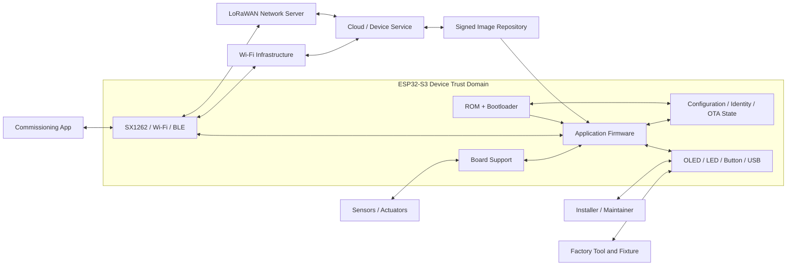

# A1.3 — System Context, Product Boundaries and Trust Boundaries

| Control field | Value |
|---|---|
| Document ID | `ESP32S3-PA-A1.3` |
| Version | `0.1` |
| Status | Draft |
| Owner / approver | Me |
| Product baseline | Heltec WiFi LoRa 32 V3 / exact revision TBD |
| Target gate | G-A — Phase A baseline approval |
| Change control | Changes after baseline require a recorded change request |
| Evidence rule | A claim is complete only when linked evidence exists |

> **Control note:** `TBD-*` items are not omissions. They are controlled decisions that require an owner, due date, and closure evidence before the applicable gate.

## 1. System of interest

The system of interest is the field device including the ESP32-S3 application firmware, approved bootloader configuration, board support, local persistent data, communications adapters, diagnostics, and update/recovery behavior.

## 2. Context diagram

## 3. Responsibility matrix

| Responsibility | Application | Bootloader | Cloud/LNS | Mobile/service tool | Factory tool |
|---|---|---|---|---|---|
| Sensor acquisition | Primary | None | Consume | Diagnose | Test |
| Product state machine | Primary | Boot-only | Observe/control within API | Observe | Test |
| Image selection | Support/confirm | Primary | Publish policy | Initiate if authorized | Program/recover |
| Image authenticity | Verify through platform API | Enforce boot policy | Sign/publish | None | Verify/program |
| Configuration schema | Primary | Minimal compatibility data | Store desired state | Edit authorized fields | Seed defaults |
| Device identity | Use/protect | Preserve lifecycle | Register/authorize | Bind | Provision |
| LoRaWAN session | Primary | None | Network side | Configure | Test |
| Diagnostics | Produce/redact | Boot/reset reason | Collect | Display | Capture |
| Factory reset | Execute policy | Preserve recovery | Revoke/rebind | Authorize/initiate | Restore |
| Recovery | Participate | Primary safe path | Provide image/config | Local steps | Full recovery |

One row shall not have two primary owners.

## 4. Product boundary decisions

### Inside device product boundary

- Firmware and approved boot configuration.
- Device configuration, identity reference, counters, and logs.
- Board-support behavior.
- Local UI and service interface.
- Communications protocol adapters.
- Update, rollback, reset, and recovery logic.

### Outside product boundary

- LoRaWAN network availability.
- Gateway placement.
- Cloud service uptime.
- Mobile OS behavior.
- External sensor accuracy unless supplied as part of the product.
- Power quality beyond specified limits.
- Regulatory authorization outside approved region configuration.

## 5. Trust boundaries

| ID | Boundary | Threat focus | Required control direction |
|---|---|---|---|
| TB-001 | Device ↔ LoRaWAN network | Spoofing, replay, command abuse | Session security, counters, authorization |
| TB-002 | Device ↔ Wi-Fi/Internet | MITM, malicious endpoint | TLS, certificate/time policy |
| TB-003 | Device ↔ Mobile app | Unauthorized provisioning | Authenticated, time-limited commissioning |
| TB-004 | Device ↔ Factory tool | Identity/key exposure | Controlled fixture and lifecycle state |
| TB-005 | Bootloader ↔ Application | Untrusted image | Signature verification and rollback policy |
| TB-006 | Application ↔ Persistent store | Corruption, rollback, secret exposure | Schema/version, encryption policy, atomic updates |
| TB-007 | Device ↔ Physical user | Debug/service abuse | Access policy, production lock-down |
| TB-008 | Cloud ↔ Image repository | Supply-chain tampering | Signed artifacts, hash, release authorization |

## 6. Data classes

| Class | Examples | Confidentiality | Integrity | Retention |
|---|---|---|---|---|
| D1 Public | Firmware version, product model | Low | Medium | Product lifetime |
| D2 Operational | Telemetry, status | Product-specific | High | Policy-defined |
| D3 Configuration | Sampling, endpoints, region | Medium | High | Until reset/change |
| D4 Credentials | Wi-Fi, LoRaWAN keys, tokens | Critical | Critical | Controlled lifecycle |
| D5 Security state | anti-rollback, counters, trust anchors | High | Critical | Product lifetime |
| D6 Diagnostics | reset reasons, faults | Medium | High | Bounded ring/history |
| D7 Factory | serial, calibration, manufacturing result | Medium | Critical | Product lifetime |

## 7. External interface inventory

| Interface ID | Interface | Owner | Direction | Specification location |
|---|---|---|---|---|
| IF-HW-001 | Sensor/peripheral electrical interface | BSP | Bidirectional | A2.3 |
| IF-RF-001 | LoRa/SX1262 | Radio adapter | Bidirectional | A2.3 |
| IF-NET-001 | LoRaWAN application payload | App/Cloud | Bidirectional | A2.3 |
| IF-NET-002 | Wi-Fi/TLS service | App/Cloud | Bidirectional | A2.3 |
| IF-LOC-001 | BLE provisioning | App/Mobile | Bidirectional | A2.3 |
| IF-SVC-001 | USB/serial service | App/Tool | Bidirectional | A2.3 |
| IF-OTA-001 | OTA manifest and image | App/Repository | Inbound | A2.3 |
| IF-MFG-001 | Factory programming/test | Factory | Bidirectional | A2.3 |
| IF-DATA-001 | Persistent schema | App/Boot | Internal | A2.3 |

## 8. Boundary acceptance checks

- No cloud responsibility is silently assigned to firmware.
- No bootloader responsibility is duplicated in the application.
- Factory-only capability has a lifecycle restriction.
- Recovery remains available after application failure.
- Every external data flow crosses an identified trust boundary.
- Every interface has one specification owner.

## 9. Exit checklist

- [ ] Exact external actors identified.
- [ ] Product boundary approved.
- [ ] Responsibility matrix has one primary owner per row.
- [ ] Trust boundaries and data classes reviewed.
- [ ] Interface inventory complete.
- [ ] Out-of-scope items explicit.
- [ ] Diagram source committed.
