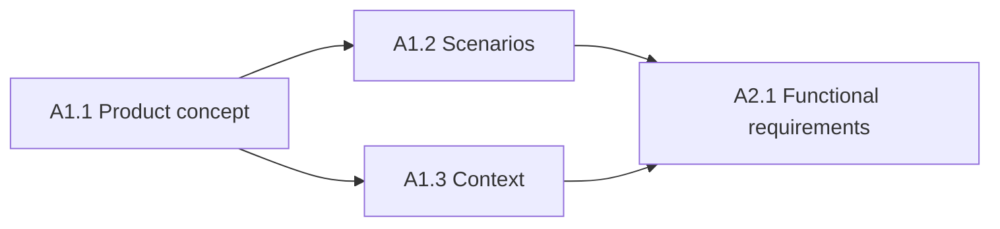

# A1 — Product Concept Definition

| Control field | Value |
|---|---|
| Document ID | `ESP32S3-PA-A1` |
| Version | `0.1` |
| Status | Draft |
| Owner / approver | Me |
| Product baseline | Heltec WiFi LoRa 32 V3 / exact revision TBD |
| Target gate | G-A — Phase A baseline approval |
| Change control | Changes after baseline require a recorded change request |
| Evidence rule | A claim is complete only when linked evidence exists |

> **Control note:** `TBD-*` items are not omissions. They are controlled decisions that require an owner, due date, and closure evidence before the applicable gate.

## Objective

Establish a shared and testable understanding of the product before detailed requirements are written.

## Work packages

| ID | Work package | Primary output |
|---|---|---|
| A1.1 | Product concept | Product concept and use-case baseline |
| A1.2 | Operating scenarios | Normal, abnormal, degraded, and recovery catalogue |
| A1.3 | System context | Boundaries, responsibilities, trust zones, external actors |

## Execution sequence

## Concept quality rules

- Describe user value before implementation.
- Separate product behavior from architecture.
- Treat failure and maintenance behavior as first-class product behavior.
- Declare assumptions visibly.
- Assign every responsibility to one system element.
- Define what the product will not do.
- Use measurable language or controlled TBDs.

## Cluster exit criteria

- Primary users and use cases are identified.
- Operating modes and recovery behavior are defined.
- External systems and trust boundaries are visible.
- No major responsibility is ambiguous.
- Inputs are sufficient to write testable functional requirements.
