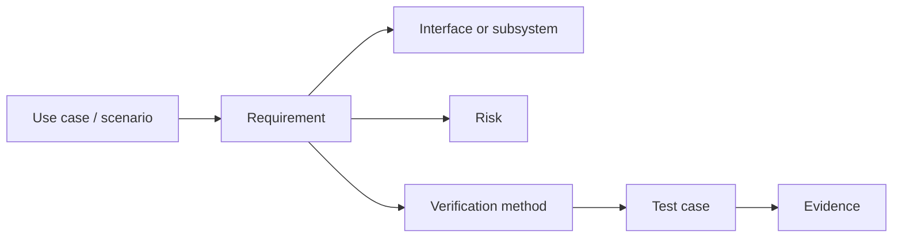

# A2 — Requirements Engineering

| Control field | Value |
|---|---|
| Document ID | `ESP32S3-PA-A2` |
| Version | `0.1` |
| Status | Draft |
| Owner / approver | Me |
| Product baseline | Heltec WiFi LoRa 32 V3 / exact revision TBD |
| Target gate | G-A — Phase A baseline approval |
| Change control | Changes after baseline require a recorded change request |
| Evidence rule | A claim is complete only when linked evidence exists |

> **Control note:** `TBD-*` items are not omissions. They are controlled decisions that require an owner, due date, and closure evidence before the applicable gate.

## Objective

Transform the approved product concept into uniquely identified, measurable, feasible, traceable, and verifiable requirements and interfaces.

## Work packages

| ID | Work package | Output |
|---|---|---|
| A2.1 | Functional requirements | Observable system behavior |
| A2.2 | Non-functional requirements | Numeric performance and quality budgets |
| A2.3 | Interface control | External/internal contracts and failure behavior |
| A2.4 | Traceability | Source-to-test coverage and acceptance catalogue |

## Requirements lifecycle

## Review dimensions

- Correctness and necessity.
- Unambiguous wording.
- Completeness and consistency.
- Feasibility on the target platform.
- Verification cost and method.
- Security and safety implications.
- Backward compatibility and lifecycle effects.
- Manufacturing and recovery coverage.

## Cluster exit criteria

- Every requirement has an immutable ID.
- Every requirement has a source.
- Every requirement has a verification method.
- NFRs use numeric targets or controlled closure actions.
- Interfaces define ownership, limits, errors, recovery, and security.
- The RTM contains no orphan requirement.
