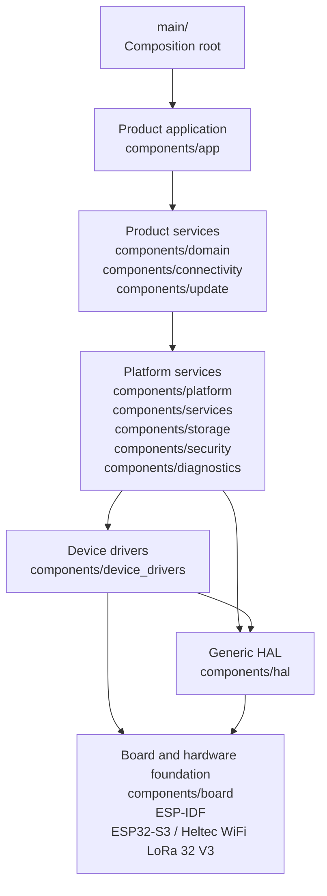

# C1.1 System Architecture: Firmware Layers, Component Groups and Dependency Direction

## Purpose

C1.1 establishes the top-level firmware architecture that all later
Cluster C and Cluster D work packages must follow.

It defines:

- Firmware layers.
- Component groups assigned to those layers.
- Permitted dependency direction.
- Forbidden dependency bypasses.
- The component-group diagram used by later interface and implementation
  work.

The governing completion criterion is:

> Layering prevents product logic from bypassing platform abstractions.

## Scope

### In scope

C1.1 defines:

- Product-application, product-services, platform-services,
  hardware-abstraction, and board/hardware-foundation layers.
- Placement of existing and planned firmware component groups.
- Direction of compile-time and runtime dependencies.
- The boundary that contains raw ESP-IDF and hardware access.
- A component-group diagram.
- Dependency controls that later CMake and CI checks must enforce.

### Out of scope

The following are deferred to their owning work packages:

- Exact APIs, inputs, outputs, mutable-resource ownership, threading,
  initialization, shutdown and error contracts: C1.2.
- Architecture decision records and final review of circular or
  overlapping responsibilities: C1.3.
- Pin assignments, active levels and board revision details: C2.1.
- HAL and device-driver implementation: C3.
- Startup sequencing, service-result models and safe-mode behavior: C5.
- Task priorities, queues, events, timers and watchdog liveness: C6.
- Storage, diagnostics and security implementation details: C7 and C8.

C1.1 fixes architectural placement and dependency direction. It does not
pre-empt detailed contracts owned by later work packages.

## Architecture principles

1. Product behavior is separated from reusable platform capability.
2. Dependencies point downward toward hardware.
3. Lower layers never depend on higher layers.
4. Product logic never accesses raw ESP-IDF peripheral APIs.
5. Board-specific facts remain isolated in `components/board`.
6. Hardware access is contained by HAL and device-driver components.
7. Dependencies are declared through ESP-IDF component CMake metadata.
8. Same-level dependencies are prohibited by default and require an
   approved C1.3 architecture decision when unavoidable.
9. Generated or cross-cutting metadata must not become a path for
   hardware or product-layer bypass.
10. Exact interface and resource-ownership decisions are completed in
    C1.2.

## Layer model

```text
┌──────────────────────────────────────────────────────────────┐
│ 1. Product application                                      │
│    Product orchestration and top-level product state         │
├──────────────────────────────────────────────────────────────┤
│ 2. Product services                                         │
│    Domain behavior, connectivity and update workflows        │
├──────────────────────────────────────────────────────────────┤
│ 3. Platform services                                        │
│    Reusable runtime, storage, security and diagnostics       │
├──────────────────────────────────────────────────────────────┤
│ 4. Hardware abstraction                                     │
│    4A. Device drivers                                       │
│    4B. Generic HAL                                          │
├──────────────────────────────────────────────────────────────┤
│ 5. Board and hardware foundation                            │
│    Board facts, ESP-IDF, ESP32-S3 and physical peripherals   │
└──────────────────────────────────────────────────────────────┘
```

Layer 4 contains two ordered sublayers. Device drivers may depend on the
generic HAL. The generic HAL must not depend on device drivers.

## Component-group diagram



The arrows show permitted architectural dependency direction. They do
not define exact component-to-component APIs; those are specified in
C1.2.

A platform service may depend directly on the generic HAL when no
device-specific driver exists, but product layers may not bypass platform
services to reach either drivers or HAL.

## Component-group placement

| Path or group | Layer | Status | Architectural responsibility |
|---|---|---|---|
| `main/` | Composition root | Existing | Minimal ESP-IDF entry point that starts the product application |
| `components/app` | Product application | Existing | Product orchestration and top-level product-state coordination |
| `components/domain` | Product services | Planned | Product rules, validated domain models and product decisions |
| `components/connectivity` | Product services | Existing | Wi-Fi, BLE, LoRaWAN and cloud-session workflows |
| `components/update` | Product services | Existing | OTA workflow, trial-image coordination and update policy |
| `components/platform` | Platform services | Existing | Board-independent platform façade and lifecycle abstractions |
| `components/services` | Platform services | Existing | Reusable runtime services and service coordination |
| `components/storage` | Platform services | Existing | Persistent configuration, operational state and filesystem services |
| `components/security` | Platform services | Existing | Identity, credentials, cryptographic services and secure-state access |
| `components/diagnostics` | Platform services | Existing | Logging, health information, fault capture and diagnostic services |
| `components/device_drivers` | Hardware abstraction, device-driver sublayer | Planned | Sensor, actuator, LED, button, OLED, SX1262 and battery drivers |
| `components/hal` | Hardware abstraction, generic-HAL sublayer | Planned | GPIO, I2C, SPI, UART, ADC, PWM, timer and power abstractions |
| `components/board` | Board and hardware foundation | Existing | Board pins, revision facts, safe board initialization and self-test |
| `components/build_metadata` | Controlled cross-cutting leaf | Existing | Read-only source, build and toolchain provenance |

`components/board` remains the sole board-support component. A separate
BSP directory is not introduced.

Product-level authorization and failure policy belong in product
application or domain components. `components/security` provides reusable
security capability and is not duplicated at multiple layers.

## Dependency-direction contract

### Composition root

`main/` is not a product-logic component.

It may:

- Emit controlled build metadata.
- Invoke the product-application startup entry point.

It must not directly initialize drivers, storage, networking, security,
board peripherals or product workflows.

### Product application

`components/app` may depend on product-service interfaces.

It must not depend directly on:

- Platform-service implementation details.
- HAL interfaces.
- Device-driver interfaces.
- Board headers.
- Raw ESP-IDF APIs or peripheral registers.

### Product services

Product services may depend on platform-service interfaces.

They must not depend directly on:

- HAL implementations.
- Device drivers.
- Board pin definitions.
- Raw ESP-IDF peripheral APIs.

Product services contain product workflows and policy, not reusable
hardware-access mechanisms.

### Platform services

Platform services may depend on device-driver or generic-HAL interfaces.

They must not:

- Encode product-specific states or product policy.
- Include board pin numbers directly.
- Use raw peripheral registers.
- Call product services or product-application logic.

Exact service-to-service dependencies are defined and reviewed under
C1.2 and C1.3.

### Device drivers

Device drivers may depend on generic-HAL interfaces, board definitions
and narrowly required ESP-IDF device facilities.

They must not:

- Depend on platform services.
- Depend on product services.
- Depend on the product application.
- Make product-policy decisions.
- Invoke product callbacks to select recovery or retry policy.

Drivers report hardware outcomes through structured contracts; higher
layers decide product behavior.

### Generic HAL

The generic HAL may depend on board definitions and approved ESP-IDF
peripheral facilities.

It must not:

- Depend on device drivers.
- Depend on platform or product components.
- Contain product-specific policy.
- Expose board pin numbers above the hardware-abstraction boundary.

### Board and hardware foundation

`components/board` contains board-specific facts and board-initialization
boundaries.

Board-specific information includes:

- Pin assignments.
- Active levels.
- Pull configuration.
- Electrical capability.
- Board revision.
- Peripheral availability.

No product or platform component may hard-code those facts.

ESP-IDF, the ESP32-S3 SoC and the physical Heltec board form the external
foundation below the controlled firmware components.

## Allowed and forbidden dependency examples

| Source | Target | Result | Reason |
|---|---|---|---|
| `app` | Product-service interface | Allowed | Normal downward product dependency |
| Product service | Platform-service interface | Allowed | Product workflow uses reusable platform capability |
| Platform service | Device-driver interface | Allowed | Platform capability uses a controlled device abstraction |
| Platform service | Generic-HAL interface | Allowed | No device-specific driver exists for that resource |
| Device driver | Generic-HAL interface | Allowed | Driver uses generic peripheral abstraction |
| HAL or driver | `board` | Allowed | Hardware abstraction consumes board-specific facts |
| `app` | ESP-IDF driver API | Forbidden | Product logic bypasses all abstractions |
| Product service | `board` | Forbidden | Product service bypasses platform and hardware abstraction |
| Product service | Device driver | Forbidden | Product workflow bypasses platform services |
| Platform service | Raw peripheral register | Forbidden | Platform service bypasses hardware abstraction |
| Device driver | Product callback | Forbidden | Lower layer depends upward |
| `board` | Product or platform service | Forbidden | Foundation layer depends upward |
| Any component | Undeclared CMake dependency | Forbidden | Dependency graph becomes invisible and unenforceable |

## Same-level and cross-cutting dependencies

Same-level dependencies are not automatically approved.

A same-level dependency may be introduced only when:

1. It cannot be replaced by a downward dependency or neutral interface.
2. It is recorded in a C1.3 architecture decision.
3. It does not create a dependency cycle.
4. Its public and private dependency declarations are explicit.
5. Its ownership and error behavior are specified in C1.2.

The ordered device-driver-to-HAL dependency is not a lateral exception;
it is the defined sublayer direction within hardware abstraction.

`components/build_metadata` is a controlled cross-cutting leaf:

- Runtime components may read its immutable metadata.
- It must not own mutable runtime resources.
- It must not depend on product, platform, driver, HAL or board
  components.
- It must not expose raw hardware access.

## CMake dependency enforcement

Every ESP-IDF component must declare dependencies through `REQUIRES` or
`PRIV_REQUIRES`.

Later architecture verification must reject:

- An upward dependency.
- A product-layer dependency on platform implementation, drivers, HAL,
  board or raw ESP-IDF peripheral APIs.
- A lower-layer dependency on product code.
- An unapproved same-level dependency.
- A dependency cycle.
- A source include that bypasses the declared component graph.

The exact machine-readable dependency allowlist and verification script
are produced after C1.2 defines component interfaces and C1.3 approves
architecture decisions.

## C1.1 acceptance checks

C1.1 is ready for review when:

- The five conceptual architecture layers are defined.
- The hardware-abstraction layer has ordered device-driver and HAL
  sublayers.
- Existing repository components are assigned to a layer or controlled
  cross-cutting category.
- Planned `domain`, `hal` and `device_drivers` groups are identified.
- `components/board` remains the sole board-support component.
- The component-group diagram is present.
- Dependency direction is explicitly downward.
- Product code is prohibited from accessing platform implementation,
  drivers, HAL, board or raw ESP-IDF APIs directly.
- Drivers, HAL and board code are prohibited from depending on product
  logic.
- Same-level exceptions require C1.3 approval.
- Detailed API, ownership, threading, initialization and error decisions
  remain deferred to C1.2.
- Startup, task, queue and watchdog designs remain deferred to C5 and C6.

## Acceptance record

C1.1 was accepted after review and successful integration into main.

- Pull request: [#19](https://github.com/CPParthasarathy/SQD/pull/19)
- Accepted main commit: $AcceptedCommit
- Post-merge CI run: [30207286673](https://github.com/CPParthasarathy/SQD/actions/runs/30207286673)
- CI result: Quality contracts and all three ESP-IDF build profiles passed.
- Accepted date: 2026-07-26

The accepted architecture document and component-group diagram satisfy the
C1.1 completion criterion: product logic is prohibited from bypassing
platform, hardware-abstraction, board and raw ESP-IDF boundaries.
## Result

This architecture establishes controlled separation between product logic
and hardware-facing implementation.

The required dependency chain is:

```text
Product application
        ↓
Product services
        ↓
Platform services
        ↓
Device drivers / Generic HAL
        ↓
Board / ESP-IDF / hardware foundation
```

No product component may bypass that chain to reach raw platform or
hardware facilities.
