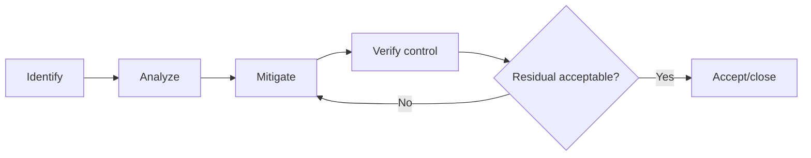

# Phase A Risk Register

| Control field | Value |
|---|---|
| Document ID | `ESP32S3-RISK-REGISTER` |
| Version | `0.1` |
| Status | Draft |
| Owner / approver | Me |
| Product baseline | Heltec WiFi LoRa 32 V3 / exact revision TBD |
| Target gate | G-A — Phase A baseline approval |
| Change control | Changes after baseline require a recorded change request |
| Evidence rule | A claim is complete only when linked evidence exists |

> **Control note:** `TBD-*` items are not omissions. They are controlled decisions that require an owner, due date, and closure evidence before the applicable gate.

## Scoring

Probability and impact are Low/Medium/High/Critical. Before gate, convert to the project's numeric scoring scheme if required. Critical impact items cannot be accepted implicitly.

| Risk ID | Category | Description | Probability | Impact | Score | Mitigation | Owner | Status |
|---|---|---|---|---|---|---|---|---|
| R-HW-001 | Hardware | Board revision differs from assumed schematic | Medium | High | TBD | Record exact revision; continuity/functional verification | Me | Open |
| R-HW-002 | Hardware | GPIO or strap conflict prevents reliable boot | Medium | Critical | TBD | Pin audit and boot-mode tests | Me | Open |
| R-MEM-001 | Memory | OTA slots cannot fit production image with margin | Medium | Critical | TBD | Early partition model and size POC | Me | Open |
| R-MEM-002 | Memory | Wi-Fi/TLS peak heap causes instability | Medium | High | TBD | Instrument worst-case heap and tune buffers | Me | Open |
| R-PWR-001 | Power | Board-level deep-sleep current exceeds product target | High | High | TBD | Measure exact board; control OLED/Vext/radios; reconsider board if needed | Me | Open |
| R-PWR-002 | Power | Brownout during flash write corrupts state | Medium | Critical | TBD | Voltage threshold, transactional storage, fault injection | Me | Open |
| R-RF-001 | RF | LoRa range or join reliability below deployment need | Medium | High | TBD | Controlled link tests and deployment survey | Me | Open |
| R-RF-002 | RF | Wi-Fi/BLE/LoRa coexistence or sequencing issue | Medium | Medium | TBD | Serialized radio policy and POC | Me | Open |
| R-LORA-001 | Software | LoRaWAN stack integration incompatible with ESP-IDF baseline | Medium | High | TBD | Isolated POC and version pinning | Me | Open |
| R-OTA-001 | Update | Interrupted or bad OTA image causes loss of service | Medium | Critical | TBD | Dual slots, validation, trial confirmation, rollback tests | Me | Open |
| R-SEC-001 | Security | Credentials exposed through logs or factory process | Medium | Critical | TBD | Secret-handling policy, log scan, controlled provisioning | Me | Open |
| R-SEC-002 | Security | Unauthorized or replayed command changes state | Medium | Critical | TBD | Authorization/freshness design and negative tests | Me | Open |
| R-SEC-003 | Security | Debug/factory interface remains exposed in field lifecycle | Medium | High | TBD | Lifecycle policy and production configuration review | Me | Open |
| R-STOR-001 | Storage | NVS corruption or schema migration loses trusted state | Medium | High | TBD | Versioned schema, dual-copy/transaction strategy, corruption POC | Me | Open |
| R-USB-001 | Recovery | USB/recovery path unavailable after application failure | Low | Critical | TBD | Bootloader/download-mode recovery test | Me | Open |
| R-MFG-001 | Manufacturing | Wrong identity or keys assigned to a unit | Medium | Critical | TBD | Atomic unit record, verification, reconciliation | Me | Open |
| R-REQ-001 | Process | Product use case remains ambiguous, causing requirement churn | High | High | TBD | Close A1.1 TBDs before architecture | Me | Open |
| R-REV-001 | Process | Single-person review misses critical defect | Medium | High | TBD | Structured checklist and independent review for irreversible decisions | Me | Open |

## Risk workflow

## Required risk fields before gate

Cause, consequence, trigger/indicator, probability rationale, impact rationale, mitigation, contingency, owner, due date, evidence, residual risk, and acceptance authority.
